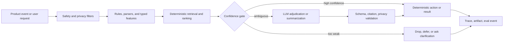

# Feature Changelogs and Rework Artifacts

Purpose: create implementation-grounded changelogs for the AI/Search features in AppTrail. These docs explain what the current system does, what artifacts exposed failures, what architectural decisions followed, what changes should be made, and how those changes feed evals and RCA.

These are not claims of bank-scale traffic or completed enterprise ML maturity. They are product-specific engineering plans based on the current repo.

## Reading Order

1. [Eval Artifact Pipeline](eval-artifact-pipeline-changelog.md)
2. [Artifact Evaluation Runbook](artifact-evaluation-runbook.md)
3. [Gmail Classifier](gmail-classifier-changelog.md)
4. [Search Retrieval and Source Intelligence](search-source-intelligence-changelog.md)
5. [Radar Research](radar-research-changelog.md)
6. [Copilot Routing](copilot-routing-changelog.md)
7. [Resume Tailoring Evidence Retrieval](resume-tailoring-changelog.md)

## Document Workflow

Each feature doc should follow the same progression:

```text
baseline implementation
  -> observed artifacts and failure signs
  -> root cause analysis
  -> architecture decision
  -> implementation changelog
  -> eval artifacts
  -> cost model and projected cost movement
  -> tuning and next iteration
```

The point is to show the workflow used to choose the architecture, not just the final architecture. If an eval is small, synthetic, or manually labeled, the doc should say that clearly and use it for failure discovery rather than statistical proof.

## Core Architecture Workflow

Simple API calls to an LLM are not enough engineering. They hide routing, retrieval, privacy, validation, and measurement problems inside one non-deterministic step.

The target pattern is:



The LLM should be used where it adds value:

- summarizing scoped evidence
- contextualizing ambiguous language
- choosing between typed routes when rules are insufficient
- producing user-facing narrative after deterministic retrieval

The LLM should not be the source of truth for:

- private URL safety
- source verification
- user/application identity
- status updates
- provider access mode
- report evidence quality
- product mutations

## Artifact Strategy

Every feature rework should generate the same categories of artifacts:

| Artifact | Purpose |
| --- | --- |
| Baseline trace | Shows how the current implementation behaved before changes. |
| Failure case set | Captures broken routes, generic Radar outputs, bad retrieval, or classifier mistakes. |
| Decision trace | Explains rules, features, thresholds, route choice, and validation outcome. |
| Eval metrics | Machine-readable metrics used to compare baseline and candidate behavior. |
| Case results | Per-case pass/fail, failure type, and root cause. |
| RCA summary | Converts failures into implementation tasks. |
| Cost breakdown | Shows current token/API cost, target cost drivers, and projected savings from architecture changes. |
| Generated report | Human-readable artifact for engineering review, demo, and implementation history. |

Recommended generated directory layout:

```text
docs/ai-artifacts/generated/
  YYYY-MM-DD_<feature>_<dataset>_<variant>_<version>/
    report.md
    metadata.json
    metrics.json
    failure_summary.json
    case_results.jsonl
    source_input.json
    token_breakdown.json
    cost_breakdown.json
    latency_metrics.json
```

Cost artifacts should separate measured data from projections:

```text
measured_current_cost
  -> derived from ai_model_calls, run steps, provider usage, or generated eval reports

modeled_candidate_cost
  -> derived from measured baseline multiplied by expected call-rate, token, or provider-fallback changes
```

Do not hard-code vendor prices unless the artifact records the price source and date. Prefer internal ledger fields such as `AiModelCall.cost_estimate_cents`, token counts, `ResearchRunStep` cost metadata, and `JobSearchProviderUsage`.

Run the current local artifact suite:

```bash
scripts/run_feature_artifact_suite.py --overwrite
```

Generate and run the broader synthetic coverage profile:

```bash
scripts/generate_synthetic_eval_inputs.py
scripts/run_feature_artifact_suite.py --dataset-profile synthetic --overwrite
```

Preview what would run:

```bash
scripts/run_feature_artifact_suite.py --dry-run --no-radar-lineage
```

Run individual component artifact evals:

```bash
scripts/run_gmail_classifier_artifact_eval.py --overwrite
scripts/run_source_retrieval_eval.py --overwrite
scripts/run_copilot_router_eval.py --overwrite
scripts/run_radar_evidence_eval.py --overwrite
```

The goal is not to pretend the eval data is large. The goal is to show an engineering loop:

```text
observe failure
  -> capture artifact
  -> label failure
  -> identify root cause
  -> change architecture
  -> rerun eval
  -> compare result
  -> decide next iteration
```

## Business Tradeoff Summary

| Feature | Main Business Risk | Engineering Bias |
| --- | --- | --- |
| Gmail classifier | Missing a job-related email hurts user trust. Sending every email to an LLM increases cost and privacy exposure. | High recall for job-related detection, high precision for automatic status updates, LLM only for ambiguity. |
| Source intelligence | Private links or tokenized URLs must not become shared product data. | Fail closed on privacy, verify public sources before reuse. |
| Radar | Generic reports look smart but are not actionable. | Source precision and missing-data honesty over broad recall. |
| Copilot | A generic assistant feels broken when it cannot use product state. | Route first, read typed product data, ask clarifying questions. |
| Search/retrieval | Bad retrieval causes bad model answers even with a strong LLM. | Metadata and lexical baseline first, embeddings only after measured retrieval misses. |
| Resume tailoring | Prompt-only rewriting can invent experience or overstate weak evidence. | Evidence cards, citation support, privacy preflight, and abstention before generation. |
| Eval layer | Small datasets can mislead if treated as statistically conclusive. | Use small evals for failure discovery, regression, RCA, and promotion discipline. |
