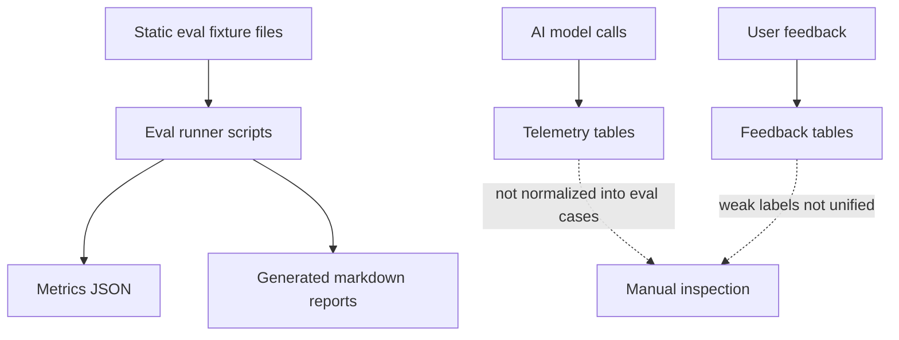
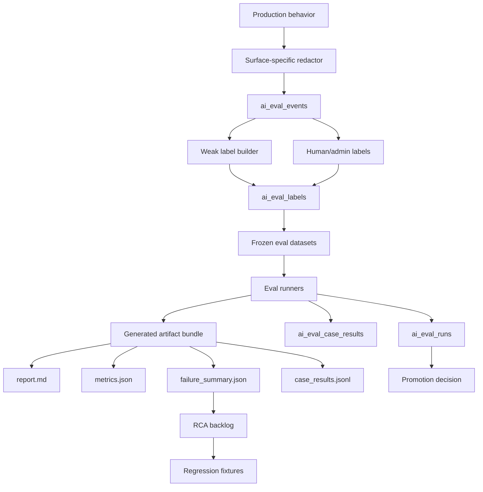

# Eval Artifact Pipeline Changelog

## Architecture Decision Context

The eval system is the control plane for improving AppTrail's AI features. Without eval artifacts, failures stay anecdotal: "Radar is generic", "Copilot routed poorly", or "the classifier sent too much to the LLM." With artifacts, each issue becomes a labeled, replayable case with metrics, root cause, and a promotion decision.

The current system has a useful foundation. The rework should not replace it. It should connect offline fixtures, production traces, feedback, generated reports, and promotion reports into one pipeline.

The workflow here is:

```text
inspect existing eval scripts, telemetry tables, and generated reports
  -> identify missing bridge from production behavior to eval cases
  -> create redacted eval event and label contracts
  -> freeze small datasets for regression, not statistical proof
  -> generate human-readable and machine-readable artifacts
  -> use failure summaries for RCA and promotion decisions
```

## Current Implementation

Current files and data:

- `backend/services/evals/assistant_eval.py`
- `backend/services/evals/search_eval.py`
- `backend/services/evals/classifier_eval.py`
- `backend/services/red_team.py`
- `scripts/run_copilot_eval.py`
- `scripts/run_email_classifier_eval.py`
- `scripts/run_search_eval.py`
- `scripts/run_red_team_eval.py`
- `scripts/generate_ai_report.py`
- `scripts/regenerate_ai_progress_index.py`
- `docs/ai-artifacts/generated/*`
- `evals/copilot/copilot_questions_v1.jsonl`
- `evals/email_classifier/email_classifier_v1.jsonl`
- `evals/search/search_queries_v1.jsonl`
- `evals/red_team/*.jsonl`

Current persisted AI/feedback tables:

- `AiModelCall`
- `AiSafetyDecision`
- `AiArtifact`
- `AiExperiment`
- `AiFeedbackRewardEvent`
- `AiShadowRun`
- `AiPromotionReport`
- `AiModelCard`
- `CopilotFeedback`
- `ResearchFeedback`
- `EmailFeedback`

Current generated report bundles already have a strong shape:

```text
docs/ai-artifacts/generated/
  2026-05-02_email-classifier-eval_email-classifier-v1_gpt-4o-mini_v3/
    report.md
    metadata.json
    metrics.json
    token_breakdown.json
    cost_breakdown.json
    latency_metrics.json
    summary_payload.json
    source_input.json
```

## Current Architecture



The current system proves that evals and generated artifacts are possible, but it does not yet turn production behavior into a reusable labeled dataset.

## Current Failure Modes

1. Production failures are not consistently captured as eval cases.
2. Weak labels from feedback are not unified across Copilot, Radar, Gmail, and search.
3. A bad output often has no structured root cause, such as `wrong_route`, `retrieval_miss`, or `missing_rule`.
4. File fixtures are useful but too small to represent product drift.
5. Eval reports are generated, but not yet part of a promotion gate for router/prompt/model changes.

## Target Architecture



## New Data Contracts

### Eval Event

```json
{
  "surface": "copilot",
  "task_name": "route_intent",
  "event_type": "assistant_message",
  "source_table": "copilot_messages",
  "source_id": "uuid",
  "input_snapshot": {},
  "output_snapshot": {},
  "context_snapshot": {},
  "redaction_summary": {},
  "policy_snapshot": {},
  "model_call_id": "uuid-or-null",
  "created_from": "production_trace"
}
```

### Case Result

```json
{
  "event_id": "uuid",
  "status": "failed",
  "scores": {
    "route_correct": 0,
    "citation_coverage": 0.5
  },
  "failure_types": ["wrong_route", "retrieval_miss"],
  "root_cause": "missing_route",
  "fix_type": "route_registry_change"
}
```

## Artifacts to Generate

For each eval run:

```text
report.md
metadata.json
metrics.json
failure_summary.json
case_results.jsonl
source_input.json
token_breakdown.json
cost_breakdown.json
latency_metrics.json
optional_confusion_matrix.json
optional_rca_backlog.md
```

## Cost Model

### Current Cost Drivers

The existing file-based evals are cheap because most are deterministic. Cost appears when evals replay model calls, run candidate prompts, or compare variants.

Eval cost formula:

```text
eval_run_cost =
  dataset_case_count
  * variant_count
  * avg_model_calls_per_case
  * avg_cost_per_model_call
```

Measured fields:

```text
AiModelCall.surface
AiModelCall.task_name
AiModelCall.variant
AiModelCall.prompt_tokens
AiModelCall.context_tokens
AiModelCall.output_tokens
AiModelCall.cost_estimate_cents
AiEvalRun summary metrics
generated report token_breakdown.json
generated report cost_breakdown.json
```

### Target Cost Shape

Use eval tiers:

| Tier | When It Runs | Cost Posture |
| --- | --- | --- |
| Smoke fixture eval | Every PR/CI candidate | Deterministic or minimal model calls |
| Targeted regression eval | When touching a feature route/classifier/retriever | Small frozen dataset |
| Scheduled full eval | Nightly/weekly or before promotion | Broader dataset and variants |
| Shadow/prod eval | Controlled rollout only | Uses production traces and budget caps |

This prevents the eval layer itself from becoming an uncontrolled cost center.

### Cost Artifacts

Generate:

```text
eval_suite_cost_baseline.json
eval_suite_cost_after.json
eval_suite_cost_projection.json
```

Required fields:

```json
{
  "eval_run_id": "uuid",
  "dataset_case_count": 0,
  "variant_count": 0,
  "model_call_count": 0,
  "avg_cost_cents_per_case": 0.0,
  "total_cost_cents": 0,
  "cost_by_surface": {},
  "cost_by_task": {},
  "budget_cap_cents": 0,
  "evidence_status": "measured | projected | fixture"
}
```

Minimum feature-specific artifact sets:

| Feature | Baseline Artifact | Candidate Artifact | RCA Artifact |
| --- | --- | --- | --- |
| Gmail classifier | `email_classifier_baseline_trace.jsonl` | `email_classifier_hybrid_trace.jsonl` | `email_classifier_failure_summary.json` |
| Radar | `radar_baseline_run_trace.json` | `radar_source_grounded_trace.json` | `radar_evidence_rca.md` |
| Copilot | `copilot_baseline_transcripts.jsonl` | `copilot_router_case_results.jsonl` | `copilot_route_failure_summary.json` |
| Search/source | `search_baseline_topk.jsonl` | `search_direct_source_topk.jsonl` | `retrieval_miss_rca.md` |

## Evaluation Philosophy

At the current product scale, evals are not statistically conclusive. That is acceptable. Their first job is to expose clear failure signs:

- Radar returned a generic report because retrieval produced an empty or generic page.
- Copilot failed because no route existed for a product-specific request.
- Gmail classifier sent obvious noise or PII-heavy content to a model unnecessarily.
- Search ranked weak generic documents above verified job postings.

This is still valuable because each failure is actionable.

## RCA Taxonomy

Root cause categories:

```text
retrieval_miss
wrong_route
missing_route
bad_threshold
missing_rule
bad_prompt
schema_failure
source_quality_gap
privacy_redaction_gap
label_error
stale_data
product_state_gap
```

Fix categories:

```text
rule_change
threshold_change
retrieval_filter_change
source_quality_gate_change
prompt_change
route_registry_change
router_training_data
human_label_needed
product_data_model_change
privacy_sanitizer_change
defer_no_fix
```

## Implementation Changelog

### Step 1: Capture Eval Events

- Add `ai_eval_events`, `ai_eval_labels`, `ai_eval_datasets`, `ai_eval_dataset_items`, `ai_eval_runs`, and `ai_eval_case_results`.
- Add surface-specific redactors.
- Backfill recent Copilot, Radar, Gmail, source, and search cases.

### Step 2: Build Weak Labels

- Convert thumbs feedback, source status, report status, search saves, email feedback, and admin source actions into weak labels.
- Keep weak labels separate from human/gold labels.

### Step 3: Freeze Small Datasets

Initial datasets:

```text
email_classifier_privacy_and_recall_v1
radar_evidence_quality_v1
copilot_router_v1
copilot_grounded_answer_v1
source_privacy_v1
search_retrieval_relevance_v1
```

### Step 4: Generate Artifact Bundles

- Wrap the existing report writer with `backend/services/evals/artifact_writer.py`.
- Link generated artifacts to `AiArtifact`.
- Regenerate `docs/ai-artifacts/ai-system-progress-over-time.md`.

### Step 5: Add Promotion Gates

- Use `AiPromotionReport` to compare baseline and candidate variants.
- Block changes that increase unsupported claims, private data exposure, or severe routing errors.

## Business Tradeoff

The business value is not "we have a huge eval set." The value is operational discipline. AppTrail can show that every AI failure creates a labeled case, every architectural change is measured, and every prompt/model/router change has a promotion path.

That is the correct level of maturity for this product today.
