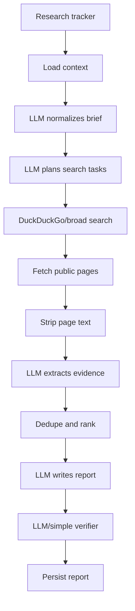
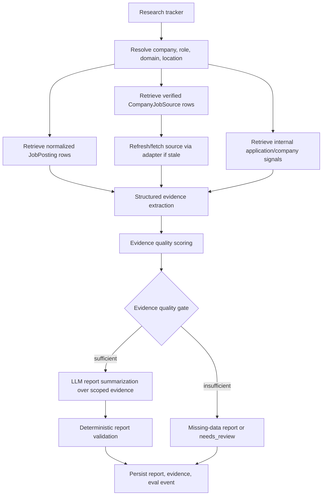

# Radar Research Changelog

## Architecture Decision Context

Radar should not be a broad web research agent with an LLM asked to infer opportunity signals from whatever pages search returns. That architecture is fragile. If retrieval lands on a generic or empty page, the model has no real evidence and the output becomes generalized.

The target architecture is source-grounded Radar: verified job sources, normalized postings, internal product signals, deterministic evidence quality scoring, and LLM summarization only after evidence is collected and validated.

The workflow here is:

```text
inspect current research graph and run artifacts
  -> identify broad-search and empty-page failure cases
  -> label generic, wrong-company, stale, and unsupported evidence
  -> replace broad-search-first retrieval with verified source retrieval
  -> score evidence quality before report writing
  -> evaluate source tier, specificity, citation coverage, and missing-data honesty
```

## Current Implementation

Current code:

- `backend/tasks/run_research_radar.py`
- `backend/services/research_radar/graph.py`
- `backend/services/research_radar/state.py`
- `backend/services/research_radar/schemas.py`
- `backend/services/research_radar/nodes/plan.py`
- `backend/services/research_radar/nodes/search.py`
- `backend/services/research_radar/nodes/fetch.py`
- `backend/services/research_radar/nodes/extract.py`
- `backend/services/research_radar/nodes/dedupe.py`
- `backend/services/research_radar/nodes/report.py`
- `backend/services/research_radar/nodes/verify.py`
- `backend/services/research_radar/nodes/persist.py`
- `backend/services/opportunity_radar/sources.py`
- `backend/services/opportunity_radar/signal_extractor.py`

Current graph:

```text
load_tracker_context
  -> normalize_research_brief
  -> validate_brief
  -> plan_research_tasks
  -> run_search_tasks
  -> fetch_documents
  -> extract_evidence
  -> dedupe_and_rank_evidence
  -> build_report_diff
  -> write_report
  -> derive_report_actions
  -> verify_report
  -> persist_report
  -> emit_alerts
  -> schedule_next_run
```

Current strengths:

- Research runs, run steps, source items, evidence items, reports, and feedback are persisted.
- Steps capture model, prompt version, cost, token, error, and output metadata.
- `fetch_public_https` is used for safer fetching.
- Indeed and LinkedIn are unsupported as direct scraped sources.
- Reports can be forced to `needs_review` when evidence is missing.

Current weakness: broad search and LLM extraction happen too early. Radar does not yet treat `company_job_sources` and `job_postings` as the primary source of truth.

## Current Architecture



## Current Failure Modes

### Generic Evidence

Radar may fetch a generic careers page or company landing page and try to turn that into a specific hiring or opportunity signal.

Failure sign:

```text
source_type = generic careers page
evidence = broad hiring statement
report finding = specific role/team opportunity
```

### Empty Page Retrieval

If retrieval lands on an empty page, bot-protected page, or thin page, the LLM has nothing useful to summarize.

Failure sign:

```text
fetched_text_length = 0 or very small
source_status = fetched
evidence_count = 0
report still attempts narrative summary
```

### Wrong Source Priority

Verified job postings or source-intelligence records may exist but Radar still performs broad search first.

### Weak Verification

The verifier may detect missing citations, but evidence quality is not scored deeply enough before the model writes the report.

## Target Architecture



## Target Source Order

1. Tracker profile and user context.
2. Existing `JobPosting` rows matching company, role family, location, and freshness.
3. Verified active `CompanyJobSource` rows.
4. Provider adapters to refresh stale or missing postings.
5. Internal user signals such as applications, company visits, prior reports, and company tech profiles.
6. Approved official public sources for the domain.
7. Broad search only as discovery/fallback.

Broad search should not be the default source of truth.

## Evidence Quality Contract

Each evidence candidate should be scored before report writing:

```json
{
  "source_tier": "tier_1_verified_first_party",
  "source_trust": 0.95,
  "specificity_score": 0.9,
  "company_match_score": 1.0,
  "role_match_score": 0.86,
  "recency_score": 0.82,
  "citation_span": "Senior Data Scientist, Fraud Analytics",
  "claim_type": "job_opening",
  "quality_flags": []
}
```

Required gates:

- Generic pages cannot support high-confidence role-specific claims by themselves.
- Empty or near-empty fetches cannot produce evidence.
- A company-specific claim needs company/domain/source match.
- A role-specific claim needs role family or posting title match.
- Discovery-only evidence cannot publish as the sole support for a report finding.
- Missing data should be stated directly instead of filled with generic language.

## Deterministic vs LLM Boundary

Use deterministic logic for:

- source retrieval order
- provider verification
- job posting extraction
- source tier
- company match
- role match
- recency
- evidence quality gate
- citation coverage
- report status decision

Use LLM for:

- summarizing already-scored evidence
- explaining why evidence matters
- drafting user-facing report sections
- converting structured findings into readable recommendations

Do not use LLM for:

- deciding whether evidence exists
- upgrading generic evidence to specific claims
- verifying source access mode
- bypassing missing data

## Cost Model

### Current Cost Drivers

Radar cost is step-based. The current graph can spend model calls on planning, evidence extraction, report writing, and verification even when retrieval was weak.

Approximate current cost:

```text
cost_per_research_run =
  sum(research_run_step.model_costs)
  + broad_search_provider_cost
  + fetch/retry overhead
```

The more useful business metric is:

```text
cost_per_supported_finding =
  total_run_cost / count(quality_gated_supported_findings)
```

A cheap report with generic or unsupported findings is not successful.

Measured fields:

```text
ResearchRunStep.model_name
ResearchRunStep.prompt_version
ResearchRunStep.input/output snapshots
ResearchRunStep token and cost metadata
AiModelCall.cost_estimate_cents
ResearchSourceItem source_type/status
ResearchEvidenceItem count and quality metadata
JobSearchProviderUsage broad provider usage
```

### Target Cost Shape

Source-grounded Radar should reduce cost in three ways:

1. Fewer broad search calls when verified sources already exist.
2. Fewer LLM extraction calls over generic or empty pages.
3. Fewer report-writing calls for runs that should stop at missing-data or `needs_review`.

Projected target:

```text
target_run_cost =
  deterministic_retrieval_cost
  + source_refresh_cost
  + quality_gated_llm_summary_cost
  + deterministic_validation_cost
```

Expected savings:

```text
llm_extraction_calls_avoided =
  baseline_fetched_documents - quality_eligible_documents

broad_search_calls_avoided =
  baseline_broad_search_calls - target_broad_search_calls
```

### Cost Artifacts

Generate:

```text
radar_cost_baseline.json
radar_step_cost_waterfall_baseline.json
radar_cost_after.json
radar_cost_projection.json
```

Required fields:

```json
{
  "research_run_count": 0,
  "avg_llm_steps_per_run": 0.0,
  "avg_cost_cents_per_run": 0.0,
  "avg_cost_cents_per_published_report": 0.0,
  "avg_cost_cents_per_supported_finding": 0.0,
  "broad_search_calls_per_run": 0.0,
  "fetched_docs_per_supported_finding": 0.0,
  "empty_or_generic_docs_filtered": 0,
  "llm_extraction_calls_avoided": 0,
  "evidence_status": "measured | projected | fixture"
}
```

## Artifacts to Generate

Baseline artifacts:

```text
radar_baseline_run_trace.json
radar_baseline_source_items.jsonl
radar_baseline_evidence_items.jsonl
radar_baseline_report.md
radar_empty_page_cases.jsonl
radar_generic_evidence_cases.jsonl
radar_baseline_metrics.json
```

Candidate artifacts:

```text
radar_source_grounded_run_trace.json
radar_verified_source_retrieval_trace.jsonl
radar_evidence_quality_scores.jsonl
radar_report_after.md
radar_missing_data_report_cases.jsonl
radar_candidate_metrics.json
radar_failure_summary_after.json
```

Generated report bundle:

```text
docs/ai-artifacts/generated/
  YYYY-MM-DD_radar-source-grounded_radar-evidence-v1_source-quality-gate_v1/
```

## Eval Metrics

```text
source_tier1_or_tier2_rate
generic_evidence_rate
empty_page_evidence_rate
wrong_company_rate
wrong_role_rate
citation_coverage
unsupported_claim_rate
needs_review_rate
missing_data_stated_rate
published_without_specific_evidence_rate
cost_per_report
latency_p95
```

Important interpretation: with a small dataset, these metrics are directional. They show failure signatures and regression risk. They should not be presented as statistically definitive.

## Implementation Changelog

### Phase 1: Add Source-Grounded Retrieval

- Add `backend/services/research_sources/retriever.py`.
- Query `JobPosting` and `CompanyJobSource` first.
- Keep broad search as fallback/discovery.

### Phase 2: Add Evidence Quality

- Add `backend/services/research_radar/evidence_quality.py`.
- Score source trust, specificity, company match, role match, recency, and citation span.
- Store quality fields in source/evidence payloads.

### Phase 3: Change Graph Middle

Replace:

```text
plan_research_tasks -> run_search_tasks -> fetch_documents -> extract_evidence
```

With:

```text
plan_source_retrieval
  -> retrieve_verified_sources
  -> fetch_or_refresh_sources
  -> extract_structured_evidence
  -> score_evidence_quality
  -> optional_llm_evidence_summarization
```

### Phase 4: Add Report Contract

Every report finding must include:

- finding
- why it matters
- evidence list
- source tier
- citation span
- confidence
- missing data if applicable

### Phase 5: Add Radar Eval Runner

- Build `backend/services/evals/radar_eval.py`.
- Score source quality, generic evidence, unsupported claims, missing citations, and missing-data honesty.

## Business Tradeoffs

Radar should bias toward precision and provenance. A generic but confident report is worse than a less exciting report that says:

```text
No verified role-specific signal was found. Radar checked verified job postings and official career sources, then left this item in review.
```

That is not a product weakness. It is trust-building behavior.

## Future Scaling Path

Add more advanced retrieval only when evals show the need:

- embeddings for semantically matching roles and company signals
- cross-encoder reranking for evidence candidates
- domain-specific extractors for biotech, fintech, or data/ML roles
- learned source/evidence reranker trained on labeled Radar outcomes

Do not start there. First make Radar deterministic, grounded, and measurable.
