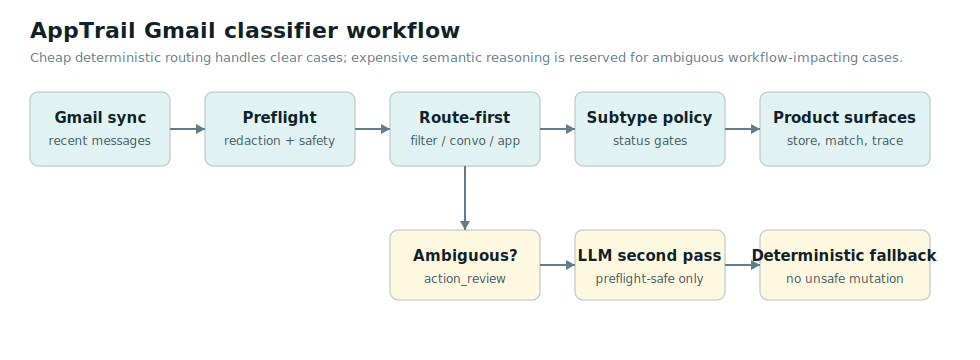
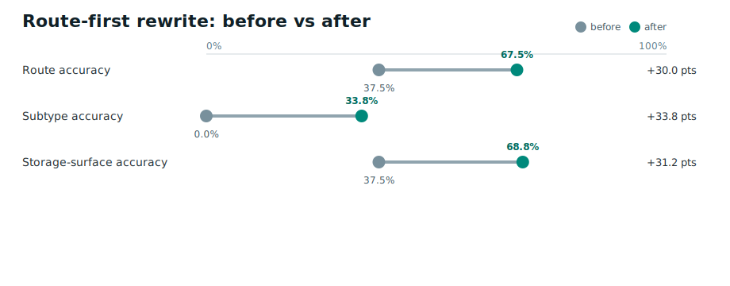
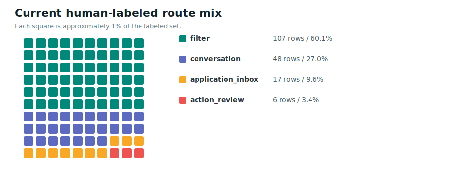
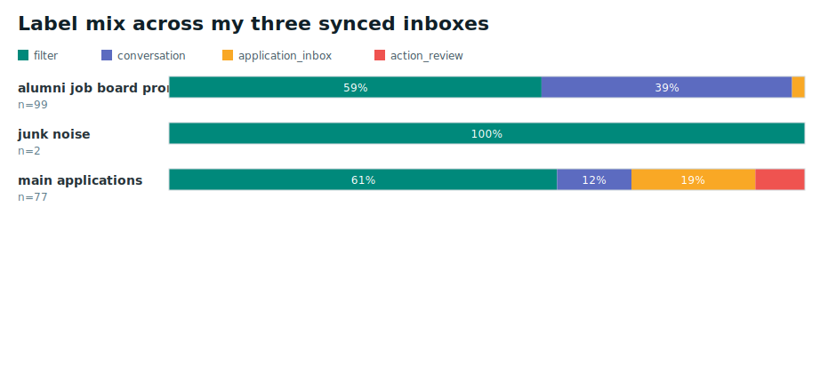
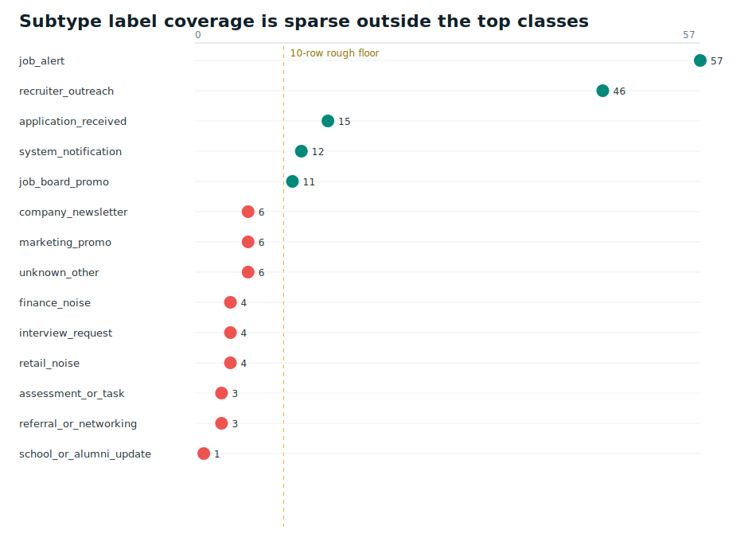
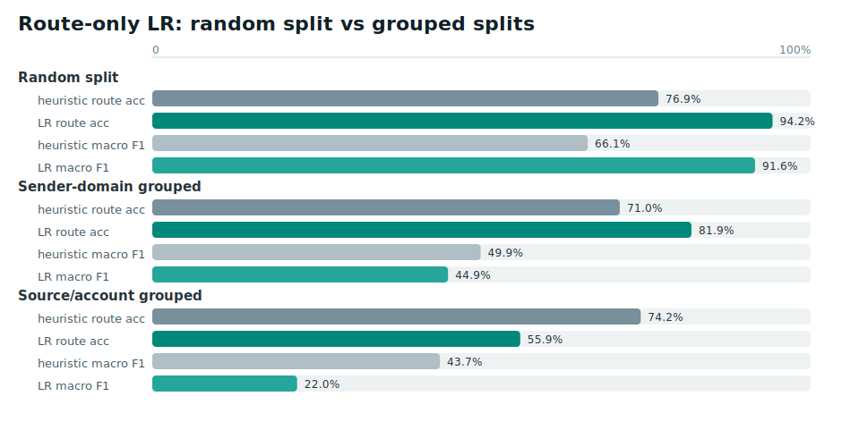
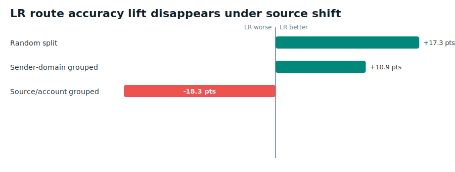
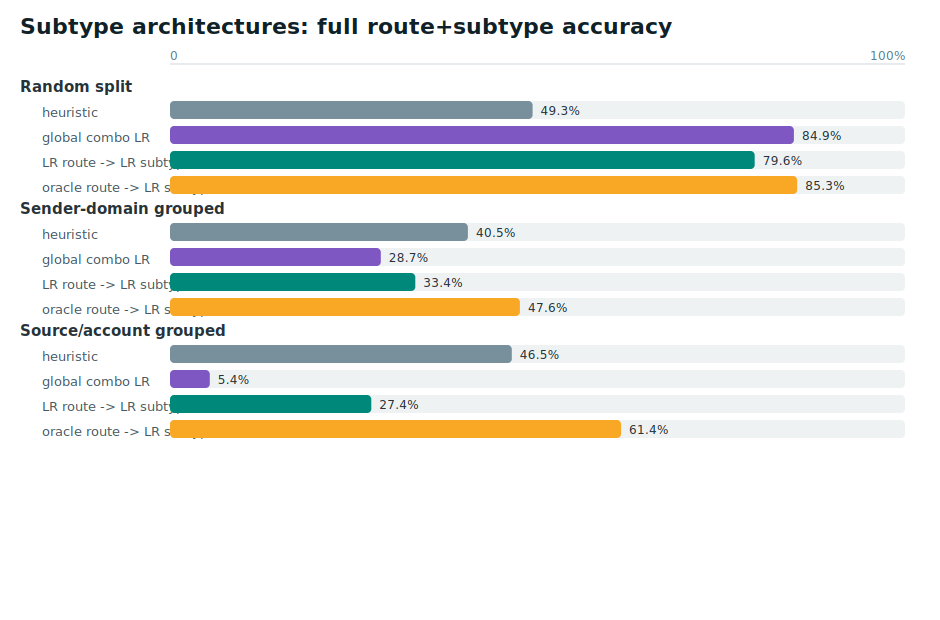

# I Built a Gmail Classifier Starting From Zero Labeled Data. Here's What Actually Worked.

<p style="margin-top:-0.06in;margin-bottom:0.2in;color:#455a64;font-size:12.5pt;">By <strong>Colby Reichenbach</strong></p>

There is a version of this story where I tell you I trained a model, hit `94.2%` accuracy, and shipped it. That version is technically true. It is also almost completely misleading, and honestly it is the version most people would post.

Here is the real one.

## What I Am Building and Why This Problem Exists

AppTrail is a job-search OS I am building solo. One place to track applications, sync Gmail, follow recruiter conversations, prep for interviews, capture job opportunities, and do research without losing everything across seventeen browser tabs and a spreadsheet you stopped updating three weeks ago.

Gmail sync is central to the whole thing because email is where most job-search events actually land first. Application confirmations, rejections, recruiter replies, interview scheduling links, assessments, job alerts, and a whole lot of noise. The classifier's job is to look at each inbound message and route it into one of four product behaviors:

- **Filter** -- ignore it, suppress it from the product entirely
- **Conversation** -- surface it as a recruiter or networking thread
- **Application inbox** -- attach it to an active application lifecycle
- **Action review** -- something job-related but ambiguous, flag it for a closer look

Sounds like a pretty standard classification problem. Four classes, route each email, done. Except the labels here are not just labels. They are operational decisions with downstream side effects.

A message routed to application inbox can trigger a status update on an active job application. Route a job-board marketing digest there by mistake and you have silently corrupted someone's application state. Route a recruiter reply to filter and you have hidden something the user actually needed to act on. The error cost is not symmetric. Some wrong answers are annoying. Others break the product.

This is the thing that gets lost when people talk about ML accuracy as the primary goal. Accuracy is a proxy. The real question is always: what actually happens downstream when the classifier is wrong?



## The Starting Condition: Zero Labels

Solo builder, real inbox data, zero pre-labeled training data. That is not a unique situation. That is the starting condition for pretty much every applied ML problem that is not a Kaggle competition.

So where do you get data?

I could not treat raw Gmail as a bulk training corpus or something I could freely export, share, or hand to a model. I could use my own synced emails for careful labeling, but only with scoped exports, redaction where needed, and a clear separation between "data I can inspect locally" and "data I would ever send to an external system." I also could not use a public email dataset as the main source of truth because none of them had my route taxonomy. I could not generate synthetic data without first knowing what correct looked like inside my own system. And I could not label at scale while I was also building the product, managing the pipeline, and doing everything else that comes with building solo.

The move in this situation is to start with heuristics and use them to generate signal.

A heuristic classifier is not a fallback. It is not a placeholder you swap out later with real ML. It is a decision policy you can read, explain, and iterate on. It also produces predictions you can label against, which is exactly how you build your first real training set without burning runway or privacy budget.

So that is where I started.

## The First Classifier and How It Broke

The initial version used lifecycle-style signals to decide routing. Does this email mention `onsite`? Does it have a scheduling link? Does it reference an application stage or a hiring decision?

It worked fine on obvious cases. It was a mess on the edge cases that matter.

When I ran my first diagnostic labeling pass, 160 priority rows pulled from live Gmail syncs and manually labeled, the failure mode was pretty clear:

- 63 rows: job-board alerts or digest emails confidently routed to application inbox
- 25 rows: marketing-style emails routed to conversation
- 53 rows: high-confidence predictions that were just wrong

The classifier was chasing surface-level signals without asking whether the email was part of an actual candidate process at all. Words like `onsite`, `apply`, `recommendations`, and `applications due` were treated as lifecycle evidence regardless of context.

The `onsite` signal is a good example. It showed up in 77 emails. Wrong 90% of the time. Because `onsite` in a job-board listing means the job is physically located on-site. Geographic. `onsite` in a scheduling message from a recruiter means interview format. Same word, completely different meaning depending on what kind of email you are actually looking at.

The classifier had no way to resolve that. So it guessed wrong, confidently, over and over.

## The Fix: Route First, Then Subtype

The architectural fix was pretty simple once I saw the failure mode clearly. Decide where an email belongs before you try to figure out what it means within that destination.

The rewrite separated route selection from subtype classification and enforced that order:

```text
email
  -> privacy and safety preflight
  -> local feature extraction
  -> route scoring       <- destination decided here
  -> route selection
  -> subtype classification inside the selected route
  -> deterministic side-effect policy
  -> optional redacted LLM adjudication for ambiguous cases
```

And critically, the side-effect policy -- whether a message can trigger an application status update -- is gated on route and application/status policy, not on subtype confidence alone. That is the layer that prevents a confident but wrong subtype prediction from freely touching downstream state.

The same `onsite` signal now gets interpreted differently depending on which route the email is heading toward. In a filter-bound email it is geographic noise. In a conversation-bound email from a recruiter it might be interview context. The signal did not change. What changed is when and how it gets used.

Results on the original 160-row diagnostic set after the rewrite:



| Metric | Before | After |
| --- | ---: | ---: |
| Route accuracy | 37.5% | 67.5% |
| Storage-surface accuracy | 37.5% | 68.8% |
| Unwanted stored rows | 89 | 0 |
| Marketing-as-conversation errors | 25 | 0 |
| Opportunity/filter as lifecycle errors | 63 | 0 |

The number I care most about is unwanted stored rows. `89` down to `0`. That is the product metric. Everything else is how you explain it.

The tradeoff is conservative fallback behavior. About 30% of rows in this subset would have escalated to LLM adjudication rather than making a deterministic call. That is a deliberate choice. In a system where wrong answers have real side effects, saying "I am not sure" is better than being wrong with confidence.

## Building the Label Set

To run actual ML experiments I needed actual labels. I exported two priority-sampled batches from live Gmail syncs: emails that were either high-confidence wrong, in edge-case territory, or from underrepresented categories. Two waves, `340` total rows, `338` with usable labels.

Because the label policy changed as the route taxonomy became clearer, I did not treat those two waves as one clean training pool. The distribution below is the newer `178`-row policy-corrected set, which is also the set behind the LR metrics later in the report:

That newer set came from three connected inboxes I control, and the mix matters. My main inbox is where most real job applications and recruiter threads land. My alumni inbox has more job-board and career-platform promotional traffic. My old personal inbox is mostly random noise. So when I talk about a source/account split later, it is not an abstract platform metric; it is a practical way to test whether the classifier still works when the inbox personality changes.





| Route | Count |
| --- | ---: |
| `filter` | 107 |
| `conversation` | 48 |
| `application_inbox` | 17 |
| `action_review` | 6 |


Top subtype counts:

| Subtype | Count |
| --- | ---: |
| `job_alert` | 57 |
| `recruiter_outreach` | 46 |
| `application_received` | 15 |
| `system_notification` | 12 |
| `job_board_promo` | 11 |
| `marketing_promo` | 6 |
| `unknown_other` | 6 |
| `company_newsletter` | 6 |
| `interview_request` | 4 |
| `finance_noise` | 4 |




Several subtypes had fewer than 10 examples. `interview_request` had 4. `action_review` had 6 route-level examples. This is not a sampling problem. It is just reality. Most email is noise. Application lifecycle events are actually rare. Recruiter messages cluster around a small slice of senders.

This is the data problem that tutorials do not really prepare you for. You do not get to choose your class distribution. You work with what your product generates. And if your product is job-search tooling, your classes are naturally imbalanced because real job searches are naturally imbalanced. Most of what lands in your inbox is garbage.

## Running the ML Experiment

With real labels in hand, I ran a TF-IDF + Logistic Regression shadow classifier. Not a transformer, not an embedding model, not an LLM. The simplest thing that could plausibly work.

The numbers below use the newer `178`-row policy-corrected label set, not a blind pool of all `338` historical labels. That matters because the labeling policy changed as the route taxonomy became clearer.

The reasoning was practical: fast to train and evaluate, cheap to run many times, interpretable enough that you can see which tokens drove which predictions, and easy to test under different evaluation conditions without burning a lot of time.

The evaluation design here matters more than the model choice. I used three split strategies.

**Random stratified split** -- shuffle and split, preserving class ratios. Standard evaluation you see in most ML writeups.

**Sender-domain grouped split** -- hold out entire sender domains. Tests whether the model generalizes to email senders it has not seen before.

**Source/account grouped split** -- hold out entire Gmail accounts from that three-inbox set. This is the closest thing I had to real production conditions. A new user connects their Gmail and the model has to classify their inbox cold, having never seen their senders, their writing patterns, or their email history.

Results:





| Split | Heuristic acc / macro F1 | LR acc / macro F1 |
| --- | ---: | ---: |
| Random stratified | 76.9% / 66.1% | 94.2% / 91.6% |
| Sender-domain grouped | 71.0% / 49.9% | 81.9% / 44.9% |
| Source/account grouped | 74.2% / 43.7% | 55.9% / 22.0% |

The random split looks great. `94.2%`. That is the number you put in a blog post if you want to sound like you shipped something impressive.

The source/account grouped split is the honest one. Under production-like conditions LR dropped to `55.9%` accuracy and `22.0%` macro F1. Application-inbox recall, the most important class for the product, fell to `0.0%`. The model could not find a single application lifecycle email when evaluated on accounts it had not seen during training.

The heuristic held at `74.2%` under the same split. Heuristics generalize differently from learned models. They are not fitting to the distribution of your training accounts. They are encoding domain rules that apply regardless of who the sender is, because they never trained on accounts at all.

This is the core lesson from the whole experiment. Evaluation design determines what you actually learn. A random split would have told me to ship LR. The grouped split told me the truth. If I had posted the `94.2%` number and called it done, I would have shipped something that fails on new users, which is exactly the scenario that matters most.

## The Subtype Experiment

I also ran a hierarchical subtype experiment to see whether decomposing the problem helped. Route first, then a route-conditioned subtype classifier inside each route, compared across a few strategies: current heuristic, a global combo LR, LR route then LR subtype, and an oracle condition where I handed the model the true route as a diagnostic upper bound.



| Source/account grouped strategy | Full route+subtype accuracy |
| --- | ---: |
| Current heuristic | 46.5% |
| Global combo LR | 5.4% |
| Global route + global subtype LR | 4.2% |
| LR route -> LR subtype | 27.4% |
| Oracle route -> LR subtype | 61.4% |

The oracle result was the most useful thing to come out of it. When I gave the subtype model the actual correct route, full route plus subtype accuracy jumped to `61.4%`. With LR-predicted routes it was `27.4%`. With heuristic routes it was `46.5%`.

The read on that: subtype quality right now is bottlenecked by route quality, not by anything specific to the subtype model. There is no point building better subtype models until the route layer improves. This is a pattern worth internalizing in hierarchical ML work. Fixing the upstream error is almost always higher leverage than tuning the downstream model. The oracle gap tells you exactly how much headroom you have if you could solve the upstream problem first.

## Synthetic Data: Proceed With Suspicion

With so few examples in sparse classes, 4 rows of `interview_request` and 6 route-level rows of `action_review`, synthetic data was an obvious thing to try. I prompted an LLM to generate realistic job-search emails for underrepresented categories across five prompt iterations.

The consistent problem: synthetic examples can be schema-valid and semantically wrong. The generated emails looked right and passed format validation. But manual review kept finding subtle drift. The most common failure was that positive-scenario emails for application inbox would leak job-alert and promotional language into the body. Right structure, wrong content texture.

One early run made the risk obvious. The generator produced the row below as `application_inbox/application_received` and, before the review gate was tightened, marked it `training_eligible=true` even though `human_reviewed=false`.

```text
Subject: Job Alert: New Software Developer Openings
Assigned label: application_inbox/application_received
Body excerpt: Hello! We found some new job openings that match your profile: - Frontend Developer at Tech Innovations - Backend Developer at Creative Solutions Check them out on our website! Best, Job Finder Alerts --- You can manage your job...
Generator rationale: Despite relating to job opportunities, this is a notification for job alerts and should be filtered appropriately.
```

Source: `audit/runs/gmail_synthetic_scenarios/2026-05-12Tgoal3a-live-synthetic-v2/synthetic_scenarios.csv`. That is not a subtle failure. The email is clearly a job alert, and the generator's own rationale says it should be filtered. If I had trained on this without checking it, I would have taught the model that a job alert belongs in the application inbox. That is exactly the kind of label noise that makes a classifier look better in a lab and worse in the product.


In the table below, "accepted" means the generator produced rows that passed schema and count checks for that prompt run. It does not mean I approved those rows as training data. After the stricter review pass, I treated the synthetic set as a lab artifact, not as a source of production labels.

| Prompt version | Result | Decision |
| --- | --- | --- |
| v1 | 9 accepted rows, then 78 accepted after per-family calls | Too small/generic; semantic failures found |
| v2 | 78 accepted, 10 semantic warnings | Positive scenarios still leaked job-alert/promo cases |
| v3 | 79 generated, 73 accepted, 6 rejected | Best schema behavior, but manual review found subtle semantic drift |
| v4 | 34 accepted, 12 rejected | Few-shot examples exposed failures but output shape regressed |
| v5 | 52 accepted, 10 rejected | Better shape, still not trusted automatically |

A model trained on that learns the wrong boundary, and it learns it confidently because the training data looked clean. Synthetic data is not useless, but it needs a critic gate: another model reviewing outputs for semantic validity, human spot-check, or both. Injecting it into training data without review is how you build classifiers that are wrong in ways that are hard to diagnose later.

I also tested a public Kaggle job-application email dataset as a research-only probe. It contained `497` anonymized rows but did not have AppTrail's route/subtype labels. A weak-label application-inbox subtype probe trained on `400` rows reached `47.1%` accuracy and `45.7%` macro F1 on only `17` real application-inbox rows. Useful signal, not production evidence.

## The LLM Layer (and Why It Is Not the Default)

Raw Gmail content is messy in ways that matter. Names, phone numbers, physical addresses, private scheduling links, quoted thread history going back months. Sending every email to an external model expands the privacy surface, adds latency on every classification, and costs money at scale.

So the LLM in AppTrail's classifier is a second-pass adjudicator, not the primary classifier. Local classification runs first. Only ambiguous cases are considered for escalation. Before any model call, preflight minimizes the body, strips signatures and quoted text, redacts sensitive values, scans for redaction leaks and injection patterns, and blocks the call if the prompt is not safe enough.

In the policy-corrected label set, `14.0%` of rows were LLM-eligible and `0` were blocked in that artifact. The block paths exist and are tested; the zero count just means the eligible slice happened to be clean enough to pass. The important point is that the adjudication model never sees raw inbox content, and even a model result still has to pass the deterministic side-effect policy before it can touch application state.

## What Is Actually in Production

Current production decision: heuristics in production, LR kept in offline shadow evaluation, LLM for ambiguous preflight-safe cases only.

On the current `178`-row policy-corrected eval set:

| Metric | Value |
| --- | ---: |
| Route accuracy | 74.7% |
| Application-inbox recall | 82.4% |
| Conversation recall | 43.8% |
| LLM escalation rate | 14.0% |
| Original diagnostic unwanted stored rows after route-first | 0 |

Not a perfect classifier. Conversation recall at `43.8%` is a real gap I know about. I also still track offline mutation-risk flags separately, so I am not claiming lifecycle risk is solved globally.

But the failure mode it most needed to avoid in the first version -- marketing and job-board messages flooding application workflows -- was eliminated on the diagnostic subset. That is why heuristics stay in production for now. The failure modes they avoid are the ones that break product trust fastest.

## What Has to Change Before I Promote a Learned Model

I know exactly what the promotion gate looks like. Worth writing down explicitly because it is easy to keep moving the bar in your head without committing it anywhere.

For a learned route model to replace the heuristic in production, I would need one gate that combines model quality and data coverage:

- Source/account grouped route accuracy has to match or beat the heuristic baseline
- Source/account grouped macro F1 has to be materially above it
- Application-inbox recall has to stay high
- Conversation recall has to improve
- False-positive lifecycle mutation risk stays near zero
- The model produces calibrated confidence or explicit abstention
- 1,000+ real labeled Gmail examples across multiple account types
- 200+ per major route where feasible
- 50-100+ per key sparse subtypes
- A fresh holdout not used for any tuning decisions

I am at `338` usable labels right now. The bottleneck is not model architecture. It is data diversity. A more complex model would just find better ways to overfit to the three account groups I have labeled so far.

## The Actual Takeaway

Looking back at everything I ran, the diagnostic labeling, the route-first rewrite, the LR shadow experiments, the subtype hierarchy, the synthetic data probes, the useful work was not model selection.

It was identifying which routing errors had product side effects versus which ones were just metrics noise. It was designing evaluation splits that actually reflected production conditions. It was iterating the architecture before touching the model. It was building a label methodology out of a live running system. And it was not shipping something that only looked good under an easy split.

When you are building solo with no existing training data, heuristics are not a failure to do ML. They are the current best decision policy given the actual constraints: label scarcity, distribution shift, latency, cost, privacy, and the fact that wrong answers have real consequences in the product.

The same evaluation loop that tells you heuristics are right today also tells you exactly when that changes. That is the part I think gets skipped most often. Not just "which model should I use?" but: what evidence would actually change my answer?

Define that before you run the experiments. It saves you from convincing yourself a random split is good enough.

<footer style="margin-top:0.34in;padding-top:0.18in;border-top:1px solid #d8e3e8;color:#455a64;">
  <p style="margin:0 0 0.1in 0;"><strong>Colby Reichenbach</strong> -- building AppTrail and writing about applied AI systems that survive real product constraints.</p>
  <p style="margin:0;display:flex;gap:0.14in;align-items:center;flex-wrap:wrap;">
    <a href="https://www.linkedin.com/in/colby-reichenbach/" style="display:inline-flex;align-items:center;gap:0.055in;color:#0d5f73;text-decoration:none;">
      <svg width="15" height="15" viewBox="0 0 24 24" aria-hidden="true" style="vertical-align:-2px;"><rect x="2" y="2" width="20" height="20" rx="3" fill="#0A66C2"/><text x="7" y="17" font-size="12" font-family="Arial, sans-serif" font-weight="700" fill="#ffffff">in</text></svg>
      LinkedIn
    </a>
    <a href="https://colbyrreichenbach.github.io/" style="display:inline-flex;align-items:center;gap:0.055in;color:#0d5f73;text-decoration:none;">
      <svg width="15" height="15" viewBox="0 0 24 24" aria-hidden="true" style="vertical-align:-2px;"><circle cx="12" cy="12" r="9" fill="none" stroke="#0d5f73" stroke-width="2"/><path d="M3 12h18M12 3c2.4 2.7 3.6 5.7 3.6 9S14.4 18.3 12 21M12 3C9.6 5.7 8.4 8.7 8.4 12S9.6 18.3 12 21" fill="none" stroke="#0d5f73" stroke-width="1.6" stroke-linecap="round"/></svg>
      Portfolio
    </a>
  </p>
</footer>
