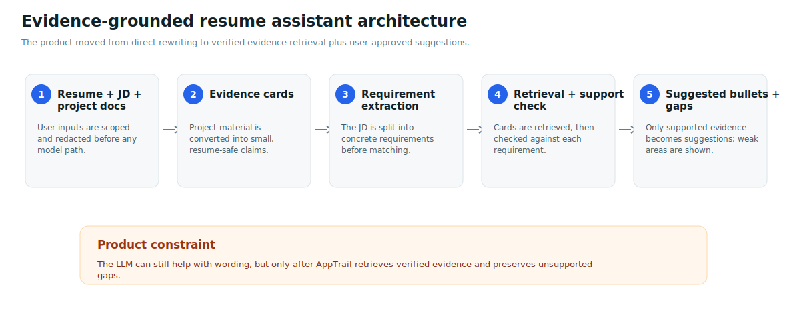
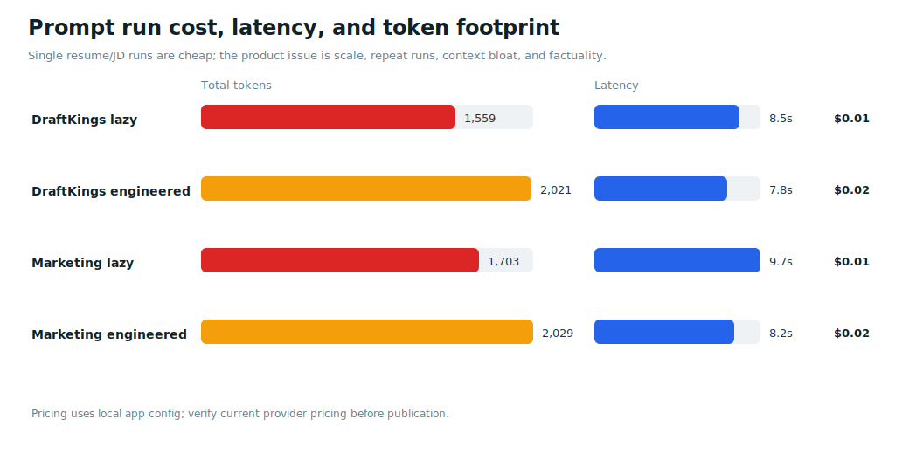
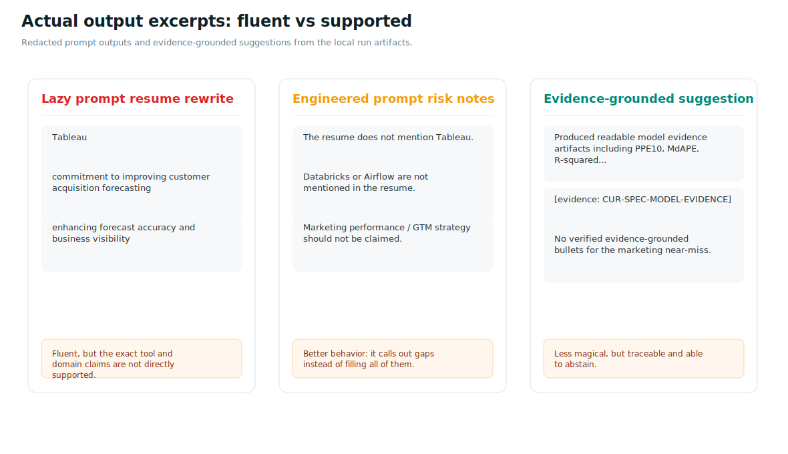
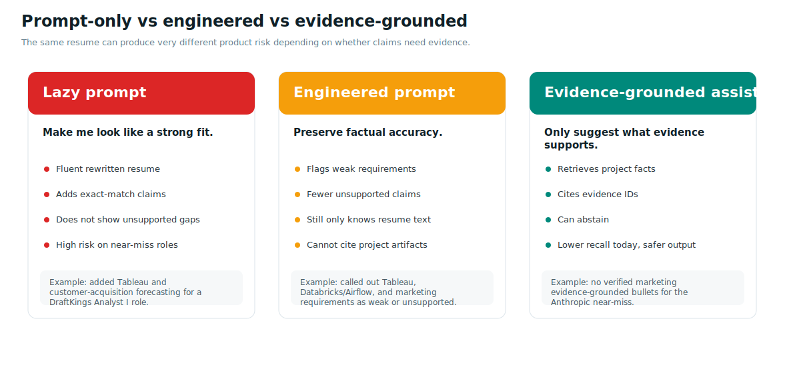
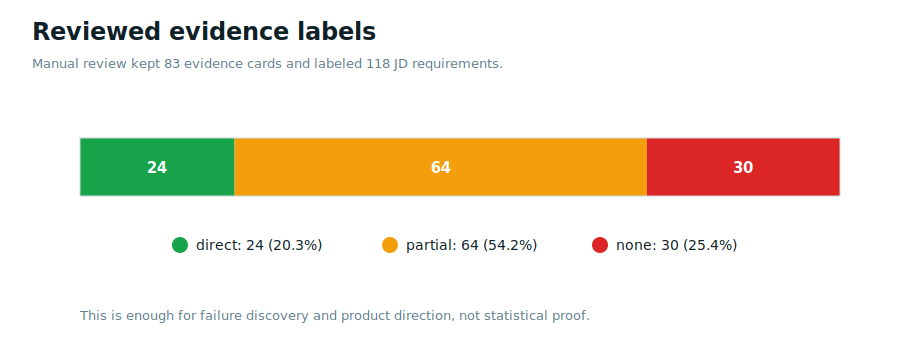
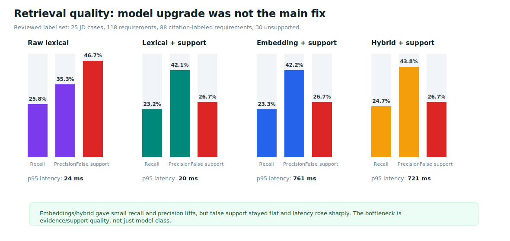

# I Tried to Build an AI Resume Tailor. The Hard Part Was Not Writing the Resume.

<p style="margin-top:-0.06in;margin-bottom:0.2in;color:#455a64;font-size:12.5pt;">By <strong>Colby Reichenbach</strong></p>

There is a version of this story where I paste my resume and a job description into an LLM, get a cleaner resume back, and call it a product.

That version is easy.

It is also the exact thing I do not want AppTrail to ship.

The problem with AI resume tailoring is not that LLMs cannot write polished bullets. They can. The problem is that they can write polished bullets that quietly stretch the truth. They turn "I built an evaluation pipeline" into "I designed golden datasets and annotation workflows." They turn "I know experimentation" into "I ran causal inference studies for marketing channels." They make the resume sound more aligned, but the alignment can come from the model filling gaps instead of the user's actual work.

For a toy demo, that might be acceptable. For a user-facing job-search product, it is not.

This report is about the path from prompt-only resume rewriting to an evidence-grounded resume assistant inside AppTrail. The useful lesson was not "use RAG because RAG is trendy." The useful lesson was that once factuality matters, the core product problem moves from generation to retrieval, support verification, and abstention.

## What AppTrail Is Trying to Do

AppTrail is a job-search OS I am building solo. One place to track applications, sync Gmail, manage recruiter conversations, capture job opportunities, prep for interviews, and research roles without scattering everything across inboxes, spreadsheets, and browser tabs.

Resume tailoring sits naturally inside that workflow. A user has:

- a resume
- a job description
- a set of projects, experiences, reports, and proof-of-work artifacts
- constraints around privacy, truthfulness, formatting, and time

The obvious feature request is: "tailor my resume to this job."

But the product version is more specific:

```text
Given a job description and the user's actual work,
identify the most relevant evidence,
suggest honest resume changes,
and avoid unsupported claims.
```

That last part matters. A resume tailorer that confidently invents qualifications can create real downstream risk: awkward interviews, mismatched expectations, trust loss with hiring teams, and a product that teaches users to outsource accuracy.

So I treated the feature less like a writing feature and more like a retrieval and evidence problem.



## The Baseline: Prompt-Only Tailoring

The first control condition was intentionally simple. I used the kind of prompt people actually use:

```text
Tailor my resume to this job description.
Make it ATS optimized and emphasize the most relevant experience.
Rewrite bullets where needed so I look like a strong fit.
```

Then I compared it against a stricter engineered prompt:

```text
Tailor my resume while preserving factual accuracy.
Do not invent tools, models, metrics, employers, degrees, dates, certifications, or outcomes.
If the job asks for something my resume does not support, do not add it.
List unsupported or weakly supported requirements.
```

The same redacted resume input went through both prompts. I tested two job descriptions:

- **DraftKings Analyst I, Customer Forecasting**: level-appropriate close fit for a 0-3 year analytics/data science profile.
- **Anthropic Data Scientist, Marketing**: near miss / bad fit with tempting overlap in Python, SQL, dashboarding, experimentation, and stakeholder analytics.

That second case is important. Bad-fit and near-miss roles are where prompt-only systems tend to get dangerous. The model sees a few overlapping words and tries to be helpful.

## Prompt Experiment Setup

The prompt runner redacted email addresses, phone numbers, and URLs before sending the resume content to the model.

| Input | Path |
| --- | --- |
| Resume PDF | `/Users/colbyreichenbach/Desktop/work/ColbyReichenbach_Resume_1.pdf` |
| Extracted resume text | `docs/ai-artifacts/generated/resume-tailoring-prompt-experiment/source_resume_extracted.md` |
| Reviewed JD cases | `docs/ai-artifacts/generated/resume-tailoring-jd-label-pack/jd_cases_labeled.json` for DraftKings, plus `docs/ai-artifacts/generated/resume-tailoring-curated-evidence-reviewed/curated_jd_cases_reviewed.json` for the reviewed broader JD set |
| Prompt runner | `scripts/run_resume_prompt_tailoring_experiment.py` |

Measured prompt runs:



| Case | Fit type | Prompt mode | Prompt tokens | Output tokens | Total tokens | Latency | Est. cost |
| --- | --- | --- | ---: | ---: | ---: | ---: | ---: |
| DraftKings Analyst I, Customer Forecasting | close fit / level-appropriate | lazy | 942 | 617 | 1,559 | 8.5s | $0.01 |
| DraftKings Analyst I, Customer Forecasting | close fit / level-appropriate | engineered | 1,121 | 900 | 2,021 | 7.8s | $0.02 |
| Anthropic Data Scientist, Marketing | near miss / bad fit | lazy | 938 | 765 | 1,703 | 9.7s | $0.01 |
| Anthropic Data Scientist, Marketing | near miss / bad fit | engineered | 1,117 | 912 | 2,029 | 8.2s | $0.02 |

Costs use the local pricing configuration in `backend/services/ai_pricing.py`; I would verify provider pricing before publishing final cost claims.

At first glance, the cost and latency are not scary. A single small prompt run is cheap enough. But this is not the full architecture. This is one resume, one JD, and a compact resume text. It does not include dumping project repositories, long project reports, multiple rewrite passes, or repeated tailoring across many jobs.

That matters because the real user expectation is not "rewrite one page once." It is "help me apply to many jobs without hallucinating my work." At that point, context size, repeated calls, latency, and factuality all become product constraints.

## What the Lazy Prompt Did

For the level-appropriate DraftKings Analyst I role, the lazy prompt produced a good-looking resume. That is exactly why this is risky. Even when the seniority is fair, the model still tries to close gaps by adding tools and domain-specific wording that the source resume does not directly support.

| Output claim | Why it is risky |
| --- | --- |
| Added `Tableau` to skills | The source resume and project cards support dashboards/reporting, but do not show Tableau specifically. |
| "commitment to improving customer acquisition forecasting" | The source work supports forecasting and analytics, but not customer-acquisition forecasting as a business domain. |
| AiBS "enhancing forecast accuracy and business visibility" | AiBS supports sports analytics and decision modeling, not forecasting accuracy for customer acquisition. |
| Pulse Tracker "data visualization through user-facing workflow automation" | Pulse supports AI workflow automation and product telemetry, but this wording blends automation with visualization in a way the resume does not directly prove. |

The lazy prompt did not produce nonsense. It produced believable stretch. That is the harder failure mode. If the output were obviously bad, the product risk would be smaller. The dangerous version is a resume that sounds plausible enough that the user might not catch what changed.

The Anthropic Marketing near-miss made the pattern clearer.

| Output claim | Why it is risky |
| --- | --- |
| Added `Causal Inference` to skills | The source resume does not list causal inference. |
| "Designed experiments and causal inference studies..." | The resume supports hypothesis testing and A/B testing vocabulary, but not causal inference studies for marketing channels or audience targeting. |
| "Performance Analysis & Strategy" for campaign effectiveness and GTM strategy | The resume supports analytics and dashboards, not marketing performance, campaign effectiveness, or go-to-market strategy. |
| "Cross-Functional Collaboration" with marketing/product/commercial teams | The resume does not directly evidence marketing, commercial, acquisition, or retention collaboration. |

That is the failure mode I care about. The model did what it was asked to do: make me look like a strong fit. The product should be asking a different question: "What can we honestly support from the user's actual work?"



## The Engineered Prompt Was Better, But Not Enough

The engineered prompt improved the behavior. It preserved more of the original resume, then called out weakly supported requirements instead of claiming them.

For the DraftKings case, it explicitly flagged:

- Tableau or similar data visualization platforms
- Databricks
- Airflow
- the risk of claiming specific tools that were not in the source resume

For the Anthropic Marketing case, it explicitly flagged:

- marketing performance data
- go-to-market strategy
- causal inference for marketing channels
- audience targeting

That is a meaningful improvement. Prompt engineering matters. A stronger prompt can force the model to be more honest about unsupported requirements.

But it still only has the resume text. It cannot inspect the underlying project reports. It cannot choose exact evidence IDs. It cannot prove that a rewritten bullet is grounded in a real artifact. And it still produced a tailored resume for a role where the reviewed evidence set said the marketing-specific requirements were unsupported.

So the engineered prompt is a better baseline, not the final product architecture.



## Why I Did Not Just Dump the Whole Repo Into Chat

There is another tempting path: upload every project report, repo zip, resume, and job description into a long context window and ask the model to reason over all of it.

That can work once. It is not a product architecture.

I have done versions of this manually. It is slow, expensive, and hard to reproduce. More importantly, context bloat changes the failure mode. The model may skim, truncate, overweight whatever appears late in the context, or miss important details buried in a large project. If you run the same task again after adding another project or another rewrite request, the input shape changes and the answer can drift.

For AppTrail, I want a system where the user can upload project material once, have it converted into structured evidence, and get reproducible suggestions later. Not "dump everything into one chat and hope the context window behaves."

That pushed the design toward evidence cards.

## The Evidence-Grounded Architecture

The safer architecture looks like this:

```text
resume / project docs / job description
  -> privacy and format preflight
  -> resume-safe evidence cards
  -> JD requirement extraction and cleaning
  -> retrieval over evidence cards
  -> pairwise support verification
  -> suggested projects / suggested bullets / explicit gaps
  -> optional LLM wording pass using only verified evidence
```

This reframes the problem.

The LLM is no longer allowed to invent experience to satisfy a job description. It can only help word claims after the retrieval system finds evidence that supports them. If evidence is weak, the product should say so.

In other words:

```text
Prompt-only resume tailoring:
  "Make me look like a fit."

Evidence-grounded resume assistant:
  "Show me what I can honestly claim, and where I should not claim fit."
```

That is a very different product.

## Building the Evidence Layer

I started with six local project reports:

- AppTrail / jobRadar
- AiBS ABS Observatory
- Augusta Defended
- Pulse Tracker
- ShelfOps
- S.P.E.C. NYC

Those reports were messy in the way real user material is messy. A single project can contain analytics, product engineering, ML, MLOps, privacy controls, dashboards, APIs, and frontend work. That is actually useful for the product problem. Real experience is not neatly sorted into one skill per document.

The first extraction pass created cards that were often too broad. A line might describe a PostgreSQL warehouse, dashboarding, forecasting, and data visualization all at once. If the skills attached to that card were too broad, the retriever could treat one capability as evidence for another. That created false support.

So I rewrote the representation into curated evidence cards:

- one card should make one citeable claim
- broad project tags belong at the project level
- narrow evidence skills belong on the specific card
- a card should not claim production impact if the source only supports a local artifact, prototype, or eval result
- privacy, governance, MLOps, analytics, integrations, UI surfaces, and model evaluation should be split into separate evidence when possible

After the review pass:

| Review surface | Count |
| --- | ---: |
| Curated evidence cards reviewed | 83 |
| Cards kept | 83 |
| JD cases | 25 |
| Requirement rows | 118 |
| Citation-labeled requirements | 88 |
| Unsupported requirements | 30 |



| Label | Count |
| --- | ---: |
| `direct` | 24 |
| `partial` | 64 |
| `none` | 30 |

This is still a small dataset. I do not treat it as statistical proof. I treat it as a failure-discovery benchmark: enough to compare approaches, expose failure modes, and decide what should not ship yet.

## Retrieval Results

I tested several retrieval paths against the reviewed label set:



| Run | Citation labels | Citation recall@3 | Citation precision@3 | Unsupported false support | Unsupported rows with returns | p95 latency |
| --- | ---: | ---: | ---: | ---: | ---: | ---: |
| Reviewed raw lexical | 88 | 25.8% | 35.3% | 46.7% | 14 | 24 ms |
| Reviewed lexical + cleaner/support | 88 | 23.2% | 42.1% | 26.7% | 8 | 20 ms |
| Reviewed OpenAI embedding + cleaner/support | 88 | 23.3% | 42.2% | 26.7% | 8 | 761 ms |
| Reviewed OpenAI hybrid + cleaner/support | 88 | 24.7% | 43.8% | 26.7% | 8 | 721 ms |

The embedding/hybrid result was useful because it was not dramatic.

OpenAI hybrid improved citation recall over lexical + support by about `1.5` points and precision by about `1.7` points, but it did not reduce unsupported false support. It also added roughly `700+ ms` p95 latency.

That is not enough lift to justify making embeddings the product default.

The bigger lesson was that representation mattered more than model class. Cleaner evidence cards and a support verifier did more for safety than switching from lexical to embeddings.

## Where Retrieval Still Fails

The reviewed rerun showed the current retrieval system is not ready for automatic resume rewriting.

The main failure modes:

- Broad words like `model`, `data`, `metrics`, `analytics`, `product`, and `quality` can match across unrelated contexts.
- Unsupported rows can still return evidence when the job requirement is broad enough.
- Some valid evidence is missed because the evidence card wording does not match the JD wording.
- Some requirements ask for stakeholder behavior or domain ownership that the project artifacts do not directly prove.
- The support verifier helps, but it is deterministic and not a final semantic judge.

This is where the ML instinct can mislead you. The first reaction is "try embeddings" or "try a transformer." But the eval says the bigger problem is not pure semantic retrieval. It is support quality, evidence granularity, and abstention.

The gate for a reranker or cross-encoder should be specific:

```text
If the correct evidence is already in the candidate pool
but consistently ranked below weaker evidence,
then a reranker is justified.

If the correct evidence is missing,
or the labels/cards are weak,
then a reranker just makes a messy problem more expensive.
```

That is the same lesson I hit with the Gmail classifier. A more advanced model is not automatically the next step. The next step depends on what the error analysis says.

## What Evidence-Grounded Output Looks Like

The evidence-grounded system is much more conservative than prompt-only tailoring.

A few representative suggestions from the reviewed OpenAI hybrid run show the product shape. These are not as comprehensive as the lazy prompt's rewritten resume. That is the point. They are narrower because they are grounded in evidence.

| Role case | Requirement | Suggested bullet | Evidence |
| --- | --- | --- | --- |
| Microsoft Copilot Shopping, applied scientist | Ranking / personalization / decision modeling | Modeled challenge value and decision quality through run expectancy, win expectancy, count-state baselines, modeled decision rows, recommendation rates, and team decision-value summaries. | `CUR-AIBS-DECISION-VALUE` |
| Microsoft Copilot Shopping, applied scientist | ML/statistics/Python/product systems | Built task configuration for email classification, draft writing, resume tailoring, resume parsing, job extraction, research brief normalization, search planning, evidence extraction, report writing, report verification, source intelligence, and copilot behavior. | `CUR-APPTRAIL-AI-ORCHESTRATOR` |
| Microsoft Ads Signals, applied scientist | Evaluation / forecasting metrics | Tracked forecasting metrics including MAE, MAPE, WAPE, MASE, bias, interval coverage, holdout metrics, cutoff date, row count, stores, products, date range, and feature set. | `CUR-SHELFOPS-FORECAST-METRICS` |
| Microsoft Copilot, full-stack SWE | Analytics / audit surfaces | Built analytics and audit surfaces including classifier audits, extraction reports, AI ops, model cards, promotion reports, ATS intelligence, source usage/health, research feedback stats, and dashboard analytics. | `CUR-APPTRAIL-ANALYTICS-AUDIT` |
| Microsoft Ads Signals, applied scientist | Modeling pipeline | Built a supervised valuation modeling pipeline with time splits, H3 price-lag features, temporal regime features, training feature validation, optional Optuna tuning, and global or routed model strategies. | `CUR-SPEC-MODEL-PIPELINE` |
| Microsoft Copilot Discover, applied scientist | Retrieval / orchestration workflow | Implemented a bounded LangGraph research workflow with explicit nodes for tracker context, brief normalization, planning, search, document fetching, evidence extraction, dedupe/ranking, report writing, verification, persistence, alerting, and rescheduling. | `CUR-APPTRAIL-RESEARCH-RADAR-GRAPH` |

The full reviewed output table is available at `docs/ai-artifacts/generated/resume-tailoring-curated-evidence-reviewed-eval-openai-hybrid/generated_bullets.csv`. The important product distinction is that every evidence-grounded row carries an evidence ID. The generated sentence is no longer floating by itself.

For the Anthropic Marketing case, the reviewed hybrid output had no verified evidence-grounded rows. The system had prompt-only placeholders for a few marketing requirements, but no supported evidence bullets.

That is exactly the kind of abstention I want from the product. If the role asks for marketing campaign effectiveness, channel incrementality, and go-to-market strategy, and the evidence layer cannot support those claims, AppTrail should not pretend it can.

## The Product Pivot

The initial product idea was automatic resume tailoring:

```text
upload resume + job description
  -> get rewritten resume
```

After the experiments, that is not the product I would ship.

The better product is an AI-guided resume assistant:

```text
upload resume + project docs + job description
  -> extract job requirements
  -> retrieve relevant project evidence
  -> show strongest matching projects
  -> suggest grounded bullets
  -> show unsupported requirements
  -> let the user decide what to include
```

The assistant can still use an LLM. But the LLM should operate inside a constrained lane:

- write from verified evidence only
- preserve unsupported gaps
- avoid adding uncited tools, metrics, methods, or outcomes
- keep privacy-sensitive information out of the model prompt unless explicitly needed and redacted

The user gets help, but they also get control.

Instead of saying:

```text
Here is your optimized resume.
```

The product should say:

```text
These three projects are strongest for this job.
These five facts are supported by your project evidence.
These requirements are weak or unsupported.
Here are suggested bullets you can use or edit.
```

That is less magical, but it is more trustworthy.

## What I Would Ship Next

I would not ship full resume rewriting from the current retriever.

I would ship a guided evidence assistant behind a clear product boundary:

- requirement extraction from the JD
- project/evidence matching
- cited bullet suggestions
- unsupported-gap display
- user approval before anything touches the resume
- optional wording pass that only sees verified evidence

The quality gate for moving beyond that:

- reduce unsupported false support below the current `26.7%`
- improve citation recall without sacrificing precision
- prove that embeddings or reranking improve the right failure mode, not just overall score
- add a human-review workflow for evidence cards and requirement labels
- add output-level checks that compare generated bullets against cited evidence
- keep latency and cost visible per run

With unlimited labeled data and production usage, I would eventually test:

- a trained support classifier for requirement-evidence pairs
- a reranker only after candidate-pool analysis proves ranking is the bottleneck
- embeddings as a challenger, not the default
- LLM-as-critic checks for generated bullet faithfulness
- per-user evidence stores with privacy controls and audit logs

But today, the evidence says the responsible feature is not "generate my resume." It is "help me understand what my real experience supports."

## The Actual Takeaway

The core lesson is the same one I keep running into while building AppTrail: applied AI gets interesting when the model output has consequences.

If the output is a demo paragraph, a fluent rewrite is enough.

If the output is a resume a real person sends to a real company, fluency is not enough. The product has to care whether the claim is true.

That changed the whole feature. It started as a writing tool and became a retrieval, evaluation, and governance problem.

The model can write the sentence. The product has to prove the sentence belongs.

## Appendix: Generated Resume Outputs

The full generated resumes are linked instead of printed inline so the report stays readable. These are the redacted model outputs from the prompt experiment; contact fields were replaced with placeholders before the model call.

| Case | Prompt | Why it matters | Full output |
| --- | --- | --- | --- |
| DraftKings level-appropriate fit | Lazy prompt | Shows that even a fair-fit role can trigger unsupported tool/domain additions. | [Open PDF](resume-tailoring-generated-resumes/draftkings-analyst-i-lazy.pdf) |
| DraftKings level-appropriate fit | Engineered prompt | Shows the better prompt shape: preserved evidence plus unsupported tools called out. | [Open PDF](resume-tailoring-generated-resumes/draftkings-analyst-i-engineered.pdf) |
| Anthropic Marketing near-miss | Lazy prompt | Shows the highest-risk pattern: transferable analytics experience gets stretched into direct marketing and causal-inference claims. | [Open PDF](resume-tailoring-generated-resumes/anthropic-marketing-near-miss-lazy.pdf) |
| Anthropic Marketing near-miss | Engineered prompt | Shows the desired product behavior: transferable skills are preserved, unsupported marketing requirements are explicitly called out. | [Open PDF](resume-tailoring-generated-resumes/anthropic-marketing-near-miss-engineered.pdf) |

The linked PDFs are rendered from publication-safe markdown copies of the redacted generated outputs. The raw prompt-run artifacts remain in `docs/ai-artifacts/generated/`, which is intentionally ignored as a scratch/output directory.

## Reproducibility Notes

The full source artifact list, prompt paths, metrics, and media assets are documented in `docs/ai-artifacts/resume-tailoring-media-pack.md`, `docs/ai-artifacts/resume-tailoring-decision-log.md`, and `docs/ai-artifacts/feature-changelogs/resume-tailoring-changelog.md`.
