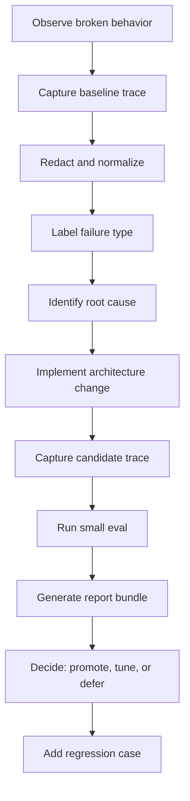

# Artifact Evaluation Runbook

## Purpose

This runbook defines how to generate artifacts for the feature changelog cycle without overstating the strength of the data.

The current product does not have enough labeled production volume for statistically strong model evaluation. That is fine. The first eval goal is failure discovery, RCA, regression protection, and architecture comparison.

Do not fabricate eval metrics. If a report is based on fixtures, synthetic examples, or a small hand-labeled set, label it that way.

## Artifact Cycle



## Directory Convention

Use this convention for generated feature artifacts:

```text
docs/interview-artifacts/generated/
  YYYY-MM-DD_<feature>_<dataset>_<variant>_<version>/
    report.md
    metadata.json
    metrics.json
    failure_summary.json
    case_results.jsonl
    source_input.json
    token_breakdown.json
    cost_breakdown.json
    latency_metrics.json
    cost_projection.json
```

## Existing Runnable Evals

Current scripts:

```bash
scripts/run_email_classifier_eval.py
scripts/run_search_eval.py
scripts/run_copilot_eval.py
scripts/run_red_team_eval.py
scripts/generate_synthetic_eval_inputs.py
```

Component artifact scripts:

```bash
scripts/run_gmail_classifier_artifact_eval.py
scripts/run_source_retrieval_eval.py
scripts/run_copilot_router_eval.py
scripts/run_radar_evidence_eval.py
scripts/package_feature_artifacts.py
```

Current generated-report helper:

```bash
scripts/generate_ai_report.py \
  --input path/to/report-input.json \
  --output-dir docs/interview-artifacts/generated
```

Current index helper:

```bash
scripts/regenerate_ai_progress_index.py \
  --generated-dir docs/interview-artifacts/generated \
  --output docs/interview-artifacts/ai-system-progress-over-time.md
```

Suite wrapper:

```bash
scripts/run_feature_artifact_suite.py --overwrite
```

The suite currently runs:

```text
gmail_classifier_artifact_eval
source_retrieval_artifact_eval
copilot_router_artifact_eval
radar_evidence_artifact_eval
copilot_grounded_answer_eval
red_team_eval
radar_lineage_report
progress_index
```

Dry run without executing eval scripts:

```bash
scripts/run_feature_artifact_suite.py --dry-run --no-radar-lineage
```

Generate broader deterministic synthetic coverage inputs:

```bash
scripts/generate_synthetic_eval_inputs.py
```

Run the suite against the broader synthetic profile:

```bash
scripts/run_feature_artifact_suite.py --dataset-profile synthetic --overwrite
```

Use the synthetic profile to expose missing bins and routing/retrieval gaps.
Use the default seed profile for smaller hand-reviewed regression artifacts.

The suite wrapper records command status in:

```text
docs/interview-artifacts/generated/feature-artifact-suite-summary.json
```

## Feature Artifact Plans

## Cost Reporting Standard

Every feature artifact should include a measured baseline and a modeled candidate cost. Keep these separate.

Measured baseline sources:

```text
AiModelCall.cost_estimate_cents
AiModelCall.prompt_tokens
AiModelCall.context_tokens
AiModelCall.output_tokens
AiModelCall.reasoning_tokens
AiModelCall.cached_input_tokens
ResearchRunStep.cost_estimate_cents
ResearchRunStep.token metadata
JobSearchProviderUsage.request_count
generated report cost_breakdown.json
generated report token_breakdown.json
```

Standard cost projection shape:

```json
{
  "feature": "gmail_classifier",
  "period": "monthly",
  "evidence_status": "projection_from_measured_baseline",
  "baseline": {
    "events": 1000,
    "model_call_rate": 1.0,
    "avg_cost_cents_per_model_call": 0.0,
    "estimated_total_cost_cents": 0.0
  },
  "candidate": {
    "events": 1000,
    "model_call_rate": 0.25,
    "avg_cost_cents_per_model_call": 0.0,
    "estimated_total_cost_cents": 0.0
  },
  "delta": {
    "model_calls_avoided": 750,
    "cost_delta_cents": 0.0,
    "cost_reduction_percent": 75.0
  },
  "assumptions": [
    "Example numbers are placeholders unless generated from telemetry.",
    "Vendor prices must be dated if used directly."
  ]
}
```

Minimum cost metrics:

```text
model_call_rate
avg_input_tokens
avg_context_tokens
avg_output_tokens
avg_cost_cents_per_call
cost_per_1000_events
cost_per_successful_result
latency_p50_p95
fallback_rate
```

### Gmail Classifier

Baseline trace:

```text
email_classifier_baseline_trace.jsonl
```

Required fields:

```json
{
  "case_id": "email-001",
  "source": "fixture_or_redacted_production",
  "subject_redacted": "Interview with <company>",
  "sender_domain": "greenhouse.io",
  "expected_job_related": true,
  "expected_category": "interview_request",
  "current_decision": "interview_request",
  "current_model_used": true,
  "failure_type": null
}
```

Candidate trace:

```text
email_classifier_hybrid_decision_trace.jsonl
```

Must include:

- decision path
- matched features
- model used or skipped
- confidence band
- redaction summary
- status update decision

Primary metrics:

```text
job_related_recall
job_related_precision
category_accuracy
automatic_status_update_precision
llm_call_rate
privacy_redaction_pass_rate
```

Cost artifact:

```text
email_classifier_cost_projection.json
```

Cost driver:

```text
synced_email_count
  * ai_eligible_rate
  * model_call_rate
  * avg_cost_per_email_classifier_call
```

### Search and Source Intelligence

Baseline trace:

```text
search_baseline_topk.jsonl
```

Required fields:

```json
{
  "query": "data analyst bank of america",
  "expected_result_type": "verified_job_posting",
  "top_k": [],
  "failure_type": "retrieval_miss"
}
```

Candidate trace:

```text
search_direct_source_topk.jsonl
```

Must include:

- source type
- source tier
- source status
- ranking feature trace
- direct source or broad fallback mode

Primary metrics:

```text
recall_at_10
mrr_at_10
verified_source_coverage
generic_source_rate
broad_fallback_rate
private_url_false_public_rate
```

Cost artifact:

```text
search_source_cost_projection.json
```

Cost driver:

```text
search_request_count
  * broad_provider_fallback_rate
  * avg_broad_provider_cost_per_request
```

Direct source retrieval is not free, but it should mostly shift cost from paid broad-provider calls to lower-cost provider API/fetch work plus verification jobs.

### Radar

Baseline trace:

```text
radar_baseline_run_trace.json
radar_baseline_source_items.jsonl
radar_baseline_evidence_items.jsonl
```

Required failure labels:

```text
empty_page
generic_evidence
wrong_company
wrong_role
missing_citation
unsupported_claim
```

Candidate trace:

```text
radar_source_grounded_run_trace.json
radar_evidence_quality_scores.jsonl
```

Must include:

- source tier
- source trust
- specificity score
- company match score
- role match score
- recency score
- missing-data reason

Primary metrics:

```text
tier1_or_tier2_evidence_rate
generic_evidence_rate
empty_page_evidence_rate
citation_coverage
unsupported_claim_rate
missing_data_stated_rate
```

Cost artifact:

```text
radar_cost_projection.json
```

Cost driver:

```text
research_run_count
  * avg_llm_steps_per_run
  * avg_cost_per_llm_step
```

A better metric is:

```text
cost_per_supported_finding
```

because cheap generic reports are not actually successful.

### Copilot

Baseline trace:

```text
copilot_baseline_transcripts.jsonl
```

Required fields:

```json
{
  "case_id": "copilot-001",
  "user_message": "Create me a Radar for data analyst jobs at Bank of America",
  "expected_route": "radar_tracker_create_or_update",
  "current_route": null,
  "current_answer_type": "generic_answer",
  "failure_type": "missing_route"
}
```

Candidate trace:

```text
copilot_router_decision_trace.jsonl
copilot_route_case_results.jsonl
```

Must include:

- route
- confidence
- entities
- clarification needed
- tools used
- citation validation
- action proposal status

Primary metrics:

```text
route_accuracy
missing_route_rate
wrong_route_rate
clarification_precision
clarification_recall
answer_groundedness
safe_action_rate
```

Cost artifact:

```text
copilot_cost_projection.json
```

Cost driver:

```text
message_count
  * route_model_call_rate
  * answer_model_call_rate
  * avg_context_tokens
  * avg_output_tokens
```

The target is not always fewer calls. Sometimes a cheap route classifier prevents a more expensive generic answer or avoids repeated follow-up questions caused by bad routing.

## Report Input Template

Use a structured source input like this before calling `scripts/generate_ai_report.py`:

```json
{
  "metadata": {
    "title": "Copilot Router Eval",
    "report_type": "copilot-router-eval",
    "dataset_version": "copilot-router-v1",
    "model": "route-tools",
    "prompt_version": "router-v1",
    "decision": "needs_more_data",
    "recommendation": "ship behind flag for internal testing"
  },
  "metrics": {
    "route_accuracy": 0.0,
    "missing_route_rate": 0.0
  },
  "token_breakdown": {},
  "cost_breakdown": {},
  "latency_metrics": {},
  "supporting_artifacts": [],
  "notes": [
    "Small fixture-based eval. Use for failure discovery, not statistical proof."
  ]
}
```

## Promotion Criteria

Do not promote a feature change just because the demo looks better.

Minimum criteria:

- no new privacy failures
- no unsupported-claim regression
- no severe route regression
- no automatic status update regression
- known failures are labeled
- report bundle exists
- failure summary has RCA categories

Acceptable decisions:

```text
approved_for_demo_artifact
ship_behind_flag_internal
needs_more_labels
blocked_privacy_regression
blocked_quality_regression
defer_overbuilt_for_current_scale
```

## Workflow Narrative

The strongest implementation narrative is not "we solved AI with evals." The strongest implementation narrative is:

1. I observed failures in real product flows.
2. I captured them as artifacts.
3. I labeled the failure modes.
4. I changed the architecture to make the system more deterministic.
5. I reran the same cases.
6. I used the result to decide the next iteration.

That is the engineering loop expected from serious AI/Search work.
