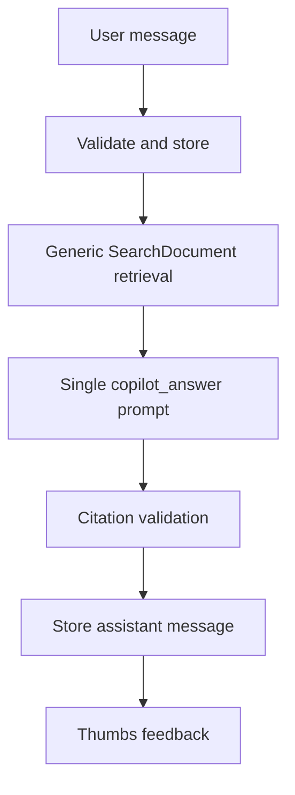
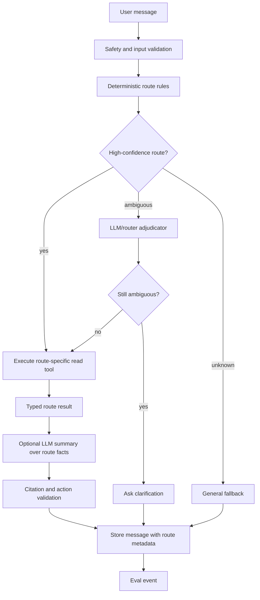

# Copilot Routing Changelog

## Architecture Decision Context

Copilot should not be one generic retrieval prompt. Users ask product-specific questions: create a Radar tracker, explain why a Radar run failed, find jobs from verified sources, diagnose Gmail sync, or identify applications needing follow-up. A generic assistant cannot reliably handle that because it does not know which product subsystem to use.

The rework should introduce a router, typed read tools, clarification questions, and route-specific evals. The LLM can help interpret ambiguous language, but the final answer should come from deterministic product data and validated route outputs.

The workflow here is:

```text
inspect current generic Copilot answer path
  -> collect failed/misrouted product questions
  -> label expected route and missing product data
  -> add deterministic route rules and typed read tools
  -> use LLM only for ambiguous route adjudication or final wording
  -> evaluate route accuracy, clarification quality, grounding, and action safety
```

## Current Implementation

Current code:

- `backend/routes/copilot.py`
- `backend/services/copilot/orchestrator.py`
- `backend/services/copilot/retrieval.py`
- `backend/services/copilot/guardrails.py`
- `backend/services/copilot/schemas.py`
- `dashboardv2/src/components/copilot/CopilotPanel.tsx`
- `backend/services/evals/assistant_eval.py`
- `evals/copilot/copilot_questions_v1.jsonl`
- `evals/copilot/failure-taxonomy.md`

Current flow:

```text
POST /api/copilot/conversations/{id}/messages
  -> validate message and rate limits
  -> store user message
  -> retrieve SearchDocument context
  -> call copilot_answer JSON task
  -> validate citations
  -> store assistant message
  -> collect feedback
```

Current strengths:

- Copilot is user-scoped and read-only.
- Prompt extraction and oversized messages are rejected.
- Answers must cite retrieved `SearchDocument` IDs when context is available.
- Feedback is persisted.
- AI model call telemetry and safety decisions exist.

Current weakness: there is no product router. A request like "create me a Radar" is not treated as a Radar tracker creation/update flow. It is treated as a generic question over retrieved documents.

## Current Architecture



## Current Failure Modes

### Wrong or Missing Route

The assistant does not know that a request belongs to a product workflow.

Example:

```text
User: "Create me a Radar for data analyst jobs at Bank of America."
Current behavior: generic explanation or weak search answer.
Expected behavior: route to radar_tracker_create_or_update, collect missing fields, propose typed action.
```

### Retrieval Fallback Instead of Tool Use

The model may search generic indexed text when it should read structured product tables.

Examples:

- Radar run diagnostics should read `ResearchRun` and `ResearchRunStep`.
- Gmail sync diagnostics should read `EmailSyncAudit`.
- Source questions should read `CompanyJobSource` and `SourceVerificationRun`.
- Follow-up questions should read `Application` and related `EmailEvent`.

### No Clarification Path

Ambiguous requests are answered instead of clarified.

Example:

```text
"Show me what's going on with Google."
```

This could mean applications, Radar, job search, company source health, or emails.

### No Route Eval

Because no route is stored, route accuracy cannot be measured.

## Target Architecture



## Route Registry

Initial routes:

| Route | Purpose | Reads |
| --- | --- | --- |
| `radar_run_diagnostics` | Explain failed/stale Radar runs. | `ResearchRun`, `ResearchRunStep`, reports, source/evidence counts. |
| `radar_report_question` | Answer questions about a specific report. | `ResearchReport`, sections, evidence, source items. |
| `radar_tracker_create_or_update` | Collect fields and propose tracker creation/update. | Existing trackers, user preferences. |
| `job_search` | Find jobs with direct source status. | `resolve_job_search`, `JobPosting`, provider status. |
| `job_source_question` | Explain company source health. | `CompanyJobSource`, `SourceVerificationRun`. |
| `application_pipeline_question` | Summarize applications and follow-ups. | `Application`, `EmailEvent`, deadlines. |
| `gmail_sync_diagnostics` | Explain sync status and safe next steps. | Gmail connection, `EmailSyncAudit`. |
| `source_privacy_settings` | Explain private links and source consent. | Redacted `UserApplicationLink`, consent state. |
| `settings_navigation` | Help user find product settings. | Static route metadata. |
| `general_career_advice` | Generic answer when no product route applies. | Optional retrieved context. |

## Route Decision Contract

```json
{
  "intent": "radar_tracker_create_or_update",
  "confidence": 0.88,
  "calibrated_confidence": 0.84,
  "entities": {
    "company": "Bank of America",
    "role": "data analyst",
    "location": null
  },
  "needs_clarification": true,
  "clarification_question": "Which location or remote preference should I use for this Radar tracker?",
  "allowed_tools": ["radar.tracker.preview_create"],
  "safety_flags": []
}
```

## Route Result Contract

```json
{
  "answer_facts": [
    {
      "fact_type": "missing_field",
      "field": "location",
      "value": null
    }
  ],
  "citations": [],
  "suggested_actions": [
    {
      "action_type": "radar_tracker_create",
      "requires_confirmation": true,
      "read_only": false,
      "payload_schema": "radar_tracker_create_v1"
    }
  ],
  "tool_trace": {
    "route": "radar_tracker_create_or_update",
    "tools": ["radar.tracker.preview_create"]
  },
  "requires_confirmation": true
}
```

## Deterministic vs LLM Boundary

Use deterministic logic for:

- known route phrases
- permissions
- user scope
- route tool execution
- data retrieval
- action schemas
- confirmation requirements
- citation validation

Use LLM for:

- ambiguous intent disambiguation
- natural-language summary over route facts
- friendly clarification wording

Do not use LLM for:

- directly mutating product state
- inventing product capabilities
- deciding permissions
- fabricating citations
- answering route-specific questions without route data

## Cost Model

### Current Cost Drivers

Current Copilot cost scales with generic model answers:

```text
message_count
  * answer_model_call_rate
  * avg_context_tokens
  * avg_output_tokens
```

Measured fields:

```text
AiModelCall.surface = copilot
AiModelCall.task_name = copilot_answer
AiModelCall.prompt_tokens
AiModelCall.context_tokens
AiModelCall.output_tokens
AiModelCall.total_tokens
AiModelCall.cost_estimate_cents
AiModelCall.latency_ms
CopilotFeedback rating
CopilotMessage metadata
```

The hidden cost is repeat traffic. If Copilot misses the route, the user asks follow-up questions, which creates more model calls without solving the task.

### Target Cost Shape

Routing changes the cost structure:

```text
target_cost =
  deterministic_route_rate * route_tool_cost
  + ambiguous_route_rate * router_adjudicator_cost
  + summarization_rate * scoped_answer_cost
```

Some routed answers may not need an LLM response at all. Others may still use a model, but with smaller route-specific context.

Important tradeoff: a small router/adjudicator call can be worth it if it prevents a large generic answer or prevents repeated follow-up turns.

### Cost Artifacts

Generate:

```text
copilot_cost_baseline.json
copilot_cost_after.json
copilot_cost_projection.json
```

Required fields:

```json
{
  "message_count": 0,
  "generic_answer_call_rate": 0.0,
  "route_model_call_rate": 0.0,
  "deterministic_route_rate": 0.0,
  "avg_context_tokens": 0,
  "avg_output_tokens": 0,
  "avg_cost_cents_per_message": 0.0,
  "cost_per_successful_answer_cents": 0.0,
  "repeat_question_rate": 0.0,
  "generic_answers_avoided": 0,
  "evidence_status": "measured | projected | fixture"
}
```

## Artifacts to Generate

Baseline artifacts:

```text
copilot_baseline_transcripts.jsonl
copilot_baseline_retrieval_context.jsonl
copilot_wrong_route_cases.jsonl
copilot_missing_route_cases.jsonl
copilot_baseline_metrics.json
```

Candidate artifacts:

```text
copilot_router_decision_trace.jsonl
copilot_route_case_results.jsonl
copilot_route_confusion_matrix.json
copilot_clarification_cases.jsonl
copilot_answer_grounding_after.jsonl
copilot_candidate_metrics.json
copilot_failure_summary_after.json
```

Generated report bundle:

```text
docs/interview-artifacts/generated/
  YYYY-MM-DD_copilot-router_copilot-router-v1_route-tools_v1/
```

## Eval Metrics

```text
route_accuracy
missing_route_rate
wrong_route_rate
clarification_precision
clarification_recall
route_tool_success_rate
answer_groundedness
citation_coverage
unsupported_claim_rate
safe_action_rate
user_feedback_reward_rate
```

Important route eval cases:

- "Create me a Radar for X."
- "Why did my Radar fail?"
- "Find data analyst jobs at X."
- "Which applications need follow-up?"
- "Why did Gmail not sync?"
- "Are my private application links shared?"
- "What sources do we have for X?"

## Implementation Changelog

### Phase 1: Add Route Registry

- Add `backend/services/copilot/router.py`.
- Add deterministic route rules.
- Add route metadata to `CopilotMessage.metadata_json`.

### Phase 2: Add Read-Only Tools

Implement the first safe routes:

- Radar run diagnostics
- Radar report Q&A
- job search/source status
- application follow-up summary
- Gmail sync diagnostics
- source privacy/settings

### Phase 3: Add Clarification

- Ask one concise question when route confidence is ambiguous.
- Store the clarification route and missing fields.

### Phase 4: Add Route Evals

- Build `backend/services/evals/copilot_router_eval.py`.
- Add confusion matrix and missing-route analysis.
- Turn failed route cases into new route rules or labeled examples.

### Phase 5: Add Proposed Actions

- Keep actions disabled by default.
- Allow model to propose typed actions only.
- Require backend validation and explicit user confirmation before mutation.

## Business Tradeoffs

Read-only routed Copilot gives most of the product value with much less risk than autonomous agents.

The user experience improves because Copilot can finally answer product questions from product tables. The risk stays bounded because route tools are typed and scoped.

## Future Scaling Path

Only after route eval data grows:

- train a lightweight route classifier
- add embedding similarity for route/entity matching
- add reranking for retrieved context
- introduce confirmed mutations for narrow actions

Do not lead with agentic automation. The first reliability issue is routing, not model intelligence.
