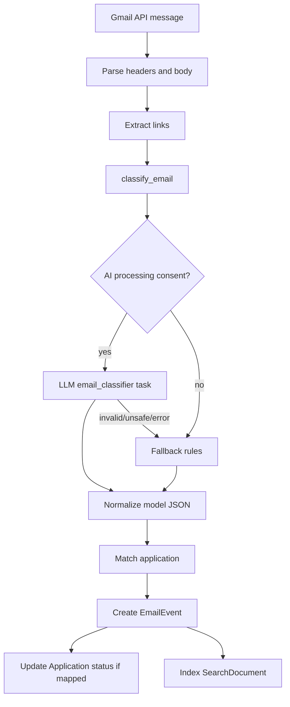
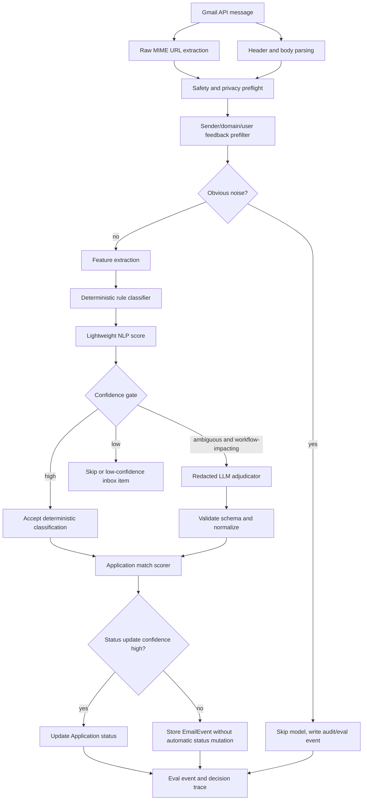

# Gmail Classifier Changelog

## Architecture Decision Context

Gmail classification is a finite-label, high-volume workflow problem. It should not be built as "send every email to an LLM and trust the JSON." That is costly, hard to debug, and unnecessarily exposes user email content to a model.

The better architecture is rules and lightweight NLP first, with LLM adjudication only when the message is ambiguous and the outcome affects the user workflow.

The workflow here is:

```text
inspect current Gmail sync/classifier code
  -> capture baseline LLM call behavior and classifier mistakes
  -> separate job-related recall from automatic status precision
  -> identify privacy and cost risk from AI-first classification
  -> move obvious cases to deterministic rules/NLP
  -> keep LLM only for ambiguous workflow-impacting emails
  -> evaluate recall, precision, LLM call rate, and privacy redaction
```

## Current Implementation

Current code:

- `backend/services/email_classifier.py`
- `backend/services/email_filter.py`
- `backend/services/email_matcher.py`
- `backend/services/email_parser.py`
- `backend/tasks/poll_gmail.py`
- Gmail sync route in `backend/main.py`
- `backend/services/evals/classifier_eval.py`
- `evals/email_classifier/email_classifier_v1.jsonl`

Current classifier labels:

```text
job_update
interview_request
rejection
offer
action_item
conversation
not_relevant
```

Current behavior:

1. Gmail sync pulls a message.
2. Headers and body are parsed.
3. Links are extracted and source-intelligence storage may run.
4. `classify_email(...)` calls the AI classifier when AI consent is enabled.
5. If the AI classifier is disabled, unsafe, invalid, or unavailable, the code falls back to deterministic phrase/domain rules.
6. The email may be matched to an application.
7. An `EmailEvent` is created.
8. Application status may be updated.
9. The event is indexed into search.

Important current issue: deterministic filtering exists, but it is not the main front door everywhere. `email_filter.py` contains useful logic such as ATS domains, non-job domains, automated sender hints, recruiting/job phrases, and `should_classify(...)`, but scheduled polling and API sync do not consistently share one pipeline.

Current sync-window behavior:

- Manual sync uses a fixed lookback on first run or when the caller explicitly passes `days`.
- After a user has sync audit history, manual sync switches to an incremental Gmail query based on the last sync audit timestamp with a one-day overlap for Gmail date-query granularity.
- Existing `gmail_message_id` values are checked before full fetch/classification, so already stored messages are not classified again.
- This is still lighter than a true Gmail History API cursor. The production target is to store a durable Gmail history cursor and use date-based sync only for backfill and recovery.

## Current Architecture



## Current Failure Modes

### Privacy and Data Minimization

If the AI path runs first, more email content reaches the model than necessary. Even with user consent, this is weaker data minimization than required for a Gmail-heavy product.

Risk artifacts to capture:

```text
email_classifier_llm_call_rate.json
email_classifier_payload_redaction_sample.jsonl
email_classifier_noise_sent_to_llm.jsonl
```

### Cost and Latency

Obvious emails should not require an API call:

- known non-job notification domains
- obvious promotional/system noise
- obvious ATS application confirmations
- obvious rejection, interview, offer, or assessment phrases

Latency should be treated as a first-class product metric. Gmail sync should report sync duration, message count, classification count, skip count, source-link failure count, indexing failure count, and eventually per-stage p50/p95. A user-triggered incremental sync should be quick; long historical backfills should move to background work with progress state instead of holding the UI open.

### Recall and Precision Tradeoff

The classifier has two different business goals:

- **Job-related recall:** high. Missing a job-related email hurts user trust.
- **Automatic status precision:** very high. Incorrectly moving an application to rejected/interview/offer is more harmful than simply surfacing an extra email.

The current flow does not make that split explicit enough.

### Incomplete Decision Trace

The current output does not consistently expose:

- matched phrases
- sender-domain category
- URL features
- user feedback blocklist hit
- confidence band
- ambiguity reason
- model used or skipped reason

Without that trace, debugging becomes "the model got it wrong" instead of "we missed a sender-domain rule" or "the threshold was too aggressive."

## Target Architecture



## Component Boundary

Gmail classification is the signal layer. It should not directly create applications, calendar events, network contacts, or draft replies. Those are downstream product actions that consume classifier output, matching evidence, and user confirmation.

The boundary should be:

```text
Gmail ingestion
  -> email classification
  -> email routing
  -> entity extraction and matching
  -> action suggestion
  -> user-confirmed action execution
```

### Email Classification

Answers:

```text
Is this job-related?
What lifecycle category does it belong to?
How confident is the system?
Which features drove the decision?
Was the LLM used?
```

Output shape:

```json
{
  "job_related": true,
  "classification": "interview_request",
  "confidence": 0.91,
  "confidence_band": "high",
  "decision_path": "rules_high_confidence",
  "model_used": false,
  "matched_features": [
    "scheduler_url",
    "interview_phrase",
    "known_application_company_match"
  ]
}
```

### Email Routing

Answers:

```text
Where should this email appear in the product?
```

Route values:

```text
skip
application_inbox
conversation
low_confidence_review
source_discovery_candidate
```

Examples:

| Classifier signal | Routing evidence | Route |
| --- | --- | --- |
| `not_relevant` | Noise score high | `skip` |
| `interview_request` | Matched active application | `application_inbox` |
| `conversation` | Human recruiter, no specific app match | `conversation` |
| `job_update` | Company/job signal but weak app match | `low_confidence_review` |
| `job_update` | Public posting/source URL, no application yet | `source_discovery_candidate` |

### Entity Extraction and Matching

Answers:

```text
Which application, company, contact, or job source does this email refer to?
```

Output shape:

```json
{
  "application_match": {
    "application_id": "uuid",
    "confidence": 0.88,
    "matched_on": ["company_domain", "role_token"]
  },
  "contact_candidate": {
    "name": "Alex Recruiter",
    "email": "alex@company.example",
    "company": "Example Co",
    "confidence": 0.82
  },
  "job_source_candidate": {
    "provider_type": "greenhouse",
    "safe_public_url": "https://boards.greenhouse.io/example/jobs/123",
    "confidence": 0.79
  }
}
```

### Action Suggestion

Answers:

```text
What user-facing actions should be offered?
```

Actions are suggestions, not automatic mutations:

```json
{
  "actions": [
    {
      "type": "create_interview",
      "label": "Add to calendar",
      "confidence": 0.84,
      "requires_user_confirmation": true
    },
    {
      "type": "create_contact",
      "label": "Add to network",
      "confidence": 0.82,
      "requires_user_confirmation": true
    },
    {
      "type": "create_application",
      "label": "Add to pipeline",
      "confidence": 0.76,
      "requires_user_confirmation": true
    }
  ]
}
```

Mapping examples:

| Route | Classification | Entity evidence | Suggested action |
| --- | --- | --- | --- |
| `application_inbox` | `interview_request` | Application match and time/scheduler signal | `create_interview` |
| `application_inbox` | `action_item` | Application match and deadline/task signal | `mark_action_needed` |
| `source_discovery_candidate` | `job_update` | Company/job URL and no existing application | `create_application` |
| `conversation` | `conversation` | Human sender and no existing contact | `create_contact` |
| `conversation` | `conversation` | Prior thread or reply-needed signal | `draft_reply` |

### User-Confirmed Action Execution

Only deterministic endpoints mutate product state:

```text
create_application -> Application
create_interview -> Interview / calendar view
create_contact -> Contact / Network
draft_reply -> Draft writer
mark_action_needed -> EmailEvent/Application task state
```

This keeps the classifier reusable and testable. The model or rules produce structured intent and evidence; product code owns routing, validation, and mutation.

## Target Data Contracts

### Email Candidate

```json
{
  "sender_email": "careers@example.com",
  "sender_domain": "example.com",
  "subject": "Application received",
  "body_text_redacted": "short sanitized excerpt",
  "raw_candidate_url_count": 2,
  "received_at": "timestamp",
  "user_company_domains_count": 4,
  "feedback_blocked_domain": false
}
```

### Classification Result

```json
{
  "classification": "interview_request",
  "confidence": 0.93,
  "confidence_band": "high",
  "decision_path": "deterministic_rule",
  "model_used": false,
  "matched_features": [
    "sender_domain_is_ats",
    "contains_interview_phrase",
    "contains_scheduler_url"
  ],
  "ambiguity_reasons": [],
  "action_needed": true,
  "safe_for_status_update": true
}
```

## Deterministic vs LLM Boundary

Use deterministic logic for:

- known noise
- ATS sender domains
- user feedback blocklists
- lifecycle phrases
- URL safety
- application matching features
- status update thresholds

Use LLM adjudication for:

- human recruiter messages with weak lexical signals
- messages with conflicting status cues
- recruiter-agency messages where company extraction is ambiguous
- nuanced "not selected now, but keep in touch" outcomes

Do not use LLM for:

- prompt-injection-like content
- obvious notification noise
- private URL safety decisions
- automatic status mutation without deterministic validation

## Business Tradeoffs

### Recall Bias

For Gmail, the right first-pass bias is recall. A missed interview request is much worse than an irrelevant notification appearing in the AppTrail inbox.

But that does not mean all downstream actions should be recall-biased:

| Decision | Bias |
| --- | --- |
| Bring into possible job email flow | Higher recall |
| Show as low-confidence item | Balanced |
| Match to application | Balanced to high precision |
| Automatically update application status | High precision |
| Send email content to LLM | Minimize and justify |

### Privacy Bias

Even with consent, the system should avoid sending content to the LLM when local rules are enough. That is a product trust decision, not just a cost optimization.

## Cost Model

### Measured Synthetic Lane Evidence

The first lane comparison used `evals/email_classifier/email_classifier_synthetic_v1.jsonl` with 150 synthetic, sanitized examples. This is not statistical proof of production quality. It is a controlled architecture probe: can the current LLM path handle clean taxonomy cases, and what does that cost in latency, money, and privacy exposure?

Generated artifacts:

- [Rules-only synthetic baseline](../generated/2026-05-06_gmail-classifier-artifact-eval_email-classifier-synthetic-v1_fallback-rules_rules-v1/report.md)
- [Live LLM synthetic baseline](../generated/2026-05-06_gmail-classifier-live-llm-artifact-eval_email-classifier-synthetic-v1_gpt-4o-mini_v3/report.md)
- [Rules vs live LLM lane comparison](../generated/2026-05-06_gmail-classifier-lane-comparison_email-classifier-synthetic-v1_fallback-rules-vs-gpt-4o-mini_rules-v1-vs-v3/report.md)

Measured result:

| Metric | Rules-only lane | Live LLM lane | Interpretation |
| --- | ---: | ---: | --- |
| Category accuracy | 0.68 | 1.00 | LLM resolved the clean taxonomy cases that rules missed. |
| Stage accuracy | 0.50 | 1.00 | Rules need stronger routing for lifecycle categories. |
| Job-related recall | 1.00 | 1.00 | Both lanes preserved the most important first-pass objective. |
| Failed cases | 48 | 0 | Synthetic failures were category/stage routing failures, not missed job emails. |
| LLM call rate | 0.00 | 1.00 | Live lane sends every classified email through the model. |
| Avg latency | 0.1 ms | 2538.3 ms | LLM-first sync does not scale as an interactive sync path. |
| p95 latency | 0.275 ms | 4510.8 ms | Tail latency becomes visible at email-batch scale. |
| Cost per 1,000 emails | 0 cents | 14.0685 cents | Dollar cost is acceptable early, but grows linearly with sync volume. |

Important finding: `100%` synthetic accuracy is not the product decision. The product decision is that an LLM-first pipeline buys clean-case routing quality by paying a per-email cost, latency, and privacy tax.

Scale math from the measured live lane:

```text
100 users * 400 emails = 40,000 emails
40,000 / 1,000 * 14.0685 cents = 562.74 cents
= $5.63 per full sync
```

Daily full reprocessing would compound:

```text
100 users daily:   ~$5.63/day    ~$168.82/month
1,000 users daily: ~$56.27/day   ~$1,688/month
10,000 users daily: ~$562.74/day ~$16,882/month
```

The latency shape is worse than the early dollar cost:

```text
400 emails/user * 2.538s avg model latency = 1,015s
= 16.9 minutes per user sequential

40,000 emails * 2.538s = 101,520s
= 28.2 hours sequential
```

Concurrency can reduce wall-clock time, but it moves the problem into queue depth, rate limits, retries, model-provider burst capacity, and operational cost. If auto-sync runs for many users around the same time, an LLM-first Gmail sync becomes a model batch-processing system instead of a lightweight product sync.

Privacy finding:

- The live lane currently evaluates full synthetic email text through the safety gateway.
- Real Gmail messages would contain user-private names, emails, phone numbers, recruiter details, URLs, candidate IDs, scheduler links, and other PII unless redaction/minimization runs first.
- Even with consent, sending every email to the LLM is weaker data minimization than this product needs.

Architecture response:

1. Keep recall high at the front door.
2. Use deterministic and lightweight NLP filters before any model call.
3. Route obvious noise and obvious lifecycle emails locally.
4. Call the LLM only for ambiguous, workflow-impacting cases.
5. Redact and minimize before LLM adjudication.
6. Force LLM output back into deterministic labels, confidence bands, and status-update gates.

This evidence supports a hybrid architecture, not because the LLM failed, but because the LLM succeeded in a way that is too expensive and privacy-expansive to use as the first layer.

### Hybrid Lane v1 Implementation

The next implementation step is classification-only. It does not change Gmail sync product behavior yet and does not add action buttons. The new lane exists so we can compare architectures before changing production routing.

Implemented code:

```text
backend/services/gmail_intelligence/
  __init__.py
  types.py
  normalizer.py
  privacy.py
  feature_extractor.py
  scorer.py
  classifier.py
  adjudicator.py
  orchestrator.py
```

Eval integration:

```text
backend/services/evals/classifier_eval.py
scripts/run_gmail_classifier_artifact_eval.py --variant hybrid_rules_nlp_llm_v1
```

Tests:

```text
tests/test_gmail_intelligence.py
tests/test_classifier_eval.py
```

The hybrid lane adds two preprocessing tracks:

| Track | Used for | Data handling |
| --- | --- | --- |
| Local NLP normalization | Feature extraction and deterministic scoring | Raw user email may be inspected in backend memory, but raw text is not written to traces/artifacts. |
| LLM privacy minimization | Ambiguous-case LLM adjudication | Email addresses, phone numbers, raw/private URLs, scheduler links, and candidate/application identifiers are redacted before model use. |

Threshold config:

```json
{
  "version": "classifier-thresholds-v1",
  "job_related_accept": 0.55,
  "job_related_ambiguous": 0.35,
  "noise_skip": 0.75,
  "category_accept": 0.70,
  "category_margin": 0.20,
  "llm_escalation_min_job_score": 0.45,
  "llm_call_rate_budget": 0.25
}
```

Initial scorer structure:

```text
EmailCandidate
  -> normalize_email
  -> extract_email_features
  -> score_email
  -> deterministic_classify
  -> optional redacted LLM adjudication when ambiguous
```

Generated artifact:

- [Hybrid rules/NLP/LLM synthetic lane](../generated/2026-05-06_gmail-classifier-hybrid-artifact-eval_email-classifier-synthetic-v1_hybrid-rules-nlp-llm_classifier-thresholds-v1/report.md)

Measured result after calibration:

| Metric | Hybrid lane v1 |
| --- | ---: |
| Category accuracy | 1.00 |
| Stage accuracy | 1.00 |
| Job-related recall | 1.00 |
| Failed cases | 0 |
| LLM call rate | 0.00 |
| Avg latency | 0.18 ms |
| p95 latency | 0.314 ms |
| Cost per 1,000 emails | 0 cents |

Calibration notes:

1. The first hybrid run caught a deterministic coverage gap: the rejection phrase `"will not be moving forward"` did not match the older `"not moving forward"` rule because the actual text contained `"not be moving forward"`.
2. The first hybrid run also sent synthetic conversation cases to the LLM because generic `candidate portal` evidence kept `job_update` too close to `conversation`. The scorer now caps generic `job_update` when explicit conversation evidence is strong.
3. These fixes are threshold/feature calibration, not proof that the classifier is complete. They show why eval-first implementation is safer than swapping production behavior immediately.

Current interpretation:

```text
Rules-only lane:
  cheap and fast, but weak lifecycle routing

Live LLM lane:
  strong on clean synthetic taxonomy, but sends every email to the model

Hybrid lane v1:
  matches clean synthetic taxonomy locally with zero model calls
```

The next proof point must come from messier redacted Gmail samples. Synthetic data has now done its job: it exposed obvious rule gaps, demonstrated the architecture tradeoff, and gave us a repeatable lane comparison.

### Gmail LLM Preflight Gate

Before any real Gmail content is allowed to reach the LLM adjudicator, the classifier now has a feature-specific preflight gate. This is not a generic agent-safety layer. It is tailored to one bounded task: classify an ambiguous Gmail message into one allowed email category.

Implemented code:

```text
backend/services/gmail_intelligence/preflight.py
backend/services/evals/gmail_preflight_eval.py
scripts/run_gmail_preflight_eval.py
evals/email_classifier/gmail_llm_preflight_synthetic_v1.jsonl
tests/test_gmail_preflight_eval.py
```

The preflight enforces:

| Gate | Gmail classifier behavior |
| --- | --- |
| Local confidence gate | Obvious local decisions do not reach the LLM. |
| Consent gate | Missing AI consent blocks LLM escalation. |
| Prompt-injection gate | Classifier-specific attempts to override labels, reveal prompts, export data, or call tools are blocked. |
| PII redaction | Email addresses and phone numbers are redacted before prompt construction. |
| Private-link redaction | Candidate/application IDs, tokenized URLs, scheduler URLs, and raw ATS URLs are replaced with typed placeholders. |
| Data minimization | Prompt contains redacted subject/body excerpt, local scores, matched features, and URL feature types, not full raw Gmail. |
| Leak detection | Generated preflight prompts are checked for raw email addresses, phone numbers, raw URLs, private URL tokens, and fixture-specific forbidden terms. |
| Bounded execution | The preflight itself makes zero model calls; the future adjudicator remains a single JSON task with deterministic fallback. |

Generated artifact:

- [Gmail classifier LLM preflight eval](../generated/2026-05-06_gmail-classifier-llm-preflight-eval_gmail-llm-preflight-synthetic-v1_no-model-preflight_classifier-thresholds-v1/report.md)

Measured preflight result:

| Metric | Value |
| --- | ---: |
| Case count | 10 |
| Pass rate | 1.00 |
| Expected LLM escalation rate | 0.40 |
| Actual LLM escalation rate | 0.40 |
| Expected block rate | 0.20 |
| Actual block rate | 0.20 |
| Prompt leak rate | 0.00 |
| Redaction pass rate | 1.00 |
| Prompt-injection block rate | 1.00 |
| Model calls | 0 |

The synthetic preflight set covers:

```text
obvious noise
obvious interview request
ambiguous recruiter message
email address redaction
phone redaction
private candidate/application URL redaction
scheduler URL redaction
public ATS URL redaction
classifier prompt injection
missing AI consent
low-signal personal email
obvious private application update that does not need LLM
```

Real Gmail rollout rule:

```text
No real Gmail LLM calls until:
  1. preflight synthetic eval passes,
  2. real Gmail dry run runs with ai_enabled=false,
  3. would-escalate redacted prompt previews are inspected,
  4. prompt leak rate remains 0,
  5. ambiguity rate is acceptable for cost/latency.
```

This lets the next real-data artifact measure messy inbox behavior without immediately exposing private email text to a model.

### Real Gmail EDA Baseline

After synthetic lane and preflight checks passed, the next step was not to tune the classifier immediately. The next step was to inspect real Gmail-derived artifacts with no new LLM calls.

Reproducible runner:

```text
scripts/run_gmail_real_eda.py
```

Private local source artifact:

```text
audit/runs/gmail_combined_real_baseline_3acct_2026-05-07T00-22-23Z/
```

Private local EDA outputs:

- [EDA summary](../../../audit/runs/gmail_combined_real_baseline_3acct_2026-05-07T00-22-23Z/eda/eda_summary.md)
- [EDA notebook](../../../audit/runs/gmail_combined_real_baseline_3acct_2026-05-07T00-22-23Z/eda/gmail_classifier_real_eda.ipynb)
- [EDA metrics](../../../audit/runs/gmail_combined_real_baseline_3acct_2026-05-07T00-22-23Z/eda/eda_metrics.json)
- [EDA chart index](../../../audit/runs/gmail_combined_real_baseline_3acct_2026-05-07T00-22-23Z/eda/charts.md)
- [Redacted example clusters](../../../audit/runs/gmail_combined_real_baseline_3acct_2026-05-07T00-22-23Z/eda/redacted_examples.md)

These files are intentionally under `audit/runs/`, which is ignored by git. They are private real-email-derived artifacts and should not be committed.

Real baseline scope:

| Account label | Sync audit decisions | Stored emails | Filtered | Skipped | Stored rate |
| --- | ---: | ---: | ---: | ---: | ---: |
| `account_alumni` | 160 | 110 | 18 | 32 | 68.75% |
| `account_main` | 435 | 173 | 96 | 166 | 39.77% |
| `account_noise` | 100 | 6 | 10 | 84 | 6.00% |

Combined totals:

```text
sync_audit_decisions: 695
stored_product_emails: 289
filtered_not_relevant: 124
skipped_obvious_noise: 282
gmail_classifier_model_calls: 0
overall_stored_rate: 41.58%
```

Current routing bins:

| Current bin | Count |
| --- | ---: |
| `skipped:obvious_noise` | 282 |
| `stored:conversation` | 138 |
| `filtered:not_relevant` | 124 |
| `stored:interview_request` | 73 |
| `stored:job_update` | 33 |
| `stored:rejection` | 23 |
| `stored:action_item` | 22 |

Main EDA finding:

```text
Opportunity-discovery/job-alert-like clusters account for 109 stored events,
or 37.72% of stored emails in this sample.
```

Dominant cluster:

| Sender domain | Current stored count |
| --- | ---: |
| `notifications.joinhandshake.com` | 97 |
| `g.joinhandshake.com` | 10 |
| `em.linkedin.com` | 1 |
| `glassdoor.com` | 1 |

Current classifications for that opportunity-discovery cluster:

| Current classification | Count |
| --- | ---: |
| `interview_request` | 54 |
| `conversation` | 52 |
| `action_item` | 3 |

Visual artifacts generated by the EDA runner:

| Chart | What it is for |
| --- | --- |
| [Current routing bins](../../../audit/runs/gmail_combined_real_baseline_3acct_2026-05-07T00-22-23Z/eda/charts/current_routing_bins.svg) | Shows where real messages are landing today: stored, filtered, or skipped. |
| [Stored classifications](../../../audit/runs/gmail_combined_real_baseline_3acct_2026-05-07T00-22-23Z/eda/charts/stored_classifications.svg) | Shows which classifier bins dominate the product inbox. |
| [Opportunity cluster classifications](../../../audit/runs/gmail_combined_real_baseline_3acct_2026-05-07T00-22-23Z/eda/charts/opportunity_cluster_classifications.svg) | Makes the Handshake/job-alert routing gap visible. |
| [Repeated rule-score clusters](../../../audit/runs/gmail_combined_real_baseline_3acct_2026-05-07T00-22-23Z/eda/charts/confidence_score_clusters.svg) | Shows that current confidence values are rule-score buckets, not calibrated probabilities. |

Interpretation:

The classifier is not just missing a phrase rule. The taxonomy is missing a route. Handshake-style opportunity notifications are job-adjacent, but many are not application lifecycle emails. Because the current classifier has no `opportunity_discovery` or `job_alert` bin, these messages are forced into `conversation`, `interview_request`, or `action_item`.

Confidence audit:

- Current confidence values are deterministic rule scores, not learned probabilities.
- Repeated scores such as `0.86` are evidence of hardcoded rule weights, not model calibration.
- The Handshake interview false-positive pattern is traceable: opportunity emails contain generic words such as `onsite`, which currently match an `interview_request` phrase rule without scheduler or active-application evidence.
- This is acceptable for a pre-labeling baseline, but it should not be described as probabilistic confidence until human labels support calibration.

This is the correct EDA conclusion to drive the next architecture change:

```text
email
  -> obvious noise filter
  -> job-relatedness
  -> applied lifecycle vs opportunity discovery vs human conversation
  -> only applied lifecycle emails receive stage labels such as interview_request/rejection/action_item
```

RCA hypotheses from the notebook:

1. The classifier taxonomy is missing an `opportunity_discovery` / `job_alert` route.
2. Generic opportunity/interview language from Handshake-style digests is being interpreted as active application lifecycle evidence.
3. Medium-confidence conversations are a high-review-load region and should not automatically mutate application state.
4. The next change should add a route layer before stage classification rather than only adding sender domains to a blocklist.

Next eval step:

Label high-yield stored clusters first, especially Handshake/opportunity alerts, then rerun:

```bash
python3 scripts/run_gmail_real_eda.py --run-dir audit/runs/gmail_combined_real_baseline_3acct_2026-05-07T00-22-23Z
```

After a routing change, compare:

```text
stored_rate
interview_request false positives
opportunity_discovery volume
manual_review_rate
sync latency
Gmail classifier LLM call rate
```

Labeling queue artifacts:

- [Labeling guidelines](../../../audit/runs/gmail_combined_real_baseline_3acct_2026-05-07T00-22-23Z/labels/labeling_guidelines.md)
- [Priority label queue](../../../audit/runs/gmail_combined_real_baseline_3acct_2026-05-07T00-22-23Z/labels/label_queue_priority.csv)
- [All stored email label queue](../../../audit/runs/gmail_combined_real_baseline_3acct_2026-05-07T00-22-23Z/labels/label_queue_all_stored.csv)

Reproducible queue generator:

```bash
python3 scripts/create_gmail_labeling_queue.py --run-dir audit/runs/gmail_combined_real_baseline_3acct_2026-05-07T00-22-23Z
```

The labeling schema separates route from subtype:

```text
expected_route:
  filter
  application_inbox
  opportunity_discovery
  conversation
  action_review
  unsure

expected_subtype:
  application_received
  application_status_update
  interview_request
  rejection
  offer
  assessment_or_task
  document_request
  recruiter_outreach
  referral_or_networking
  job_alert
  job_board_promo
  career_fair_or_event
  company_newsletter
  marketing_promo
  system_notification
  personal_email
  school_or_alumni_update
  unknown_other
  unsure
```

This is intentional. Product routing is not the same thing as lifecycle subtype. For example, a Handshake recommendation may be `opportunity_discovery` + `job_alert`; a recruiter asking for time may be `application_inbox` + `interview_request`; a grocery rewards email may be `filter` + `marketing_promo`.

Completed labels should stay local under `audit/runs/`. Once enough rows are reviewed, the EDA script should be extended to compute route accuracy, subtype accuracy, error-bucket counts, and confidence-bucket correctness.

### Priority Label Eval

After labeling the 160-row priority queue, the labels were normalized to the allowed taxonomy and evaluated with:

```bash
python3 scripts/run_gmail_label_eval.py \
  --label-path audit/runs/gmail_combined_real_baseline_3acct_2026-05-07T00-22-23Z/labels/label_queue_priority.csv
```

Private local eval outputs:

- [Priority label eval report](../../../audit/runs/gmail_combined_real_baseline_3acct_2026-05-07T00-22-23Z/labels/eval/label_eval_report.md)
- [Priority label eval metrics](../../../audit/runs/gmail_combined_real_baseline_3acct_2026-05-07T00-22-23Z/labels/eval/label_eval_metrics.json)
- [Priority label eval charts](../../../audit/runs/gmail_combined_real_baseline_3acct_2026-05-07T00-22-23Z/labels/eval/charts.md)
- [Route confusion CSV](../../../audit/runs/gmail_combined_real_baseline_3acct_2026-05-07T00-22-23Z/labels/eval/route_confusion.csv)
- [Subtype confusion CSV](../../../audit/runs/gmail_combined_real_baseline_3acct_2026-05-07T00-22-23Z/labels/eval/subtype_confusion_top.csv)

Important sample caveat:

```text
This is a priority/high-yield human-labeled sample, not a random production sample.
Use it for failure discovery and architecture decisions, not population-level accuracy claims.
```

Priority sample results:

| Metric | Value |
| --- | ---: |
| Labeled rows | 160 |
| Human acceptable | 33.12% |
| Human partial | 3.12% |
| Human not acceptable | 63.75% |
| Route accuracy | 37.50% |
| Subtype exact match | 0.00% |
| Full exact match | 0.00% |
| High-confidence wrong rows | 53 |
| High-confidence wrong rate | 33.12% |

The `0.00%` subtype exact match should not be interpreted as "the classifier is useless." It means the current classifier's labels are too coarse for the new routing taxonomy. For example, `conversation` does not distinguish `recruiter_outreach` from `referral_or_networking`, and `job_update` does not distinguish `application_received`, `job_alert`, or `marketing_promo`.

Human correctness labels:

| Label | Count |
| --- | ---: |
| `no` | 102 |
| `yes` | 53 |
| `partial` | 5 |

Top error buckets:

| Error bucket | Count |
| --- | ---: |
| `false_positive_opportunity_as_lifecycle` | 63 |
| `correct` | 55 |
| `false_positive_marketing_as_conversation` | 25 |
| `wrong_route` | 11 |
| `wrong_stage` | 5 |
| `false_positive_noise` | 1 |

Top route confusions:

| Predicted route | Expected route | Count |
| --- | --- | ---: |
| `conversation` | `conversation` | 55 |
| `application_inbox` | `filter` | 50 |
| `conversation` | `filter` | 39 |
| `conversation` | `application_inbox` | 7 |
| `application_inbox` | `application_inbox` | 5 |
| `application_inbox` | `conversation` | 4 |

Confidence finding:

```text
avg confidence for incorrect rows: 0.6887
avg confidence for partial rows:   0.8600
avg confidence for correct rows:   0.5377
```

That is the core calibration problem. Higher current confidence does not mean higher correctness on this priority sample. This is another signal that the score is a rule weight, not a calibrated probability.

Architecture conclusion from labels:

```text
email
  -> filter/noise
  -> opportunity_discovery
  -> conversation
  -> application_inbox
  -> lifecycle subtype only if application_inbox
```

This is now evidence-backed by synthetic eval, real EDA, and human-labeled priority review. The next implementation should add a route layer before lifecycle subtype classification, especially for opportunity-discovery/job-alert and marketing/promo cases.

### Labeled EDA Workspace

The priority label eval gives headline metrics. The next artifact turns those labels into a data-science workspace for root-cause analysis:

```bash
python3 scripts/run_gmail_labeled_eda.py \
  --label-path audit/runs/gmail_combined_real_baseline_3acct_2026-05-07T00-22-23Z/labels/label_queue_priority.csv
```

Private local workspace outputs:

- [Labeled EDA report](../../../audit/runs/gmail_combined_real_baseline_3acct_2026-05-07T00-22-23Z/labels/labeled_eda/labeled_eda_report.md)
- [Labeled EDA notebook](../../../audit/runs/gmail_combined_real_baseline_3acct_2026-05-07T00-22-23Z/labels/labeled_eda/gmail_labeled_eda_workspace.ipynb)
- [Labeled EDA metrics](../../../audit/runs/gmail_combined_real_baseline_3acct_2026-05-07T00-22-23Z/labels/labeled_eda/labeled_eda_metrics.json)
- [Labeled EDA charts](../../../audit/runs/gmail_combined_real_baseline_3acct_2026-05-07T00-22-23Z/labels/labeled_eda/charts.md)
- [Redacted examples by theme](../../../audit/runs/gmail_combined_real_baseline_3acct_2026-05-07T00-22-23Z/labels/labeled_eda/redacted_examples_by_theme.md)
- [Theme clusters CSV](../../../audit/runs/gmail_combined_real_baseline_3acct_2026-05-07T00-22-23Z/labels/labeled_eda/theme_clusters.csv)
- [Pattern diagnostics CSV](../../../audit/runs/gmail_combined_real_baseline_3acct_2026-05-07T00-22-23Z/labels/labeled_eda/pattern_diagnostics.csv)
- [Error n-gram lift CSV](../../../audit/runs/gmail_combined_real_baseline_3acct_2026-05-07T00-22-23Z/labels/labeled_eda/error_ngram_lift.csv)
- [Feature error lift CSV](../../../audit/runs/gmail_combined_real_baseline_3acct_2026-05-07T00-22-23Z/labels/labeled_eda/feature_error_lift.csv)

Methods used:

```text
human-label validation
route and subtype confusion analysis
pattern prevalence analysis
n-gram lift by error bucket and expected route
matched-feature lift by error bucket
theme clustering from route/subtype/domain/pattern evidence
redacted qualitative example sampling
```

Methods intentionally deferred:

```text
supervised probability model training
transformer or embedding clustering
```

Reason: the current labeled sample is small and deliberately priority-biased. It is strong enough for RCA and architecture decisions, but not strong enough for calibrated probability claims or model-training conclusions.

Theme clusters from the labeled EDA:

| Theme | Count | Not acceptable rate | Top expected subtype | Top error |
| --- | ---: | ---: | --- | --- |
| `handshake_opportunity_discovery` | 60 | 100.00% | `job_alert` | `false_positive_opportunity_as_lifecycle` |
| `recruiter_outreach_conversation` | 38 | 13.16% | `recruiter_outreach` | `correct` |
| `networking_conversation` | 18 | 0.00% | `referral_or_networking` | `correct` |
| `marketing_or_non_job_filter` | 14 | 100.00% | `marketing_promo` | `false_positive_marketing_as_conversation` |
| `application_confirmation` | 12 | 58.33% | `application_received` | `wrong_route` |

Pattern diagnostics:

| Pattern | Matched rows | Wrong rate | Predicted application inbox | Expected filter | Top error |
| --- | ---: | ---: | ---: | ---: | --- |
| `apply_language` | 91 | 80.22% | 53 | 65 | `false_positive_opportunity_as_lifecycle` |
| `onsite_location_language` | 77 | 89.61% | 53 | 61 | `false_positive_opportunity_as_lifecycle` |
| `interview_language` | 75 | 76.00% | 55 | 55 | `false_positive_opportunity_as_lifecycle` |
| `marketing_language` | 17 | 82.35% | 1 | 14 | `false_positive_marketing_as_conversation` |
| `recruiter_language` | 49 | 18.37% | 5 | 3 | `correct` |

N-gram and feature-lift findings:

- `applications due`, `recommendations`, `new job`, `job want`, and `update preferences` are highly associated with `false_positive_opportunity_as_lifecycle`.
- `interview_request_phrase:onsite` appears in 47 `false_positive_opportunity_as_lifecycle` rows and has high error lift.
- `apply_language` is common in rows that should be `filter` or `opportunity_discovery`, so the presence of "apply" cannot be used as direct application-inbox evidence.
- Marketing and finance terms are strong negative features even when the email contains weak job-like language.

Working hypotheses from labeled EDA:

1. `apply` and generic job-alert language are not enough to route to `application_inbox`; the route needs user-applied-process evidence.
2. `onsite` should be treated as location context unless accompanied by scheduler/interview-process evidence.
3. Handshake and job-board alerts need an `opportunity_discovery` route instead of lifecycle classes.
4. Marketing language should be a stronger negative feature before conversation routing.
5. Conversation should split into recruiter outreach and networking only after the route is already `conversation`.

### User Feedback Label Loop

Manual CSV labeling is useful for initial RCA, but it does not scale for a solo-dev product. The product should convert normal user corrections into classifier labels.

The design goal is not to ask users to "train a model." The design goal is to make correction actions useful to the user and capture those corrections as structured eval data.

User-facing correction actions:

```text
Mark as not job-related
Move to Conversations
Move to Application Inbox
Mark as Job Alert
Mark as Recruiter Outreach
Mark as Interview
Correct application match
Hide sender/domain
```

Each correction should create a label record:

```json
{
  "surface": "gmail_classifier",
  "email_event_id": "uuid",
  "user_id": "uuid",
  "predicted_route": "application_inbox",
  "predicted_subtype": "interview_request",
  "user_corrected_route": "opportunity_discovery",
  "user_corrected_subtype": "job_alert",
  "correction_type": "wrong_route",
  "model_version": "hybrid_rules_v1",
  "confidence": 0.86,
  "matched_features": ["interview_request_phrase:onsite"],
  "sender_domain_family": "job_board",
  "created_at": "timestamp"
}
```

Privacy rules:

```text
Do not store raw email body in the feedback table.
Do not store raw sender email if a typed sender feature is enough.
Store references to EmailEvent plus classifier features and redacted evidence only.
Keep user-level correction rows user-scoped.
Use aggregated labels for shared classifier tuning only when privacy and consent rules allow it.
```

Product and modeling value:

```text
More feedback labels
  -> better route rules and thresholds
  -> fewer ambiguous cases
  -> lower LLM fallback rate
  -> lower cost, latency, and privacy exposure
```

This is the right way to compensate for not having bank-scale labeled data. Early on, the LLM fallback covers ambiguous cases after privacy preflight. Over time, user correction labels move frequent cases back into deterministic or lightweight learned routing.

### Route-First Classifier Change Plan

The next classifier change is grounded in the real EDA and labeled priority eval, not in generic model intuition.

Evidence driving the change:

```text
Real EDA:
  opportunity/job-alert-like clusters = 109 stored emails
  opportunity/job-alert-like clusters = 37.72% of stored emails

Priority labeled eval:
  labeled rows = 160
  human not acceptable = 63.75%
  route accuracy = 37.50%
  high-confidence wrong rows = 53

Top error buckets:
  false_positive_opportunity_as_lifecycle = 63
  false_positive_marketing_as_conversation = 25
  wrong_route = 11
  wrong_stage = 5

Labeled EDA:
  handshake_opportunity_discovery = 60 rows, 100% not acceptable
  apply_language = 91 rows, 80.22% wrong
  onsite_location_language = 77 rows, 89.61% wrong
  interview_language = 75 rows, 76.00% wrong
  interview_request_phrase:onsite has high error lift
```

The EDA conclusion:

```text
The main failure is not lack of semantic capacity.
The main failure is that the classifier asks for lifecycle subtype too early.
```

The current classifier lets n-grams like `apply`, `onsite`, `applications due`, and `recommendations` push emails toward application lifecycle labels before the system decides whether the email is actually part of a user-applied process.

The new architecture must interpret words in route context:

| N-gram / signal | Current failure | Route-first interpretation |
| --- | --- | --- |
| `applications due` | Treated as application/lifecycle evidence | `opportunity_discovery` / `job_alert` |
| `recommendations` | Treated as job/application evidence | `opportunity_discovery` / `job_alert` |
| `new job` / `jobs for you` | Treated as application-inbox evidence | `opportunity_discovery` |
| `apply` | Overweights toward `application_inbox` | Weak job-related signal only |
| `onsite` | Triggers `interview_request` | Location context unless scheduler/interview-process evidence exists |
| `view message` | Generic conversation evidence | Strong `conversation` evidence |
| `discount` / `sale` / `offer` | Sometimes survives as conversation | Strong `filter` / marketing evidence |

Target decision architecture:

```text
email
  -> privacy and safety preflight
  -> feature extraction
  -> filter/noise route score
  -> opportunity_discovery route score
  -> conversation route score
  -> application_inbox route score
  -> action_review fallback
  -> subtype classification inside selected route only
  -> LLM escalation only if route ambiguity remains and preflight passes
```

Target routes:

```text
filter
opportunity_discovery
conversation
application_inbox
action_review
```

Route definitions:

| Route | Definition | Automatic status mutation |
| --- | --- | --- |
| `filter` | Not useful in AppTrail or not job/career related enough | Never |
| `opportunity_discovery` | Job alerts, job-board promos, recommended roles, career fairs, company hiring newsletters | Never |
| `conversation` | Recruiter, referral, alumni, networking, exploratory role conversation | Never by default |
| `application_inbox` | Actual application lifecycle tied to a user-applied or candidate process | Only when subtype evidence is high-confidence |
| `action_review` | Job-related but too ambiguous for automatic routing | Never |

Subtype taxonomy after route selection:

```text
application_inbox:
  application_received
  application_status_update
  interview_request
  rejection
  offer
  assessment_or_task
  document_request

conversation:
  recruiter_outreach
  referral_or_networking
  unknown_other

opportunity_discovery:
  job_alert
  job_board_promo
  career_fair_or_event
  company_newsletter

filter:
  marketing_promo
  system_notification
  personal_email
  finance_noise
  retail_noise
  unknown_other
```

Implementation plan:

```text
backend/services/gmail_intelligence/types.py
  - Add route/subtype fields to classifier result contract.
  - Keep old classification for API compatibility during rollout.

backend/services/gmail_intelligence/feature_extractor.py
  - Add route feature groups:
      opportunity_discovery_terms
      marketing_terms
      finance_terms
      retail_terms
      location_context_terms
      application_lifecycle_terms
      scheduler_terms
      conversation_terms
  - Add sender/header derived features in future dry-runs:
      sender_local_type
      sender_domain_family
      has_list_unsubscribe
      sender_display_type

backend/services/gmail_intelligence/scorer.py
  - Add separate route scores:
      filter_score
      opportunity_discovery_score
      conversation_score
      application_inbox_score
  - Downgrade `onsite` from interview evidence to location context.
  - Treat `apply` as weak job-related evidence, not application lifecycle proof.
  - Require stronger application evidence before `application_inbox`.

backend/services/gmail_intelligence/classifier.py
  - Select route first using score, precedence, and margin.
  - Run subtype classifier only inside selected route.
  - Set `status_update_allowed=false` unless route is `application_inbox` with high-confidence subtype evidence.

backend/services/gmail_intelligence/orchestrator.py
  - Escalate to LLM only for unresolved `action_review` / ambiguous workflow-impacting cases.
  - Preserve preflight redaction and prompt-leak checks.

backend/services/evals/classifier_eval.py
scripts/run_gmail_*eval*.py
  - Add route accuracy and subtype accuracy to eval artifacts.
  - Compare before/after route-first metrics against the labeled priority set.
```

Route scoring rules to implement first:

```text
If strong marketing/finance/retail evidence and no strong recruiter/application evidence:
  route = filter

If job-board/platform digest evidence and no scheduler/status/application-match evidence:
  route = opportunity_discovery

If person-like/recruiter conversation evidence and no lifecycle evidence:
  route = conversation

If application confirmation/status/rejection/assessment/scheduler/candidate-process evidence:
  route = application_inbox

If route scores are close and the message is job-related:
  route = action_review
```

Specific EDA-driven feature changes:

```text
applications due -> opportunity_discovery
recommendations -> opportunity_discovery
new job / jobs for you -> opportunity_discovery
update preferences -> opportunity_discovery or filter depending sender/domain
apply -> weak job-related evidence only
onsite -> location_context, not interview_request by itself
view message -> conversation
discount / sale / rewards / offer expires -> filter
```

Expected metric movement after implementation:

| Metric | Current priority baseline | Target next pass |
| --- | ---: | ---: |
| `false_positive_opportunity_as_lifecycle` | 63 | large drop |
| `false_positive_marketing_as_conversation` | 25 | large drop |
| High-confidence wrong rows | 53 | large drop |
| Route accuracy | 37.50% | meaningful increase |
| Would-call-LLM rate on all stored emails | 57.09% | below 25% if possible |
| Prompt leak rate | 0 | 0 |
| Actual LLM calls in dry-run | 0 | 0 |

Rerun process after route-first implementation:

```bash
# 1. Run synthetic classifier eval.
python3 scripts/run_gmail_classifier_artifact_eval.py --variant hybrid_rules_nlp_llm_v1

# 2. Run real Gmail dry run / artifact generation.
# Use dry-run mode first. Do not turn on real LLM calls yet.

# 3. Regenerate real EDA.
python3 scripts/run_gmail_real_eda.py \
  --run-dir audit/runs/gmail_combined_real_baseline_3acct_2026-05-07T00-22-23Z

# 4. Regenerate label eval against existing priority labels.
python3 scripts/run_gmail_label_eval.py \
  --label-path audit/runs/gmail_combined_real_baseline_3acct_2026-05-07T00-22-23Z/labels/label_queue_priority.csv

# 5. Regenerate labeled EDA workspace.
python3 scripts/run_gmail_labeled_eda.py \
  --label-path audit/runs/gmail_combined_real_baseline_3acct_2026-05-07T00-22-23Z/labels/label_queue_priority.csv
```

Labeling loop after implementation:

```text
First compare the new predictions against the existing 160 priority labels.
Do not relabel those rows unless the redacted artifact changed materially.

Then sample a new batch:
  - new high-confidence wrong candidates
  - new would-call-LLM candidates
  - filtered/skipped rows for false-negative checks
  - random accepted rows for unbiased quality estimate

Label only the new sample.
Use old priority labels for before/after regression.
Use new labels for discovering remaining failure modes.
```

### Route-First Implementation Pass

Implementation status: completed locally.

Files changed:

```text
backend/services/gmail_intelligence/types.py
backend/services/gmail_intelligence/feature_extractor.py
backend/services/gmail_intelligence/scorer.py
backend/services/gmail_intelligence/classifier.py
backend/services/gmail_intelligence/preflight.py
backend/services/gmail_intelligence/adjudicator.py
backend/services/email_classifier.py
backend/services/evals/classifier_eval.py
backend/services/evals/gmail_db_dry_run.py
backend/tasks/poll_gmail.py
backend/main.py
tests/test_gmail_intelligence.py
```

Implemented architecture:

```text
NormalizedEmail
  -> EmailFeatures
       sender_domain_family
       sender_local_type
       route_feature_hits
       category_feature_hits
  -> ScoreResult
       route_scores
       subtype_scores
       legacy category_scores
  -> HybridClassificationResult
       route
       subtype
       route_confidence
       subtype_confidence
       status_update_allowed
       legacy classification
```

The main product behavior change is that route controls storage and side effects. Legacy `classification` still exists for compatibility, but it no longer has sole authority to decide whether the email enters the product inbox.

Key code decisions:

```text
1. `onsite` moved out of `INTERVIEW_PHRASES`.
   It is now a `location_context` feature only.

2. Job-board digest terms like `applications due`, `jobs for you`,
   `recommended jobs`, and `update preferences` contribute to
   `opportunity_discovery`, not `application_inbox`.

3. Marketing/finance/retail sender and text signals contribute to `filter`.

4. `application_inbox` requires candidate-process evidence:
   ATS sender/URL, private application URL, lifecycle phrase, scheduler phrase,
   or high-confidence lifecycle subtype.

5. `status_update_allowed` is false unless the selected route is
   `application_inbox` and subtype confidence is strong.

6. Existing Gmail sync skips `filter` and `opportunity_discovery` results for now.
   This prevents Handshake-style alerts from being stored as application inbox
   rows while we do not yet have a dedicated opportunity/source-intelligence sink.

7. LLM escalation still exists, but only for unresolved route/subtype ambiguity
   after safety preflight. High-confidence deterministic route decisions do not
   call the model.
```

Representative regression cases added:

| Case | Expected behavior |
| --- | --- |
| Handshake `New jobs for you` with `onsite` | `opportunity_discovery` / `job_alert`, not `interview_request` |
| Handshake actual scheduler/interview email | `application_inbox` / `interview_request`, status update allowed |
| Retail marketing email with career-ish wording | `filter`, not `conversation` |
| Opportunity discovery classifier payload | not stored as `EmailEvent` yet |

Validation:

```bash
python3 -m py_compile \
  backend/services/gmail_intelligence/types.py \
  backend/services/gmail_intelligence/feature_extractor.py \
  backend/services/gmail_intelligence/scorer.py \
  backend/services/gmail_intelligence/classifier.py \
  backend/services/gmail_intelligence/preflight.py \
  backend/services/gmail_intelligence/adjudicator.py \
  backend/services/email_classifier.py \
  backend/services/evals/gmail_db_dry_run.py \
  backend/services/evals/classifier_eval.py \
  backend/tasks/poll_gmail.py \
  backend/main.py

pytest -q \
  tests/test_gmail_intelligence.py \
  tests/test_gmail_db_dry_run.py \
  tests/test_gmail_label_eval.py \
  tests/test_gmail_labeled_eda.py \
  tests/test_gmail_classifier_lane_comparison.py \
  tests/test_email_classification_corpus.py \
  tests/test_classifier_eval.py \
  tests/test_gmail_preflight_eval.py \
  tests/test_gmail_sync.py \
  tests/test_gmail_labeling_queue.py \
  tests/test_gmail_real_eda.py
```

Result:

```text
70 passed
```

Next artifact pass:

```text
1. Rerun the DB dry run with the route-first classifier.
2. Generate a fresh trace and label queue from the new predictions.
3. Compare new predictions against the existing 160 priority labels.
4. Sample new high-risk rows only after the before/after comparison.
```

### Route-First Priority Subset Eval

Artifact:

```text
audit/runs/gmail_combined_real_baseline_3acct_2026-05-07T00-22-23Z/labels/route_first_subset_eval/report.md
audit/runs/gmail_combined_real_baseline_3acct_2026-05-07T00-22-23Z/labels/route_first_subset_eval/metrics.json
audit/runs/gmail_combined_real_baseline_3acct_2026-05-07T00-22-23Z/labels/route_first_subset_eval/case_results.csv
```

Command:

```bash
python3 scripts/run_gmail_route_first_subset_eval.py \
  --label-path audit/runs/gmail_combined_real_baseline_3acct_2026-05-07T00-22-23Z/labels/label_queue_priority.csv
```

Run source:

```text
labeled rows = 160
db_exact matches = 160
redacted-preview fallback rows = 0
raw email text written to artifact = no
```

Important interpretation:

The strict route metric is not the only metric that matters here. Many human labels in the priority CSV use:

```text
expected_route = filter
expected_subtype = job_alert
```

The route-first classifier emits:

```text
predicted_route = opportunity_discovery
predicted_subtype = job_alert
```

That is a taxonomy mismatch, but it is not the original product failure. The original product failure was that these messages were being stored as application inbox or conversation rows. Therefore this eval now reports both exact route accuracy and storage-surface accuracy.

Results:

| Metric | Old classifier | Route-first classifier | Delta |
| --- | ---: | ---: | ---: |
| Strict route accuracy | 37.50% | 31.25% | -6.25 pts |
| Subtype accuracy | 0.00% | 33.12% | +33.12 pts |
| Storage-surface accuracy | 37.50% | 73.75% | +36.25 pts |
| Unwanted stored rows | 89 | 1 | -88 |
| Would-call-LLM rate | n/a | 26.88% | near 25% target |
| Marketing as conversation | 25 old error-bucket rows | 0 current rows | fixed in this subset |

Current top route pairs:

| Predicted route | Expected route | Count | Interpretation |
| --- | --- | ---: | --- |
| `opportunity_discovery` | `filter` | 62 | Taxonomy decision needed: should job alerts be filtered or kept as a future opportunity sink? |
| `conversation` | `conversation` | 30 | Correct route retained |
| `action_review` | `conversation` | 22 | Conservative fallback, likely needs LLM/human review or better recruiter-message rules |
| `action_review` | `application_inbox` | 12 | Conservative fallback, likely needs stronger application-received/status rules |
| `application_inbox` | `filter` | 1 | Remaining high-risk false positive to inspect |

Decision from this pass:

```text
The route-first architecture fixed the most damaging failure:
job-alert/marketing rows no longer flood the application inbox.

The next tuning problem is not "add more generic NLP."
The next tuning problem is route policy:
  - Decide whether job_alert belongs to `filter` or `opportunity_discovery`.
  - Reduce excessive `action_review` for clear recruiter conversations.
  - Reduce excessive `action_review` for clear application received/status emails.
```

Implementation adjustment made after this eval:

```text
`action_review` is now also skipped by Gmail sync.

Reason:
Action review means the classifier is not confident enough to pick a product
surface. It should not create an inbox row until a review or LLM adjudication
path is explicitly enabled.
```

### Current Cost Drivers

Current AI-first classification makes cost scale with Gmail volume:

```text
synced_email_count
  * ai_processing_consent_rate
  * classifier_model_call_rate
  * avg_cost_per_classifier_call
```

Measured fields:

```text
AiModelCall.surface
AiModelCall.task_name = email_classifier
AiModelCall.prompt_tokens
AiModelCall.context_tokens
AiModelCall.output_tokens
AiModelCall.total_tokens
AiModelCall.cost_estimate_cents
AiModelCall.latency_ms
EmailSyncAudit processed/skipped/classified counts
Gmail sync duration_ms
```

The current cost issue is not only dollars. It is also privacy exposure and latency. Sending obvious noise or obvious ATS emails to an LLM creates avoidable model calls and avoidable exposure of email-derived text.

### Target Cost Shape

The hybrid classifier changes the cost curve:

```text
total_email_count
  -> deterministic skip for noise
  -> deterministic classify for obvious job lifecycle messages
  -> LLM adjudication only for ambiguous workflow-impacting messages
```

Projected cost:

```text
target_cost =
  total_email_count
  * ambiguous_workflow_email_rate
  * avg_cost_per_adjudicator_call
```

Savings estimate:

```text
model_calls_avoided =
  baseline_model_calls - target_adjudicator_calls
```

### Cost Artifacts

Generate:

```text
email_classifier_cost_baseline.json
email_classifier_cost_after.json
email_classifier_cost_projection.json
```

Required fields:

```json
{
  "synced_email_count": 0,
  "classified_email_count": 0,
  "model_call_count": 0,
  "model_call_rate": 0.0,
  "avg_prompt_tokens": 0,
  "avg_output_tokens": 0,
  "avg_cost_cents_per_call": 0.0,
  "cost_per_1000_synced_emails_cents": 0.0,
  "prefilter_skip_rate": 0.0,
  "llm_calls_avoided": 0,
  "evidence_status": "measured | projected | fixture"
}
```

Cost should be evaluated alongside quality. A cheaper classifier that misses job-related emails is not acceptable. The optimization target is lower LLM call rate while preserving high job-related recall and high automatic-status precision.

### Latency Artifacts

Generate:

```text
email_classifier_latency_baseline.json
email_classifier_latency_after.json
email_classifier_latency_projection.json
```

Required fields:

```json
{
  "sync_runs": 0,
  "messages_checked": 0,
  "messages_classified": 0,
  "sync_duration_ms_p50": 0,
  "sync_duration_ms_p95": 0,
  "classifier_duration_ms_p50": 0,
  "classifier_duration_ms_p95": 0,
  "model_latency_ms_p50": 0,
  "model_latency_ms_p95": 0,
  "timeout_rate": 0.0,
  "evidence_status": "measured | projected | fixture"
}
```

## Artifacts to Generate

Baseline artifacts:

```text
email_classifier_baseline_trace.jsonl
email_classifier_llm_payload_sample_redacted.jsonl
email_classifier_llm_call_rate.json
email_classifier_confusion_matrix_baseline.json
email_classifier_failure_summary_baseline.json
email_classifier_latency_baseline.json
```

Candidate artifacts:

```text
email_classifier_hybrid_decision_trace.jsonl
email_classifier_prefilter_skip_sample.jsonl
email_classifier_llm_adjudication_cases.jsonl
email_classifier_status_update_decisions.jsonl
email_classifier_metrics_after.json
email_classifier_failure_summary_after.json
email_classifier_latency_after.json
```

Generated report bundle:

```text
docs/interview-artifacts/generated/
  YYYY-MM-DD_email-classifier-hybrid_email-classifier-v1_rules-nlp-llm_v1/
```

## Eval Metrics

```text
job_related_precision
job_related_recall
category_accuracy
stage_accuracy
application_match_precision
application_match_recall
automatic_status_update_precision
llm_call_rate
llm_cost_per_1000_emails
latency_p50_p95
prefilter_skip_rate
false_negative_job_email_rate
false_positive_noise_rate
privacy_redaction_pass_rate
user_feedback_reversal_rate
```

Minimum viable eval:

- small sanitized fixture set
- production-derived redacted examples
- known obvious noise cases
- known ATS cases
- human recruiter ambiguous cases
- prompt injection and PII/minimization cases

## Implementation Changelog

### 2026-05-06: LLM Preflight Gate Hardening

Current artifact:

```text
docs/interview-artifacts/generated/2026-05-06_gmail-classifier-llm-preflight-eval_gmail-llm-preflight-synthetic-v1_no-model-preflight_classifier-thresholds-v1/
```

Changes:

- Expanded `evals/email_classifier/gmail_llm_preflight_synthetic_v1.jsonl` from 10 to 25 cases covering noisy non-job emails, forwarded threads, recruiter signatures, physical addresses, phone formats, public ATS links, private candidate links, scheduler links, consent blocks, and prompt injection.
- Added `redacted_prompt_review.md` beside `case_results.jsonl` so the exact would-be LLM payload can be reviewed without reading the raw fixture dataset.
- Changed the hybrid Gmail orchestrator so the adjudicator can only use a prompt that already passed `evaluate_llm_preflight`.
- Redacted sender display names, physical addresses, phone numbers, emails, private URLs, scheduler URLs, and public ATS URLs before any eligible LLM prompt.
- Minimized email body text before redaction by stripping signatures and quoted thread history where possible.
- Added prompt-size blocking, prompt-injection blocking, consent blocking, and leak blocking before any model call.
- Tuned deterministic handling for product/system messages that contain words like `job` but have no job-search lifecycle category.

Result:

```text
case_count: 25
pass_rate: 1.0
prompt_leak_rate: 0.0
redaction_pass_rate: 1.0
prompt_injection_block_rate: 1.0
actual_llm_escalation_rate: 0.4
model_call_count: 0
```

Interpretation:

- Synthetic obvious cases still do not need the LLM.
- Ambiguous cases can be prepared for LLM adjudication without exposing raw fixture PII.
- The next safe step is real Gmail dry-run mode with no model calls, using the same preflight trace fields to find real-world noise and threshold gaps.

### 2026-05-07: Route-First Policy Update and Unlabeled EDA

Artifacts:

```text
audit/runs/gmail_combined_real_baseline_3acct_2026-05-07T00-22-23Z/labels/route_first_subset_eval/
audit/runs/gmail_combined_real_baseline_3acct_2026-05-07T00-22-23Z/unlabeled_route_first_dry_run/
audit/runs/gmail_combined_real_baseline_3acct_2026-05-07T00-22-23Z/unlabeled_route_first_dry_run/unlabeled_eda/
```

Decision:

- Job-board recommendation emails are now `filter` + `job_alert` or `job_board_promo`, not user-facing `opportunity_discovery`.
- The reason is product-specific: AppTrail should be the opportunity workflow, not a second inbox for external job-board recommendations.
- `opportunity_discovery` remains in the taxonomy for future internal use, such as source intelligence, company-owned hiring newsletters, or gated discovery surfaces. It is not a lifecycle route and is still not stored as an application/conversation event.

Implementation:

- `backend/services/gmail_intelligence/scorer.py` now gives job-board discovery language a `filter` route score while preserving the job-alert subtype.
- `backend/services/gmail_intelligence/classifier.py` allows `filter` routes to retain job-adjacent subtypes such as `job_alert`, `job_board_promo`, `career_fair_or_event`, and `company_newsletter`.
- `scripts/create_gmail_labeling_queue.py` and `scripts/run_gmail_labeled_eda.py` now document job-board alerts as filtered product-surface events rather than application lifecycle events.
- `scripts/run_gmail_unlabeled_eda.py` generates an unlabeled data-science workspace from a redacted DB dry-run trace:
  - route/subtype distributions
  - decision-path distributions
  - would-call-LLM rates by route
  - sender-domain-family summaries
  - n-gram lift by predicted route and route/subtype
  - matched-feature lift by route
  - review-candidate CSV
  - redacted examples by predicted route
  - charts and a reproducible notebook

Labeled priority subset result:

```text
rows: 160
source: db_exact for all rows
old_route_accuracy: 37.50%
new_route_accuracy: 63.75%
route_accuracy_delta: +26.25 percentage points
old_subtype_accuracy: 0.00%
new_subtype_accuracy: 33.12%
old_surface_accuracy: 37.50%
new_surface_accuracy: 68.75%
new_unwanted_store_count: 1
new_missed_store_count: 47
new_would_call_llm_rate: 26.25%
new_high_confidence_wrong_count: 22
new_opportunity_or_filter_as_lifecycle_count: 1
```

Interpretation:

- The filter policy fixed the major `opportunity_discovery -> filter` mismatch from the first route-first eval.
- Surface precision improved because job-board alerts are no longer being inserted into application/conversation workflows.
- The remaining missed-store count is not automatically a defect. It is the cost of stricter routing and should be reviewed with labels before loosening thresholds.
- The 26.25% would-call-LLM rate marks the cases where deterministic routing still lacks enough confidence. Those rows are the next labeling target.

Unlabeled DB dry-run result:

```text
stored_events_evaluated: 289
model_call_count: 0
predicted_routes:
  filter: 115
  action_review: 84
  application_inbox: 49
  conversation: 31
  opportunity_discovery: 10
top_route_subtypes:
  filter / job_alert: 62
  action_review / unknown_other: 42
  action_review / recruiter_outreach: 34
  conversation / referral_or_networking: 31
  filter / retail_noise: 23
  application_inbox / rejection: 22
would_call_llm_count: 105
would_call_llm_rate: 36.33%
preflight_blocked_count: 0
prompt_leak_count: 0
```

What changed in the workflow:

- Labeled EDA tells us whether the classifier is right.
- Unlabeled EDA tells us where volume and uncertainty are concentrated.
- The next manual labeling batch should sample from `application_inbox`, `conversation`, `filter / job_alert`, and `action_review` or would-call-LLM rows.
- Only after that batch should thresholds be tuned again. Without labels, changing thresholds would mostly be guessing from distribution shape.

### Phase 1: Unify Sync Pipeline

- Create shared `backend/services/gmail_sync/pipeline.py`.
- Make API sync and scheduled polling call the same pipeline.
- Standardize `EmailSyncAudit`, feedback blocklists, URL extraction, classification, link storage, and eval event writing.

### Phase 2: Decision Trace

- Add `decision_path`, `matched_features`, `confidence_band`, `ambiguity_reasons`, and `model_used`.
- Persist this in `EmailEvent` metadata or a linked eval event.

### Phase 3: Rules/NLP First

- Run `should_classify(...)` and obvious-noise logic before model calls.
- Add feature scoring.
- Add thresholds for accept, adjudicate, and drop.

### Phase 4: Redacted LLM Adjudicator

- Only call the model for ambiguous workflow-impacting cases.
- Pass minimized/redacted context.
- Validate the output schema and route back to deterministic status/application logic.

### Phase 5: Calibrate Thresholds

- Use evals and feedback to tune recall/precision.
- Keep the business rule explicit: high recall for job detection, high precision for automatic status update.

## Future Scaling Path

Only after enough labels exist:

- train a lightweight supervised classifier for category prediction
- calibrate confidence with held-out examples
- add a small NER model for company, role, date, recruiter, and deadline extraction
- compare against rules and LLM adjudicator on cost, latency, accuracy, and privacy exposure

Do not start with transformer training. The current domain has strong rule signals and limited labeled data.
