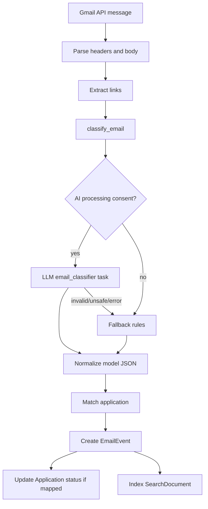
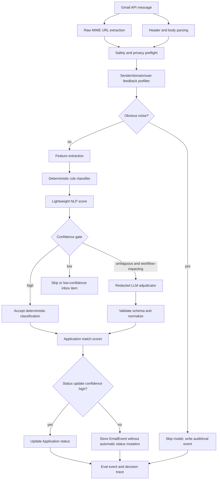

# Gmail Classifier Changelog

## Architecture Decision Context

Gmail classification is a finite-label, high-volume workflow problem. It should not be built as "send every email to an LLM and trust the JSON." That is costly, hard to debug, and unnecessarily exposes user email content to a model.

The better architecture is rules and lightweight NLP first, with LLM adjudication only when the message is ambiguous and the outcome affects the user workflow.

The workflow here is:

```text
inspect current Gmail sync/classifier code
  -> capture baseline LLM call behavior and classifier mistakes
  -> separate job-related recall from automatic status precision
  -> identify privacy and cost risk from AI-first classification
  -> move obvious cases to deterministic rules/NLP
  -> keep LLM only for ambiguous workflow-impacting emails
  -> evaluate recall, precision, LLM call rate, and privacy redaction
```

## Current Implementation

Current code:

- `backend/services/email_classifier.py`
- `backend/services/email_filter.py`
- `backend/services/email_matcher.py`
- `backend/services/email_parser.py`
- `backend/tasks/poll_gmail.py`
- Gmail sync route in `backend/main.py`
- `backend/services/evals/classifier_eval.py`
- `evals/email_classifier/email_classifier_v1.jsonl`

Current classifier labels:

```text
job_update
interview_request
rejection
offer
action_item
conversation
not_relevant
```

Current behavior:

1. Gmail sync pulls a message.
2. Headers and body are parsed.
3. Links are extracted and source-intelligence storage may run.
4. `classify_email(...)` calls the AI classifier when AI consent is enabled.
5. If the AI classifier is disabled, unsafe, invalid, or unavailable, the code falls back to deterministic phrase/domain rules.
6. The email may be matched to an application.
7. An `EmailEvent` is created.
8. Application status may be updated.
9. The event is indexed into search.

Important current issue: deterministic filtering exists, but it is not the main front door everywhere. `email_filter.py` contains useful logic such as ATS domains, non-job domains, automated sender hints, recruiting/job phrases, and `should_classify(...)`, but scheduled polling and API sync do not consistently share one pipeline.

Current sync-window behavior:

- Manual sync uses a fixed lookback on first run or when the caller explicitly passes `days`.
- After a user has sync audit history, manual sync switches to an incremental Gmail query based on the last sync audit timestamp with a one-day overlap for Gmail date-query granularity.
- Existing `gmail_message_id` values are checked before full fetch/classification, so already stored messages are not classified again.
- This is still lighter than a true Gmail History API cursor. The production target is to store a durable Gmail history cursor and use date-based sync only for backfill and recovery.

## Current Architecture



## Current Failure Modes

### Privacy and Data Minimization

If the AI path runs first, more email content reaches the model than necessary. Even with user consent, this is weaker data minimization than required for a Gmail-heavy product.

Risk artifacts to capture:

```text
email_classifier_llm_call_rate.json
email_classifier_payload_redaction_sample.jsonl
email_classifier_noise_sent_to_llm.jsonl
```

### Cost and Latency

Obvious emails should not require an API call:

- known non-job notification domains
- obvious promotional/system noise
- obvious ATS application confirmations
- obvious rejection, interview, offer, or assessment phrases

Latency should be treated as a first-class product metric. Gmail sync should report sync duration, message count, classification count, skip count, source-link failure count, indexing failure count, and eventually per-stage p50/p95. A user-triggered incremental sync should be quick; long historical backfills should move to background work with progress state instead of holding the UI open.

### Recall and Precision Tradeoff

The classifier has two different business goals:

- **Job-related recall:** high. Missing a job-related email hurts user trust.
- **Automatic status precision:** very high. Incorrectly moving an application to rejected/interview/offer is more harmful than simply surfacing an extra email.

The current flow does not make that split explicit enough.

### Incomplete Decision Trace

The current output does not consistently expose:

- matched phrases
- sender-domain category
- URL features
- user feedback blocklist hit
- confidence band
- ambiguity reason
- model used or skipped reason

Without that trace, debugging becomes "the model got it wrong" instead of "we missed a sender-domain rule" or "the threshold was too aggressive."

## Target Architecture



## Component Boundary

Gmail classification is the signal layer. It should not directly create applications, calendar events, network contacts, or draft replies. Those are downstream product actions that consume classifier output, matching evidence, and user confirmation.

The boundary should be:

```text
Gmail ingestion
  -> email classification
  -> email routing
  -> entity extraction and matching
  -> action suggestion
  -> user-confirmed action execution
```

### Email Classification

Answers:

```text
Is this job-related?
What lifecycle category does it belong to?
How confident is the system?
Which features drove the decision?
Was the LLM used?
```

Output shape:

```json
{
  "job_related": true,
  "classification": "interview_request",
  "confidence": 0.91,
  "confidence_band": "high",
  "decision_path": "rules_high_confidence",
  "model_used": false,
  "matched_features": [
    "scheduler_url",
    "interview_phrase",
    "known_application_company_match"
  ]
}
```

### Email Routing

Answers:

```text
Where should this email appear in the product?
```

Route values:

```text
skip
application_inbox
conversation
low_confidence_review
source_discovery_candidate
```

Examples:

| Classifier signal | Routing evidence | Route |
| --- | --- | --- |
| `not_relevant` | Noise score high | `skip` |
| `interview_request` | Matched active application | `application_inbox` |
| `conversation` | Human recruiter, no specific app match | `conversation` |
| `job_update` | Company/job signal but weak app match | `low_confidence_review` |
| `job_update` | Public posting/source URL, no application yet | `source_discovery_candidate` |

### Entity Extraction and Matching

Answers:

```text
Which application, company, contact, or job source does this email refer to?
```

Output shape:

```json
{
  "application_match": {
    "application_id": "uuid",
    "confidence": 0.88,
    "matched_on": ["company_domain", "role_token"]
  },
  "contact_candidate": {
    "name": "Alex Recruiter",
    "email": "alex@company.example",
    "company": "Example Co",
    "confidence": 0.82
  },
  "job_source_candidate": {
    "provider_type": "greenhouse",
    "safe_public_url": "https://boards.greenhouse.io/example/jobs/123",
    "confidence": 0.79
  }
}
```

### Action Suggestion

Answers:

```text
What user-facing actions should be offered?
```

Actions are suggestions, not automatic mutations:

```json
{
  "actions": [
    {
      "type": "create_interview",
      "label": "Add to calendar",
      "confidence": 0.84,
      "requires_user_confirmation": true
    },
    {
      "type": "create_contact",
      "label": "Add to network",
      "confidence": 0.82,
      "requires_user_confirmation": true
    },
    {
      "type": "create_application",
      "label": "Add to pipeline",
      "confidence": 0.76,
      "requires_user_confirmation": true
    }
  ]
}
```

Mapping examples:

| Route | Classification | Entity evidence | Suggested action |
| --- | --- | --- | --- |
| `application_inbox` | `interview_request` | Application match and time/scheduler signal | `create_interview` |
| `application_inbox` | `action_item` | Application match and deadline/task signal | `mark_action_needed` |
| `source_discovery_candidate` | `job_update` | Company/job URL and no existing application | `create_application` |
| `conversation` | `conversation` | Human sender and no existing contact | `create_contact` |
| `conversation` | `conversation` | Prior thread or reply-needed signal | `draft_reply` |

### User-Confirmed Action Execution

Only deterministic endpoints mutate product state:

```text
create_application -> Application
create_interview -> Interview / calendar view
create_contact -> Contact / Network
draft_reply -> Draft writer
mark_action_needed -> EmailEvent/Application task state
```

This keeps the classifier reusable and testable. The model or rules produce structured intent and evidence; product code owns routing, validation, and mutation.

## Target Data Contracts

### Email Candidate

```json
{
  "sender_email": "careers@example.com",
  "sender_domain": "example.com",
  "subject": "Application received",
  "body_text_redacted": "short sanitized excerpt",
  "raw_candidate_url_count": 2,
  "received_at": "timestamp",
  "user_company_domains_count": 4,
  "feedback_blocked_domain": false
}
```

### Classification Result

```json
{
  "classification": "interview_request",
  "confidence": 0.93,
  "confidence_band": "high",
  "decision_path": "deterministic_rule",
  "model_used": false,
  "matched_features": [
    "sender_domain_is_ats",
    "contains_interview_phrase",
    "contains_scheduler_url"
  ],
  "ambiguity_reasons": [],
  "action_needed": true,
  "safe_for_status_update": true
}
```

## Deterministic vs LLM Boundary

Use deterministic logic for:

- known noise
- ATS sender domains
- user feedback blocklists
- lifecycle phrases
- URL safety
- application matching features
- status update thresholds

Use LLM adjudication for:

- human recruiter messages with weak lexical signals
- messages with conflicting status cues
- recruiter-agency messages where company extraction is ambiguous
- nuanced "not selected now, but keep in touch" outcomes

Do not use LLM for:

- prompt-injection-like content
- obvious notification noise
- private URL safety decisions
- automatic status mutation without deterministic validation

## Business Tradeoffs

### Recall Bias

For Gmail, the right first-pass bias is recall. A missed interview request is much worse than an irrelevant notification appearing in the AppTrail inbox.

But that does not mean all downstream actions should be recall-biased:

| Decision | Bias |
| --- | --- |
| Bring into possible job email flow | Higher recall |
| Show as low-confidence item | Balanced |
| Match to application | Balanced to high precision |
| Automatically update application status | High precision |
| Send email content to LLM | Minimize and justify |

### Privacy Bias

Even with consent, the system should avoid sending content to the LLM when local rules are enough. That is a product trust decision, not just a cost optimization.

## Cost Model

### Measured Synthetic Lane Evidence

The first lane comparison used `evals/email_classifier/email_classifier_synthetic_v1.jsonl` with 150 synthetic, sanitized examples. This is not statistical proof of production quality. It is a controlled architecture probe: can the current LLM path handle clean taxonomy cases, and what does that cost in latency, money, and privacy exposure?

Generated artifacts:

- [Rules-only synthetic baseline](../generated/2026-05-06_gmail-classifier-artifact-eval_email-classifier-synthetic-v1_fallback-rules_rules-v1/report.md)
- [Live LLM synthetic baseline](../generated/2026-05-06_gmail-classifier-live-llm-artifact-eval_email-classifier-synthetic-v1_gpt-4o-mini_v3/report.md)
- [Rules vs live LLM lane comparison](../generated/2026-05-06_gmail-classifier-lane-comparison_email-classifier-synthetic-v1_fallback-rules-vs-gpt-4o-mini_rules-v1-vs-v3/report.md)

Measured result:

| Metric | Rules-only lane | Live LLM lane | Interpretation |
| --- | ---: | ---: | --- |
| Category accuracy | 0.68 | 1.00 | LLM resolved the clean taxonomy cases that rules missed. |
| Stage accuracy | 0.50 | 1.00 | Rules need stronger routing for lifecycle categories. |
| Job-related recall | 1.00 | 1.00 | Both lanes preserved the most important first-pass objective. |
| Failed cases | 48 | 0 | Synthetic failures were category/stage routing failures, not missed job emails. |
| LLM call rate | 0.00 | 1.00 | Live lane sends every classified email through the model. |
| Avg latency | 0.1 ms | 2538.3 ms | LLM-first sync does not scale as an interactive sync path. |
| p95 latency | 0.275 ms | 4510.8 ms | Tail latency becomes visible at email-batch scale. |
| Cost per 1,000 emails | 0 cents | 14.0685 cents | Dollar cost is acceptable early, but grows linearly with sync volume. |

Important finding: `100%` synthetic accuracy is not the product decision. The product decision is that an LLM-first pipeline buys clean-case routing quality by paying a per-email cost, latency, and privacy tax.

Scale math from the measured live lane:

```text
100 users * 400 emails = 40,000 emails
40,000 / 1,000 * 14.0685 cents = 562.74 cents
= $5.63 per full sync
```

Daily full reprocessing would compound:

```text
100 users daily:   ~$5.63/day    ~$168.82/month
1,000 users daily: ~$56.27/day   ~$1,688/month
10,000 users daily: ~$562.74/day ~$16,882/month
```

The latency shape is worse than the early dollar cost:

```text
400 emails/user * 2.538s avg model latency = 1,015s
= 16.9 minutes per user sequential

40,000 emails * 2.538s = 101,520s
= 28.2 hours sequential
```

Concurrency can reduce wall-clock time, but it moves the problem into queue depth, rate limits, retries, model-provider burst capacity, and operational cost. If auto-sync runs for many users around the same time, an LLM-first Gmail sync becomes a model batch-processing system instead of a lightweight product sync.

Privacy finding:

- The live lane currently evaluates full synthetic email text through the safety gateway.
- Real Gmail messages would contain user-private names, emails, phone numbers, recruiter details, URLs, candidate IDs, scheduler links, and other PII unless redaction/minimization runs first.
- Even with consent, sending every email to the LLM is weaker data minimization than this product needs.

Architecture response:

1. Keep recall high at the front door.
2. Use deterministic and lightweight NLP filters before any model call.
3. Route obvious noise and obvious lifecycle emails locally.
4. Call the LLM only for ambiguous, workflow-impacting cases.
5. Redact and minimize before LLM adjudication.
6. Force LLM output back into deterministic labels, confidence bands, and status-update gates.

This evidence supports a hybrid architecture, not because the LLM failed, but because the LLM succeeded in a way that is too expensive and privacy-expansive to use as the first layer.

### Hybrid Lane v1 Implementation

The next implementation step is classification-only. It does not change Gmail sync product behavior yet and does not add action buttons. The new lane exists so we can compare architectures before changing production routing.

Implemented code:

```text
backend/services/gmail_intelligence/
  __init__.py
  types.py
  normalizer.py
  privacy.py
  feature_extractor.py
  scorer.py
  classifier.py
  adjudicator.py
  orchestrator.py
```

Eval integration:

```text
backend/services/evals/classifier_eval.py
scripts/run_gmail_classifier_artifact_eval.py --variant hybrid_rules_nlp_llm_v1
```

Tests:

```text
tests/test_gmail_intelligence.py
tests/test_classifier_eval.py
```

The hybrid lane adds two preprocessing tracks:

| Track | Used for | Data handling |
| --- | --- | --- |
| Local NLP normalization | Feature extraction and deterministic scoring | Raw user email may be inspected in backend memory, but raw text is not written to traces/artifacts. |
| LLM privacy minimization | Ambiguous-case LLM adjudication | Email addresses, phone numbers, raw/private URLs, scheduler links, and candidate/application identifiers are redacted before model use. |

Threshold config:

```json
{
  "version": "classifier-thresholds-v1",
  "job_related_accept": 0.55,
  "job_related_ambiguous": 0.35,
  "noise_skip": 0.75,
  "category_accept": 0.70,
  "category_margin": 0.20,
  "llm_escalation_min_job_score": 0.45,
  "llm_call_rate_budget": 0.25
}
```

Initial scorer structure:

```text
EmailCandidate
  -> normalize_email
  -> extract_email_features
  -> score_email
  -> deterministic_classify
  -> optional redacted LLM adjudication when ambiguous
```

Generated artifact:

- [Hybrid rules/NLP/LLM synthetic lane](../generated/2026-05-06_gmail-classifier-hybrid-artifact-eval_email-classifier-synthetic-v1_hybrid-rules-nlp-llm_classifier-thresholds-v1/report.md)

Measured result after calibration:

| Metric | Hybrid lane v1 |
| --- | ---: |
| Category accuracy | 1.00 |
| Stage accuracy | 1.00 |
| Job-related recall | 1.00 |
| Failed cases | 0 |
| LLM call rate | 0.00 |
| Avg latency | 0.18 ms |
| p95 latency | 0.314 ms |
| Cost per 1,000 emails | 0 cents |

Calibration notes:

1. The first hybrid run caught a deterministic coverage gap: the rejection phrase `"will not be moving forward"` did not match the older `"not moving forward"` rule because the actual text contained `"not be moving forward"`.
2. The first hybrid run also sent synthetic conversation cases to the LLM because generic `candidate portal` evidence kept `job_update` too close to `conversation`. The scorer now caps generic `job_update` when explicit conversation evidence is strong.
3. These fixes are threshold/feature calibration, not proof that the classifier is complete. They show why eval-first implementation is safer than swapping production behavior immediately.

Current interpretation:

```text
Rules-only lane:
  cheap and fast, but weak lifecycle routing

Live LLM lane:
  strong on clean synthetic taxonomy, but sends every email to the model

Hybrid lane v1:
  matches clean synthetic taxonomy locally with zero model calls
```

The next proof point must come from messier redacted Gmail samples. Synthetic data has now done its job: it exposed obvious rule gaps, demonstrated the architecture tradeoff, and gave us a repeatable lane comparison.

### Gmail LLM Preflight Gate

Before any real Gmail content is allowed to reach the LLM adjudicator, the classifier now has a feature-specific preflight gate. This is not a generic agent-safety layer. It is tailored to one bounded task: classify an ambiguous Gmail message into one allowed email category.

Implemented code:

```text
backend/services/gmail_intelligence/preflight.py
backend/services/evals/gmail_preflight_eval.py
scripts/run_gmail_preflight_eval.py
evals/email_classifier/gmail_llm_preflight_synthetic_v1.jsonl
tests/test_gmail_preflight_eval.py
```

The preflight enforces:

| Gate | Gmail classifier behavior |
| --- | --- |
| Local confidence gate | Obvious local decisions do not reach the LLM. |
| Consent gate | Missing AI consent blocks LLM escalation. |
| Prompt-injection gate | Classifier-specific attempts to override labels, reveal prompts, export data, or call tools are blocked. |
| PII redaction | Email addresses and phone numbers are redacted before prompt construction. |
| Private-link redaction | Candidate/application IDs, tokenized URLs, scheduler URLs, and raw ATS URLs are replaced with typed placeholders. |
| Data minimization | Prompt contains redacted subject/body excerpt, local scores, matched features, and URL feature types, not full raw Gmail. |
| Leak detection | Generated preflight prompts are checked for raw email addresses, phone numbers, raw URLs, private URL tokens, and fixture-specific forbidden terms. |
| Bounded execution | The preflight itself makes zero model calls; the future adjudicator remains a single JSON task with deterministic fallback. |

Generated artifact:

- [Gmail classifier LLM preflight eval](../generated/2026-05-06_gmail-classifier-llm-preflight-eval_gmail-llm-preflight-synthetic-v1_no-model-preflight_classifier-thresholds-v1/report.md)

Measured preflight result:

| Metric | Value |
| --- | ---: |
| Case count | 10 |
| Pass rate | 1.00 |
| Expected LLM escalation rate | 0.40 |
| Actual LLM escalation rate | 0.40 |
| Expected block rate | 0.20 |
| Actual block rate | 0.20 |
| Prompt leak rate | 0.00 |
| Redaction pass rate | 1.00 |
| Prompt-injection block rate | 1.00 |
| Model calls | 0 |

The synthetic preflight set covers:

```text
obvious noise
obvious interview request
ambiguous recruiter message
email address redaction
phone redaction
private candidate/application URL redaction
scheduler URL redaction
public ATS URL redaction
classifier prompt injection
missing AI consent
low-signal personal email
obvious private application update that does not need LLM
```

Real Gmail rollout rule:

```text
No real Gmail LLM calls until:
  1. preflight synthetic eval passes,
  2. real Gmail dry run runs with ai_enabled=false,
  3. would-escalate redacted prompt previews are inspected,
  4. prompt leak rate remains 0,
  5. ambiguity rate is acceptable for cost/latency.
```

This lets the next real-data artifact measure messy inbox behavior without immediately exposing private email text to a model.

### Current Cost Drivers

Current AI-first classification makes cost scale with Gmail volume:

```text
synced_email_count
  * ai_processing_consent_rate
  * classifier_model_call_rate
  * avg_cost_per_classifier_call
```

Measured fields:

```text
AiModelCall.surface
AiModelCall.task_name = email_classifier
AiModelCall.prompt_tokens
AiModelCall.context_tokens
AiModelCall.output_tokens
AiModelCall.total_tokens
AiModelCall.cost_estimate_cents
AiModelCall.latency_ms
EmailSyncAudit processed/skipped/classified counts
Gmail sync duration_ms
```

The current cost issue is not only dollars. It is also privacy exposure and latency. Sending obvious noise or obvious ATS emails to an LLM creates avoidable model calls and avoidable exposure of email-derived text.

### Target Cost Shape

The hybrid classifier changes the cost curve:

```text
total_email_count
  -> deterministic skip for noise
  -> deterministic classify for obvious job lifecycle messages
  -> LLM adjudication only for ambiguous workflow-impacting messages
```

Projected cost:

```text
target_cost =
  total_email_count
  * ambiguous_workflow_email_rate
  * avg_cost_per_adjudicator_call
```

Savings estimate:

```text
model_calls_avoided =
  baseline_model_calls - target_adjudicator_calls
```

### Cost Artifacts

Generate:

```text
email_classifier_cost_baseline.json
email_classifier_cost_after.json
email_classifier_cost_projection.json
```

Required fields:

```json
{
  "synced_email_count": 0,
  "classified_email_count": 0,
  "model_call_count": 0,
  "model_call_rate": 0.0,
  "avg_prompt_tokens": 0,
  "avg_output_tokens": 0,
  "avg_cost_cents_per_call": 0.0,
  "cost_per_1000_synced_emails_cents": 0.0,
  "prefilter_skip_rate": 0.0,
  "llm_calls_avoided": 0,
  "evidence_status": "measured | projected | fixture"
}
```

Cost should be evaluated alongside quality. A cheaper classifier that misses job-related emails is not acceptable. The optimization target is lower LLM call rate while preserving high job-related recall and high automatic-status precision.

### Latency Artifacts

Generate:

```text
email_classifier_latency_baseline.json
email_classifier_latency_after.json
email_classifier_latency_projection.json
```

Required fields:

```json
{
  "sync_runs": 0,
  "messages_checked": 0,
  "messages_classified": 0,
  "sync_duration_ms_p50": 0,
  "sync_duration_ms_p95": 0,
  "classifier_duration_ms_p50": 0,
  "classifier_duration_ms_p95": 0,
  "model_latency_ms_p50": 0,
  "model_latency_ms_p95": 0,
  "timeout_rate": 0.0,
  "evidence_status": "measured | projected | fixture"
}
```

## Artifacts to Generate

Baseline artifacts:

```text
email_classifier_baseline_trace.jsonl
email_classifier_llm_payload_sample_redacted.jsonl
email_classifier_llm_call_rate.json
email_classifier_confusion_matrix_baseline.json
email_classifier_failure_summary_baseline.json
email_classifier_latency_baseline.json
```

Candidate artifacts:

```text
email_classifier_hybrid_decision_trace.jsonl
email_classifier_prefilter_skip_sample.jsonl
email_classifier_llm_adjudication_cases.jsonl
email_classifier_status_update_decisions.jsonl
email_classifier_metrics_after.json
email_classifier_failure_summary_after.json
email_classifier_latency_after.json
```

Generated report bundle:

```text
docs/interview-artifacts/generated/
  YYYY-MM-DD_email-classifier-hybrid_email-classifier-v1_rules-nlp-llm_v1/
```

## Eval Metrics

```text
job_related_precision
job_related_recall
category_accuracy
stage_accuracy
application_match_precision
application_match_recall
automatic_status_update_precision
llm_call_rate
llm_cost_per_1000_emails
latency_p50_p95
prefilter_skip_rate
false_negative_job_email_rate
false_positive_noise_rate
privacy_redaction_pass_rate
user_feedback_reversal_rate
```

Minimum viable eval:

- small sanitized fixture set
- production-derived redacted examples
- known obvious noise cases
- known ATS cases
- human recruiter ambiguous cases
- prompt injection and PII/minimization cases

## Implementation Changelog

### 2026-05-06: LLM Preflight Gate Hardening

Current artifact:

```text
docs/interview-artifacts/generated/2026-05-06_gmail-classifier-llm-preflight-eval_gmail-llm-preflight-synthetic-v1_no-model-preflight_classifier-thresholds-v1/
```

Changes:

- Expanded `evals/email_classifier/gmail_llm_preflight_synthetic_v1.jsonl` from 10 to 25 cases covering noisy non-job emails, forwarded threads, recruiter signatures, physical addresses, phone formats, public ATS links, private candidate links, scheduler links, consent blocks, and prompt injection.
- Added `redacted_prompt_review.md` beside `case_results.jsonl` so the exact would-be LLM payload can be reviewed without reading the raw fixture dataset.
- Changed the hybrid Gmail orchestrator so the adjudicator can only use a prompt that already passed `evaluate_llm_preflight`.
- Redacted sender display names, physical addresses, phone numbers, emails, private URLs, scheduler URLs, and public ATS URLs before any eligible LLM prompt.
- Minimized email body text before redaction by stripping signatures and quoted thread history where possible.
- Added prompt-size blocking, prompt-injection blocking, consent blocking, and leak blocking before any model call.
- Tuned deterministic handling for product/system messages that contain words like `job` but have no job-search lifecycle category.

Result:

```text
case_count: 25
pass_rate: 1.0
prompt_leak_rate: 0.0
redaction_pass_rate: 1.0
prompt_injection_block_rate: 1.0
actual_llm_escalation_rate: 0.4
model_call_count: 0
```

Interpretation:

- Synthetic obvious cases still do not need the LLM.
- Ambiguous cases can be prepared for LLM adjudication without exposing raw fixture PII.
- The next safe step is real Gmail dry-run mode with no model calls, using the same preflight trace fields to find real-world noise and threshold gaps.

### Phase 1: Unify Sync Pipeline

- Create shared `backend/services/gmail_sync/pipeline.py`.
- Make API sync and scheduled polling call the same pipeline.
- Standardize `EmailSyncAudit`, feedback blocklists, URL extraction, classification, link storage, and eval event writing.

### Phase 2: Decision Trace

- Add `decision_path`, `matched_features`, `confidence_band`, `ambiguity_reasons`, and `model_used`.
- Persist this in `EmailEvent` metadata or a linked eval event.

### Phase 3: Rules/NLP First

- Run `should_classify(...)` and obvious-noise logic before model calls.
- Add feature scoring.
- Add thresholds for accept, adjudicate, and drop.

### Phase 4: Redacted LLM Adjudicator

- Only call the model for ambiguous workflow-impacting cases.
- Pass minimized/redacted context.
- Validate the output schema and route back to deterministic status/application logic.

### Phase 5: Calibrate Thresholds

- Use evals and feedback to tune recall/precision.
- Keep the business rule explicit: high recall for job detection, high precision for automatic status update.

## Future Scaling Path

Only after enough labels exist:

- train a lightweight supervised classifier for category prediction
- calibrate confidence with held-out examples
- add a small NER model for company, role, date, recruiter, and deadline extraction
- compare against rules and LLM adjudicator on cost, latency, accuracy, and privacy exposure

Do not start with transformer training. The current domain has strong rule signals and limited labeled data.
