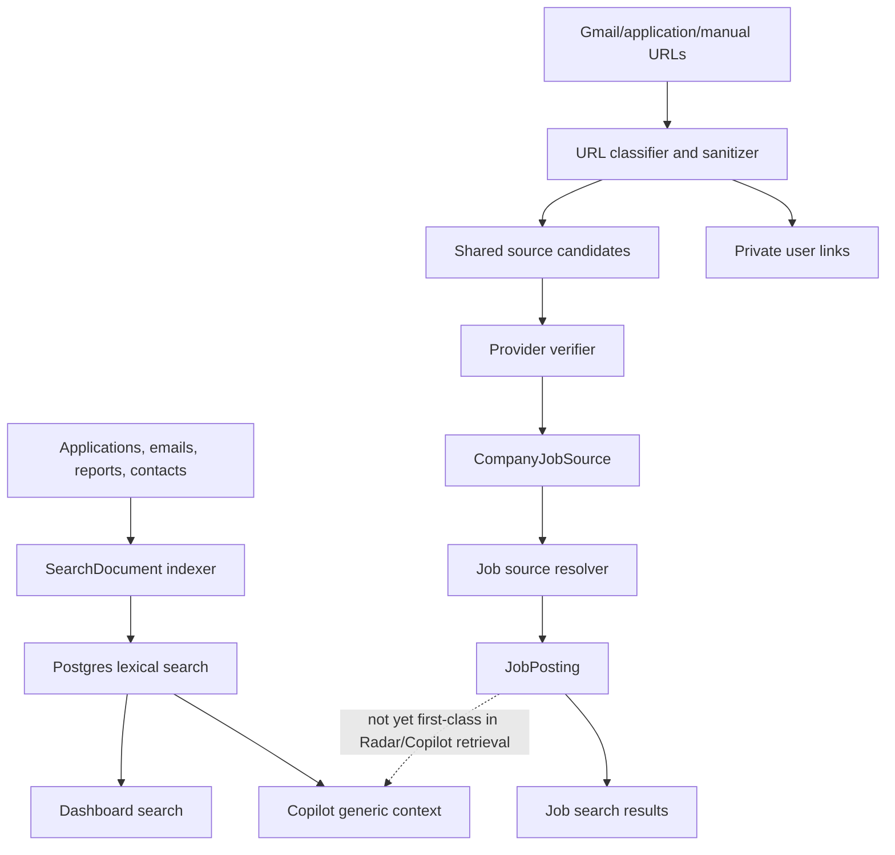
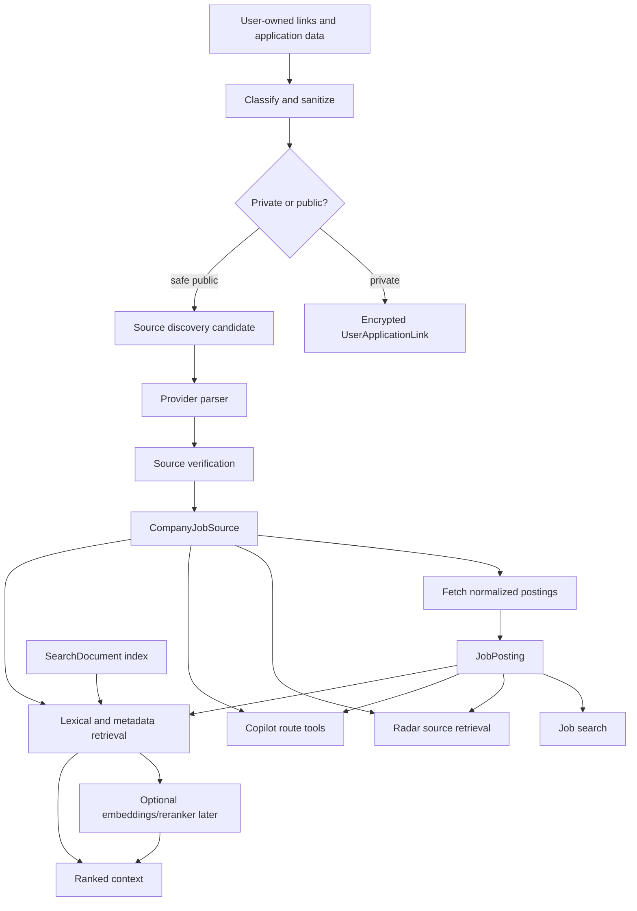

# Search Retrieval and Source Intelligence Changelog

## Architecture Decision Context

Search quality determines AI quality. If retrieval returns an empty page, generic page, stale page, or wrong company, the LLM has nothing reliable to summarize. The right fix is not "use a bigger model." The fix is to improve the source substrate, retrieval filters, ranking features, and eval loop.

AppTrail already has a meaningful source-intelligence implementation. The next step is to make it the shared data layer for job search, Radar, and Copilot.

The workflow here is:

```text
inspect current SearchDocument and source-intelligence code
  -> capture retrieval misses and weak generic-source results
  -> compare lexical baseline against direct-source retrieval
  -> add source health, source tier, and ranking feature traces
  -> reuse verified sources across job search, Radar, and Copilot
  -> add embeddings/rerankers only after evals show lexical/source ranking gaps
```

## Current Implementation

Current search code:

- `backend/services/search/indexer.py`
- `backend/services/search/documents.py`
- `backend/services/search/backends/postgres.py`
- `backend/services/search/backends/opensearch.py`
- `backend/services/evals/search_eval.py`
- `evals/search/search_documents_v1.json`
- `evals/search/search_queries_v1.jsonl`

Current source intelligence and job source code:

- `backend/services/source_intelligence/url_classifier.py`
- `backend/services/source_intelligence/url_sanitizer.py`
- `backend/services/source_intelligence/link_store.py`
- `backend/services/source_intelligence/discovery.py`
- `backend/services/job_sources/resolver.py`
- `backend/services/job_sources/verifier.py`
- `backend/services/job_sources/greenhouse.py`
- `backend/services/job_sources/lever.py`
- `backend/services/job_sources/ashby.py`
- `backend/services/job_sources/workable.py`
- `backend/services/job_sources/smartrecruiters.py`
- `backend/services/job_sources/workday.py`
- `backend/services/job_sources/structured_data.py`
- `backend/tasks/verify_job_sources.py`

Current normalized source/posting models exist:

- `CompanyJobSource`
- `UserApplicationLink`
- `SourceDiscoveryEvent`
- `JobPosting`
- `ApplicationSourceLink`
- `SourceVerificationRun`
- `JobSearchProviderUsage`

Current search backend:

- The default `SearchDocument` backend is Postgres lexical matching.
- OpenSearch exists as a backend placeholder but is not the implemented default.
- Embeddings are not provisioned in CI.
- Search evals compare keyword, semantic expansion proxy, and hybrid scoring.

## Current Architecture



## Current Failure Modes

### Retrieval Miss

The right product record exists, but retrieval does not return it.

Examples:

- Copilot cannot answer a product-specific question because generic search did not retrieve the right `SearchDocument`.
- Radar does not query verified job postings before searching the web.

### Empty or Generic Page

A broad search lands on a career landing page or empty page. The LLM receives weak context and generates a generic summary.

Artifact to capture:

```text
retrieval_empty_page_cases.jsonl
generic_source_ranked_above_verified_posting.jsonl
```

### Wrong Source Tier

A discovery candidate or generic page is treated as if it were verified evidence.

### Source Substrate Not Shared Enough

Source intelligence is implemented, but not yet consistently consumed by:

- Radar evidence retrieval
- Copilot source-status answers
- Search ranking
- Eval case generation

## Target Architecture



## Target Retrieval Strategy

Retrieval should be hybrid, but "hybrid" does not mean starting with a vector database. It means combining inspectable signals:

```text
metadata filters
  + user scope
  + source type
  + lexical score
  + company match
  + role match
  + recency
  + source confidence
  + source health
  + user feedback
  + optional semantic score
```

Required filters before ranking:

- user scope for private records
- active source status
- verified or approved access mode for shared sources
- privacy eligibility
- time window/freshness
- company/domain/provider constraints when available

## Ranking Features

```json
{
  "lexical_score": 0.71,
  "semantic_score": null,
  "source_trust": 0.95,
  "source_confidence": 0.91,
  "recency_score": 0.88,
  "company_match_score": 1.0,
  "role_match_score": 0.84,
  "location_match_score": 0.5,
  "user_history_match": 0.3,
  "dedupe_penalty": 0,
  "privacy_eligible": true
}
```

The system should explain why a result ranked.

## Deterministic vs Model Boundary

Use deterministic source logic for:

- URL classification
- private/public decision
- provider source parsing
- source verification
- provider access mode
- robots/terms controls
- dedupe keys
- broad-provider usage caps

Use lightweight NLP for:

- role family matching
- title normalization
- company alias matching
- query expansion

Use embeddings later for:

- semantic retrieval when lexical misses are measured
- near-duplicate job posting detection
- role/title similarity
- Copilot context ranking

Do not use embeddings for:

- private URL safety
- source sharing eligibility
- access mode decisions
- status updates

## Cost Model

### Current Cost Drivers

Search/source cost has two main cost centers:

```text
broad_provider_cost =
  search_request_count
  * broad_provider_fallback_rate
  * avg_broad_provider_cost_per_request

downstream_ai_cost =
  weak_retrieval_rate
  * avg_extra_llm_context_tokens_or_followup_calls
```

Measured fields:

```text
JobSearchProviderUsage.provider
JobSearchProviderUsage.request_mode
JobSearchProviderUsage.request_count
JobSearchProviderUsage.result_count
AiModelCall task costs for downstream Copilot/Radar use
SourceVerificationRun duration/status/job_count
```

Bad retrieval has hidden cost. If search returns a generic source, Copilot or Radar may spend model tokens summarizing weak context and still produce an unusable result.

### Target Cost Shape

Direct source retrieval should reduce paid broad-provider calls:

```text
target_broad_calls =
  search_request_count
  * unresolved_or_stale_source_rate
```

Expected savings:

```text
broad_calls_avoided =
  baseline_broad_calls - target_broad_calls
```

There is still verification cost, but it is amortized:

```text
verification_cost_per_search =
  source_verification_run_cost / searches_served_by_verified_source
```

The product goal is not zero cost. It is lower cost per successful, relevant result.

### Cost Artifacts

Generate:

```text
search_source_cost_baseline.json
search_source_cost_after.json
search_source_cost_projection.json
```

Required fields:

```json
{
  "search_request_count": 0,
  "direct_source_hit_rate": 0.0,
  "broad_provider_fallback_rate": 0.0,
  "broad_provider_request_count": 0,
  "broad_provider_result_count": 0,
  "broad_calls_avoided": 0,
  "avg_results_per_direct_source_search": 0.0,
  "cost_per_successful_search_cents": 0.0,
  "evidence_status": "measured | projected | fixture"
}
```

## Artifacts to Generate

Baseline artifacts:

```text
search_baseline_topk.jsonl
search_baseline_metrics.json
source_registry_snapshot_baseline.json
retrieval_miss_cases.jsonl
generic_source_cases.jsonl
```

Candidate artifacts:

```text
search_direct_source_topk.jsonl
job_posting_index_snapshot.jsonl
source_health_snapshot.json
ranking_feature_trace.jsonl
search_source_metrics_after.json
retrieval_failure_summary_after.json
```

Generated report bundle:

```text
docs/interview-artifacts/generated/
  YYYY-MM-DD_search-source-retrieval_search-source-v1_direct-source-ranker_v1/
```

## Eval Metrics

```text
mrr_at_10
ndcg_at_10
recall_at_10
verified_source_coverage
direct_source_coverage
broad_fallback_rate
generic_source_rate
empty_page_rate
stale_source_rate
duplicate_rate
private_url_false_public_rate
cost_per_successful_search
```

For Radar-specific retrieval:

```text
tier1_or_tier2_evidence_rate
generic_evidence_rate
wrong_company_rate
wrong_role_rate
```

For Copilot-specific retrieval:

```text
route_context_hit_rate
citation_candidate_coverage
unsupported_answer_due_to_retrieval_rate
```

## Implementation Changelog

### Phase 1: Make JobPosting Searchable

- Index `JobPosting` and `CompanyJobSource` into `SearchDocument` or a parallel typed retrieval API.
- Include source status, source confidence, provider type, company domain, title, location, and freshness.

### Phase 2: Direct Source First

- Make job search, Radar, and Copilot route tools query verified sources before broad search.
- Preserve broad search as fallback/discovery.

### Phase 3: Ranking Feature Trace

- Add trace output for ranked results.
- Persist enough detail for eval and RCA without exposing private data.

### Phase 4: Query and Role Matching

- Improve deterministic role matching.
- Add controlled query expansion.
- Add company alias/domain matching.

### Phase 5: Optional Semantic Retrieval

Only after evals show lexical/metadata misses:

- Add embeddings for privacy-safe summaries and normalized public records.
- Store model/version/source hash.
- Compare lexical vs lexical+embedding vs reranked variants.

## Business Tradeoffs

### Why Not Full Vector Search Immediately?

Vector search can help semantic matching, but it also adds:

- infrastructure complexity
- privacy governance for embeddings
- eval complexity
- failure opacity
- cost

At AppTrail's current scale, lexical plus metadata plus source confidence is the right baseline. It is cheaper, inspectable, and easier to debug.

### Why Source Intelligence Matters

Verified company sources reduce cost and improve freshness. They also give Radar and Copilot a safer source of truth than broad web search.

That is the business tradeoff: spend engineering time building a reusable source substrate instead of spending recurring money and reliability budget on broad search and generic LLM summaries.

## Future Scaling Path

Move toward transformer/encoder/search-engine work when one of these is true:

- lexical retrieval misses too many semantically equivalent user questions
- role title matching fails on synonyms despite deterministic expansion
- source/result volume grows beyond simple DB ranking
- evals show rerankers materially improve MRR/NDCG
- product latency requirements require a dedicated search backend

Until then, deterministic retrieval is the correct architecture.
